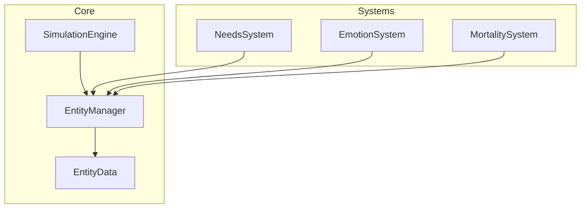

# WorldSim Documentation

Automatically generated WorldSim simulation system documentation.

## Project Statistics

| 항목 | 수량 |
|------|------|
| 시스템 (Systems) | 22 |
| 코어 모듈 (Core) | 27 |
| AI 모듈 | 1 |
| 데이터 파일 (Data) | 19 |
| 로케일 파일 (Locale) | 16 |
| 로케일 키 (Keys) | 1,359 |
| GDScript 라인 | 9,605 |

> 📅 Generated: 2026-02-18 | Source commit: `1fcf3b718547`

## Key Sections

- **[Systems](systems/)** — Simulation system docs (priority order)
- **[Config Reference](config-reference.md)** — Full GameConfig constants
- **[Data](data/)** — JSON data file analysis
- **[System Interactions](interactions/)** — Cross-system dependencies and interactions
- **[Glossary](glossary/)** — Korean/English game terms
- **[Core](core/)** — Core module reference

## Simulation Architecture

