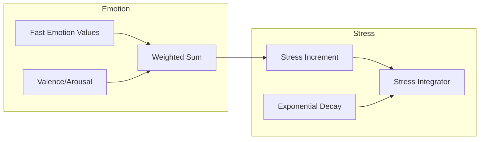

# Emotion -> Stress

한국어 / English: 계산 파이프라인 중심 상호작용 문서 / Calculation-pipeline interaction documentation.

## Interaction Overview
Stress integrates weighted emotion channels plus valence-arousal amplification, then applies exponential decay over time.

## Emotion -> Stress System
### How Emotions Drive Stress
1. **Emotion Contribution**: stress receives weighted emotion channels from the fast layer.
   - Formula: `gamma_VA * sum(w_e * emotion_e)` with valence-arousal coupling.
2. **Negative Arousal Boost**: high arousal + negative valence increases stress increment.
3. **Temporal Integration**: stress load decays exponentially using `tau_hours`.
4. **Downstream State Impact**: integrated stress updates reserve/allostatic burden.

### Data Flow: Emotion -> Stress
| Data Field | Source | Destination | Formula | Purpose |
|---|---|---|---|---|
| `sadness` | `emotion_data.fast['sadness']` | `stress_system._calc_emotion_contribution()` | `1.1 * sadness` | Convert emotion magnitude into stress load |
| `fear` | `emotion_data.fast['fear']` | `stress_system._calc_emotion_contribution()` | `1 * fear` | Convert emotion magnitude into stress load |
| `anger` | `emotion_data.fast['anger']` | `stress_system._calc_emotion_contribution()` | `0.9 * anger` | Convert emotion magnitude into stress load |
| `disgust` | `emotion_data.fast['disgust']` | `stress_system._calc_emotion_contribution()` | `0.6 * disgust` | Convert emotion magnitude into stress load |
| `valence_arousal_term` | `emotion_data.valence, emotion_data.arousal` | `stress_system._calc_emotion_contribution()` | `gamma_VA * arousal * max(-valence, 0)` | Capture negative high-arousal stress amplification |
| `stress_decay_tau` | `decay_parameters.stress.tau_hours` | `stress_system.integrator` | `stress(t+dt) = stress(t) * exp(-dt/48)` | Exponential stress decay between updates |

## Calculation Flow Diagram

## Feedback Loops
- Elevated stress feeds back into emotion dynamics through stress-induced baseline shifts and mental-break pathways.

## Source Notes
- 📄 source: `scripts/systems/emotion_system.gd:L10`
- 📄 source: `scripts/ai/behavior_system.gd:L60`
- 📄 source: `scripts/ai/behavior_system.gd:L68`
- 📄 source: `scripts/ai/behavior_system.gd:L74`
- 📄 source: `scripts/ai/behavior_system.gd:L78`
- 📄 source: `scripts/ai/behavior_system.gd:L92`
- 📄 source: `scripts/ai/behavior_system.gd:L106`
- 📄 source: `scripts/ai/behavior_system.gd:L108`
- 📄 source: `scripts/ai/behavior_system.gd:L133`
- 📄 source: `scripts/ai/behavior_system.gd:L135`
- 📄 source: `scripts/ai/behavior_system.gd:L347`

## Manual Notes
<!-- MANUAL:START -->
<!-- MANUAL:END -->
