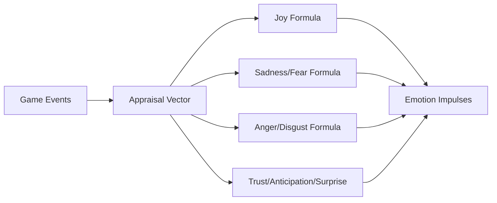

# Events -> Emotion

한국어 / English: 계산 파이프라인 중심 상호작용 문서 / Calculation-pipeline interaction documentation.

## Interaction Overview
Event presets provide appraisal vectors that are transformed into per-emotion impulses.

## Events -> Emotion System
### How Events Inject Emotional Impulses
1. **Appraisal Vector Build**: each event defines appraisal dimensions (`g, n, c, a, m, p, b, fr`).
2. **Impulse Equations**: emotion channels are computed with formulas like `I * max(g,0)` and `I * max(-g,0)*(1-c)`.
3. **Intensity Scaling**: event intensity (`I`) scales all impulse terms.
4. **Trauma Handling**: trauma-tagged events can create long-lived emotional memory traces.

### Data Flow: Events -> Emotion
| Data Field | Source | Destination | Formula | Purpose |
|---|---|---|---|---|
| `anger` | `event_appraisal_vector (g,n,c,a,m,p,b,fr,I)` | `emotion_system.impulse[anger]` | `I * max(-g, 0) * max(-a, 0) * (1 - c)` | Compute anger impulse from event appraisal |
| `anticipation` | `event_appraisal_vector (g,n,c,a,m,p,b,fr,I)` | `emotion_system.impulse[anticipation]` | `I * fr * max(g, 0)` | Compute anticipation impulse from event appraisal |
| `disgust` | `event_appraisal_vector (g,n,c,a,m,p,b,fr,I)` | `emotion_system.impulse[disgust]` | `I * max(m + p, 0)` | Compute disgust impulse from event appraisal |
| `fear` | `event_appraisal_vector (g,n,c,a,m,p,b,fr,I)` | `emotion_system.impulse[fear]` | `I * max(-g, 0) * (1 - c) * fr` | Compute fear impulse from event appraisal |
| `joy` | `event_appraisal_vector (g,n,c,a,m,p,b,fr,I)` | `emotion_system.impulse[joy]` | `I * max(g, 0)` | Compute joy impulse from event appraisal |
| `sadness` | `event_appraisal_vector (g,n,c,a,m,p,b,fr,I)` | `emotion_system.impulse[sadness]` | `I * max(-g, 0) * (1 - c)` | Compute sadness impulse from event appraisal |
| `surprise` | `event_appraisal_vector (g,n,c,a,m,p,b,fr,I)` | `emotion_system.impulse[surprise]` | `I * n` | Compute surprise impulse from event appraisal |
| `trust` | `event_appraisal_vector (g,n,c,a,m,p,b,fr,I)` | `emotion_system.impulse[trust]` | `I * max(b, 0)` | Compute trust impulse from event appraisal |
| `goal_congruence` | `event_presets.ate_food.goal_congruence` | `appraisal_vector.g` | `direct assignment` | Populate appraisal vector used by impulse equations |
| `novelty` | `event_presets.ate_food.novelty` | `appraisal_vector.n` | `direct assignment` | Populate appraisal vector used by impulse equations |
| `controllability` | `event_presets.ate_food.controllability` | `appraisal_vector.c` | `direct assignment` | Populate appraisal vector used by impulse equations |
| `ate_food.intensity` | `event_presets.ate_food.intensity` | `emotion_system.impulse_scale` | `I = 20` | Scale appraisal equations by event intensity |

## Calculation Flow Diagram

## Feedback Loops
- Sample extracted event preset used for table generation: `ate_food`.

## Source Notes
- 📄 source: `scripts/systems/emotion_system.gd:L10`
- 📄 source: `scripts/systems/social_event_system.gd:L2`
- 📄 source: `scripts/systems/social_event_system.gd:L39`
- 📄 source: `scripts/systems/social_event_system.gd:L42`
- 📄 source: `scripts/systems/social_event_system.gd:L44`
- 📄 source: `scripts/systems/social_event_system.gd:L48`
- 📄 source: `scripts/systems/social_event_system.gd:L51`
- 📄 source: `scripts/systems/social_event_system.gd:L57`
- 📄 source: `scripts/systems/social_event_system.gd:L58`
- 📄 source: `scripts/systems/social_event_system.gd:L64`
- 📄 source: `scripts/systems/social_event_system.gd:L248`
- 📄 source: `scripts/systems/social_event_system.gd:L250`
- 📄 source: `scripts/core/emotion_data.gd:L3`
- 📄 source: `scripts/core/emotion_data.gd:L11`
- 📄 source: `scripts/core/emotion_data.gd:L19`
- 📄 source: `scripts/core/emotion_data.gd:L37`

## Manual Notes
<!-- MANUAL:START -->
<!-- MANUAL:END -->
