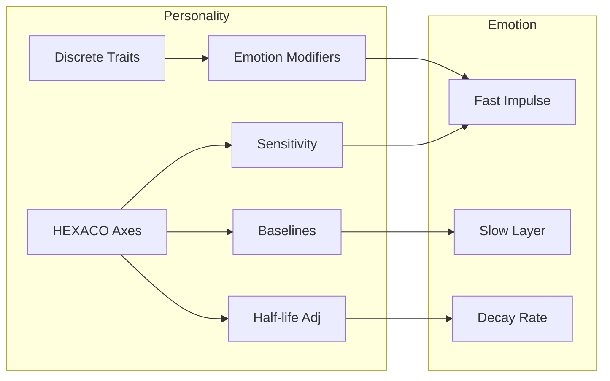

# Personality -> Emotion

한국어 / English: 계산 파이프라인 중심 상호작용 문서 / Calculation-pipeline interaction documentation.

## Interaction Overview
Personality parameters flow directly into emotion sensitivity, baseline targets, and half-life controls before impulses are integrated.

## Personality -> Emotion System
### How Personality Affects Emotions
1. **Sensitivity Coupling**: each emotion is scaled by HEXACO axes via `sensitivity = exp(coeff * z_axis)`.
   - Example: high Emotionality (`E`) increases fear/sadness response gain.
2. **Baseline Setting**: slow-layer targets come from `clampf(base + scale * z_axis, min, max)`.
   - Example: higher Extraversion (`X`) raises joy baseline.
3. **Half-life Adjustment**: emotion duration is modulated by `base_half_life * exp(coeff * z_axis)`.
   - Example: higher Emotionality (`E`) prolongs fear and sadness traces.
4. **Trait Effects**: discrete traits apply emotion modifiers. Example: `c_berserker` applies `anger_sensitivity` (+56.0%).

### Data Flow: Personality -> Emotion
| Data Field | Source | Destination | Formula | Purpose |
|---|---|---|---|---|
| `anger_sensitivity` | `entity.personality[A]` | `emotion_system.sensitivity[anger]` | `exp(-0.35*z_A)` | Scale anger impulse amplitude |
| `anticipation_sensitivity` | `entity.personality[O, C]` | `emotion_system.sensitivity[anticipation]` | `exp(0.2*z_O + 0.15*z_C)` | Scale anticipation impulse amplitude |
| `disgust_sensitivity` | `entity.personality[H]` | `emotion_system.sensitivity[disgust]` | `exp(0.25*z_H)` | Scale disgust impulse amplitude |
| `fear_sensitivity` | `entity.personality[E]` | `emotion_system.sensitivity[fear]` | `exp(0.4*z_E)` | Scale fear impulse amplitude |
| `anger_baseline` | `entity.personality.A` | `emotion_system.slow_baseline[anger]` | `clamp(2-2*z_A, 0, 10)` | Set slow-layer emotional baseline |
| `anticipation_baseline` | `entity.personality.X` | `emotion_system.slow_baseline[anticipation]` | `clamp(5+1*z_X, 0, 10)` | Set slow-layer emotional baseline |
| `anger_half_life_adj` | `entity.personality.A` | `emotion_system.half_life[anger]` | `base_half_life * exp(-0.25*z_A)` | Adjust emotion persistence duration |
| `fear_half_life_adj` | `entity.personality.E` | `emotion_system.half_life[fear]` | `base_half_life * exp(0.3*z_E)` | Adjust emotion persistence duration |
| `joy_half_life_adj` | `entity.personality.X` | `emotion_system.half_life[joy]` | `base_half_life * exp(0.2*z_X)` | Adjust emotion persistence duration |
| `anger_sensitivity` | `trait_data.traits[c_berserker].effects.emotion_modifiers` | `emotion_system.trait_sensitivity` | `value * 1.56` | Apply discrete personality trait multiplier |

## Calculation Flow Diagram

## Feedback Loops
- Personality alters emotion dynamics immediately; stronger negative emotion patterns later increase stress feedback risk.

## Source Notes
- 📄 source: `scripts/systems/emotion_system.gd:L10`
- 📄 source: `scripts/systems/personality_generator.gd:L5`
- 📄 source: `scripts/systems/personality_generator.gd:L7`
- 📄 source: `scripts/systems/personality_generator.gd:L8`
- 📄 source: `scripts/systems/personality_generator.gd:L142`
- 📄 source: `scripts/systems/personality_maturation.gd:L6`
- 📄 source: `scripts/systems/personality_maturation.gd:L8`
- 📄 source: `scripts/systems/personality_maturation.gd:L9`
- 📄 source: `scripts/systems/personality_maturation.gd:L57`
- 📄 source: `scripts/core/emotion_data.gd:L3`
- 📄 source: `scripts/core/emotion_data.gd:L19`
- 📄 source: `scripts/core/emotion_data.gd:L237`
- 📄 source: `scripts/core/emotion_data.gd:L353`
- 📄 source: `scripts/core/entity_data.gd:L50`
- 📄 source: `scripts/core/entity_data.gd:L228`
- 📄 source: `scripts/core/personality_data.gd:L62`

## Manual Notes
<!-- MANUAL:START -->
<!-- MANUAL:END -->
