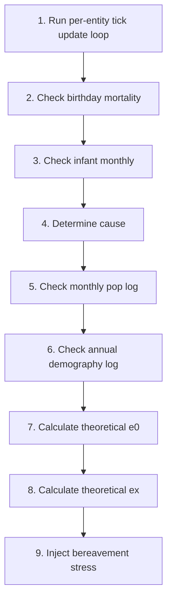

# Mortality

📄 source: `scripts/systems/mortality_system.gd` | Priority: 49 | Tick interval: 1

## Overview

The **Mortality** system implements Siler (1979) bathtub-curve mortality, Siler mortality hazard model to simulate siler(1979) bathtub-curve mortality model.
It runs every **1 ticks** (0.0 game-years) at priority **49**.

**Core entity data**: `age` (read/write (inferred)), `age_stage` (read/write (inferred)), `birth_tick` (read/write (inferred)), `entity_name` (read/write (inferred)), `frailty` (read/write (inferred)), `hunger` (read/write (inferred)), `id` (read/write (inferred))

> Siler(1979) bathtub-curve mortality model.

## Tick Pipeline

1. Run per-entity tick update loop
   📄 source: `scripts/systems/mortality_system.gd:L82`
2. Check birthday mortality
   📄 source: `scripts/systems/mortality_system.gd:L92`
3. Check infant monthly
   📄 source: `scripts/systems/mortality_system.gd:L110`
4. Determine cause
   📄 source: `scripts/systems/mortality_system.gd:L198`
   Math context: μ(x) = a₁·e^{-b₁·x} + a₂ + a₃·e^{b₃·x}
5. Check monthly pop log
   📄 source: `scripts/systems/mortality_system.gd:L213`
6. Check annual demography log
   📄 source: `scripts/systems/mortality_system.gd:L248`
7. Calculate theoretical e0
   📄 source: `scripts/systems/mortality_system.gd:L341`
8. Calculate theoretical ex
   📄 source: `scripts/systems/mortality_system.gd:L345`
   Math context: μ(x) = a₁·e^{-b₁·x} + a₂ + a₃·e^{b₃·x}
9. Inject bereavement stress
   📄 source: `scripts/systems/mortality_system.gd:L378`

### Pipeline Diagram



## Formulas

### Calculates the age-specific mortality hazard rate combining infant decline, constant background risk, and exponential aging.

**Model**: Siler (1979) bathtub-curve mortality (Siler, W. (1979). A Competing-Risk Model for Animal Mortality)

$$
μ(x) = a₁·e^{-b₁·x} + a₂ + a₃·e^{b₃·x}
$$

**Interpretation**: Calculates the age-specific mortality hazard rate combining infant decline, constant background risk, and exponential aging.

**GDScript**:
```gdscript
Siler(1979) bathtub-curve mortality model.
μ(x) = a₁·e^{-b₁·x} + a₂ + a₃·e^{b₃·x}
Birthday-based distributed checks (not every-tick iteration).
Infants (0-1yr) checked monthly for higher resolution.
```

| Variable | Meaning |
| :-- | :-- |
| `bathtub` | bathtub |
| `curve` | curve |
| `mortality` | mortality |
| `model` | model |
| `x` | x |
| `a₁` | infant mortality amplitude (rapid decline after birth) |
| `e` | e |
| `b₁` | infant mortality decline rate |
| `a₂` | age-independent background mortality |
| `a₃` | senescent mortality amplitude (exponential aging) |
| `b₃` | senescent mortality acceleration rate (Gompertz parameter) |
| `based` | based |
| `distributed` | distributed |
| `every` | every |
| `tick` | tick |
| `iteration` | iteration |

📄 source: `scripts/systems/mortality_system.gd:L3`

### Calculates the age-specific mortality hazard rate combining infant decline, constant background risk, and exponential aging.

**Model**: Siler (1979) bathtub-curve mortality (Siler, W. (1979). A Competing-Risk Model for Animal Mortality)

$$
μ(x) = a₁·e^{-b₁·x} + a₂ + a₃·e^{b₃·x}
$$

**Interpretation**: Calculates the age-specific mortality hazard rate combining infant decline, constant background risk, and exponential aging.

**GDScript**:
```gdscript
Siler hazard components
```

| Variable | Meaning |
| :-- | :-- |
| `hazard` | hazard |
| `components` | components |

📄 source: `scripts/systems/mortality_system.gd:L133`

### Calculates the age-specific mortality hazard rate combining infant decline, constant background risk, and exponential aging.

**Model**: Siler (1979) bathtub-curve mortality (Siler, W. (1979). A Competing-Risk Model for Animal Mortality)

$$
μ(x) = a₁·e^{-b₁·x} + a₂ + a₃·e^{b₃·x}
$$

**Interpretation**: Calculates the age-specific mortality hazard rate combining infant decline, constant background risk, and exponential aging.

**GDScript**:
```gdscript
var mu_infant: float = _a1 * exp(-_b1 * age_years)
```

| Variable | Meaning |
| :-- | :-- |
| `mu_infant` | instantaneous hazard rate μ(x) |
| `_a1` | infant mortality amplitude (rapid decline after birth) |
| `_b1` | infant mortality decline rate |
| `age_years` | age-related input |

📄 source: `scripts/systems/mortality_system.gd:L134`

### Calculates the age-specific mortality hazard rate combining infant decline, constant background risk, and exponential aging.

**Model**: Siler (1979) bathtub-curve mortality (Siler, W. (1979). A Competing-Risk Model for Animal Mortality)

$$
μ(x) = a₁·e^{-b₁·x} + a₂ + a₃·e^{b₃·x}
$$

**Interpretation**: Calculates the age-specific mortality hazard rate combining infant decline, constant background risk, and exponential aging.

**GDScript**:
```gdscript
var mu_senescence: float = _a3 * exp(_b3 * age_years)
```

| Variable | Meaning |
| :-- | :-- |
| `mu_senescence` | instantaneous hazard rate μ(x) |
| `_a3` | senescent mortality amplitude (exponential aging) |
| `_b3` | senescent mortality acceleration rate (Gompertz parameter) |
| `age_years` | age-related input |

📄 source: `scripts/systems/mortality_system.gd:L136`

### Calculates the age-specific mortality hazard rate combining infant decline, constant background risk, and exponential aging.

**Model**: Siler (1979) bathtub-curve mortality (Siler, W. (1979). A Competing-Risk Model for Animal Mortality)

$$
μ(x) = a₁·e^{-b₁·x} + a₂ + a₃·e^{b₃·x}
$$

**Interpretation**: Calculates the age-specific mortality hazard rate combining infant decline, constant background risk, and exponential aging.

**GDScript**:
```gdscript
var m1: float = exp(-_tech_k1 * tech_level)
	var m2: float = exp(-_tech_k2 * tech_level)
	var m3: float = exp(-_tech_k3 * tech_level)
```

| Variable | Meaning |
| :-- | :-- |
| `m1` | m1 |
| `_tech_k1` |  tech k1 |
| `tech_level` | tech level |
| `m2` | m2 |
| `_tech_k2` |  tech k2 |
| `m3` | m3 |
| `_tech_k3` |  tech k3 |

📄 source: `scripts/systems/mortality_system.gd:L139`

### Calculates the age-specific mortality hazard rate combining infant decline, constant background risk, and exponential aging.

**Model**: Siler (1979) bathtub-curve mortality (Siler, W. (1979). A Competing-Risk Model for Animal Mortality)

$$
μ(x) = a₁·e^{-b₁·x} + a₂ + a₃·e^{b₃·x}
$$

**Interpretation**: Calculates the age-specific mortality hazard rate combining infant decline, constant background risk, and exponential aging.

**GDScript**:
```gdscript
var nutrition: float = clampf(entity.hunger, 0.0, 1.0)
	m1 *= lerpf(2.0, 0.8, nutrition)
	m2 *= lerpf(1.5, 0.9, nutrition)
```

| Variable | Meaning |
| :-- | :-- |
| `nutrition` | nutrition state input |
| `entity` | entity |
| `hunger` | nutrition state input |
| `m1` | m1 |
| `m2` | m2 |

📄 source: `scripts/systems/mortality_system.gd:L144`

### Calculates the age-specific mortality hazard rate combining infant decline, constant background risk, and exponential aging.

**Model**: Siler (1979) bathtub-curve mortality (Siler, W. (1979). A Competing-Risk Model for Animal Mortality)

$$
μ(x) = a₁·e^{-b₁·x} + a₂ + a₃·e^{b₃·x}
$$

**Interpretation**: Calculates the age-specific mortality hazard rate combining infant decline, constant background risk, and exponential aging.

**GDScript**:
```gdscript
Annual death probability: q = 1 - exp(-μ)
```

| Variable | Meaning |
| :-- | :-- |
| `death` | death |
| `probability` | probability term |
| `q` | q |

📄 source: `scripts/systems/mortality_system.gd:L168`

### Calculates the age-specific mortality hazard rate combining infant decline, constant background risk, and exponential aging.

**Model**: Siler (1979) bathtub-curve mortality (Siler, W. (1979). A Competing-Risk Model for Animal Mortality)

$$
μ(x) = a₁·e^{-b₁·x} + a₂ + a₃·e^{b₃·x}
$$

**Interpretation**: Calculates the age-specific mortality hazard rate combining infant decline, constant background risk, and exponential aging.

**GDScript**:
```gdscript
var q_annual: float = 1.0 - exp(-mu_total)
	q_annual = clampf(q_annual, 0.0, 0.999)
```

| Variable | Meaning |
| :-- | :-- |
| `q_annual` | probability term |
| `mu_total` | instantaneous hazard rate μ(x) |

📄 source: `scripts/systems/mortality_system.gd:L169`

### Calculates the age-specific mortality hazard rate combining infant decline, constant background risk, and exponential aging.

**Model**: Siler (1979) bathtub-curve mortality (Siler, W. (1979). A Competing-Risk Model for Animal Mortality)

$$
μ(x) = a₁·e^{-b₁·x} + a₂ + a₃·e^{b₃·x}
$$

**Interpretation**: Calculates the age-specific mortality hazard rate combining infant decline, constant background risk, and exponential aging.

**GDScript**:
```gdscript
Monthly: q_month = 1 - (1 - q_annual)^(1/12)
```

| Variable | Meaning |
| :-- | :-- |
| `q_month` | probability term |
| `q_annual` | probability term |

📄 source: `scripts/systems/mortality_system.gd:L175`

### Calculates the age-specific mortality hazard rate combining infant decline, constant background risk, and exponential aging.

**Model**: Siler (1979) bathtub-curve mortality (Siler, W. (1979). A Competing-Risk Model for Animal Mortality)

$$
μ(x) = a₁·e^{-b₁·x} + a₂ + a₃·e^{b₃·x}
$$

**Interpretation**: Calculates the age-specific mortality hazard rate combining infant decline, constant background risk, and exponential aging.

**GDScript**:
```gdscript
q_check = 1.0 - pow(1.0 - q_annual, 1.0 / 12.0)
```

| Variable | Meaning |
| :-- | :-- |
| `q_check` | probability term |
| `q_annual` | probability term |

📄 source: `scripts/systems/mortality_system.gd:L176`

### Calculates the age-specific mortality hazard rate combining infant decline, constant background risk, and exponential aging.

**Model**: Siler (1979) bathtub-curve mortality (Siler, W. (1979). A Competing-Risk Model for Animal Mortality)

$$
μ(x) = a₁·e^{-b₁·x} + a₂ + a₃·e^{b₃·x}
$$

**Interpretation**: Calculates the age-specific mortality hazard rate combining infant decline, constant background risk, and exponential aging.

**GDScript**:
```gdscript
var roll: float = _rng.randf() * total
```

| Variable | Meaning |
| :-- | :-- |
| `roll` | roll |
| `_rng` |  rng |
| `total` | total |

📄 source: `scripts/systems/mortality_system.gd:L202`

### Calculates the age-specific mortality hazard rate combining infant decline, constant background risk, and exponential aging.

**Model**: Siler (1979) bathtub-curve mortality (Siler, W. (1979). A Competing-Risk Model for Animal Mortality)

$$
μ(x) = a₁·e^{-b₁·x} + a₂ + a₃·e^{b₃·x}
$$

**Interpretation**: Calculates the age-specific mortality hazard rate combining infant decline, constant background risk, and exponential aging.

**GDScript**:
```gdscript
Theoretical e0 from current Siler parameters
```

| Variable | Meaning |
| :-- | :-- |
| `e0` | e0 |
| `from` | from |
| `current` | current |
| `parameters` | parameters |

📄 source: `scripts/systems/mortality_system.gd:L282`

### Calculates the age-specific mortality hazard rate combining infant decline, constant background risk, and exponential aging.

**Model**: Siler (1979) bathtub-curve mortality (Siler, W. (1979). A Competing-Risk Model for Animal Mortality)

$$
μ(x) = a₁·e^{-b₁·x} + a₂ + a₃·e^{b₃·x}
$$

**Interpretation**: Calculates the age-specific mortality hazard rate combining infant decline, constant background risk, and exponential aging.

**GDScript**:
```gdscript
e(start) = integral from start to 120 of S(x)/S(start) dx
```

| Variable | Meaning |
| :-- | :-- |
| `start` | start |
| `integral` | integral |
| `from` | from |
| `to` | to |
| `of` | of |
| `x` | x |
| `dx` | dx |

📄 source: `scripts/systems/mortality_system.gd:L347`

### Calculates the age-specific mortality hazard rate combining infant decline, constant background risk, and exponential aging.

**Model**: Siler (1979) bathtub-curve mortality (Siler, W. (1979). A Competing-Risk Model for Animal Mortality)

$$
μ(x) = a₁·e^{-b₁·x} + a₂ + a₃·e^{b₃·x}
$$

**Interpretation**: Calculates the age-specific mortality hazard rate combining infant decline, constant background risk, and exponential aging.

**GDScript**:
```gdscript
var m1: float = exp(-_tech_k1 * tech_level)
	var m2: float = exp(-_tech_k2 * tech_level)
	var m3: float = exp(-_tech_k3 * tech_level)
	var dx: float = 0.5  # half-year steps
```

| Variable | Meaning |
| :-- | :-- |
| `m1` | m1 |
| `_tech_k1` |  tech k1 |
| `tech_level` | tech level |
| `m2` | m2 |
| `_tech_k2` |  tech k2 |
| `m3` | m3 |
| `_tech_k3` |  tech k3 |
| `dx` | dx |

📄 source: `scripts/systems/mortality_system.gd:L348`

### Calculates the age-specific mortality hazard rate combining infant decline, constant background risk, and exponential aging.

**Model**: Siler (1979) bathtub-curve mortality (Siler, W. (1979). A Competing-Risk Model for Animal Mortality)

$$
μ(x) = a₁·e^{-b₁·x} + a₂ + a₃·e^{b₃·x}
$$

**Interpretation**: Calculates the age-specific mortality hazard rate combining infant decline, constant background risk, and exponential aging.

**GDScript**:
```gdscript
var mu: float = m1 * _a1 * exp(-_b1 * x) + m2 * _a2 + m3 * _a3 * exp(_b3 * x)
		cum_hazard_start += mu * dx
```

| Variable | Meaning |
| :-- | :-- |
| `mu` | instantaneous hazard rate μ(x) |
| `m1` | m1 |
| `_a1` | infant mortality amplitude (rapid decline after birth) |
| `_b1` | infant mortality decline rate |
| `x` | x |
| `m2` | m2 |
| `_a2` | age-independent background mortality |
| `m3` | m3 |
| `_a3` | senescent mortality amplitude (exponential aging) |
| `_b3` | senescent mortality acceleration rate (Gompertz parameter) |
| `cum_hazard_start` | cum hazard start |
| `dx` | dx |

📄 source: `scripts/systems/mortality_system.gd:L359`

### Calculates the age-specific mortality hazard rate combining infant decline, constant background risk, and exponential aging.

**Model**: Siler (1979) bathtub-curve mortality (Siler, W. (1979). A Competing-Risk Model for Animal Mortality)

$$
μ(x) = a₁·e^{-b₁·x} + a₂ + a₃·e^{b₃·x}
$$

**Interpretation**: Calculates the age-specific mortality hazard rate combining infant decline, constant background risk, and exponential aging.

**GDScript**:
```gdscript
var mu: float = m1 * _a1 * exp(-_b1 * x) + m2 * _a2 + m3 * _a3 * exp(_b3 * x)
		var s_rel: float = exp(-cum_hazard)  # S(x)/S(start)
		integral += s_rel * dx
		cum_hazard += mu * dx
```

| Variable | Meaning |
| :-- | :-- |
| `mu` | instantaneous hazard rate μ(x) |
| `m1` | m1 |
| `_a1` | infant mortality amplitude (rapid decline after birth) |
| `_b1` | infant mortality decline rate |
| `x` | x |
| `m2` | m2 |
| `_a2` | age-independent background mortality |
| `m3` | m3 |
| `_a3` | senescent mortality amplitude (exponential aging) |
| `_b3` | senescent mortality acceleration rate (Gompertz parameter) |
| `s_rel` | s rel |
| `cum_hazard` | cum hazard |
| `integral` | integral |
| `dx` | dx |

📄 source: `scripts/systems/mortality_system.gd:L367`

### Calculates the age-specific mortality hazard rate combining infant decline, constant background risk, and exponential aging.

**Model**: Siler (1979) bathtub-curve mortality (Siler, W. (1979). A Competing-Risk Model for Animal Mortality)

$$
μ(x) = a₁·e^{-b₁·x} + a₂ + a₃·e^{b₃·x}
$$

**Interpretation**: Calculates the age-specific mortality hazard rate combining infant decline, constant background risk, and exponential aging.

**GDScript**:
```gdscript
COR (Hobfoll 1989): loss events use is_loss=true -> x2.5 multiplier.
```

| Variable | Meaning |
| :-- | :-- |
| `loss` | loss |
| `events` | events |
| `use` | use |
| `is_loss` | is loss |
| `x2` | x2 |
| `multiplier` | instantaneous hazard rate μ(x) |

📄 source: `scripts/systems/mortality_system.gd:L377`

## Config Reference

| Constant | Default | Controls | Behavior Effect |
| :-- | :-- | :-- | :-- |
| `get_age_years` | (not found) | Behavior tuning constant. | Adjusts baseline system behavior under this module. |

## Cross-System Effects

### Imported Modules

- `scripts/core/game_calendar.gd` via `preload` at `scripts/systems/mortality_system.gd:L8`

### Shared Entity Fields

| Field | Access | Shared With |
| :-- | :-- | :-- |
| `age` | read/write (inferred) | [`aging`](aging.md), [`family`](family.md), [`needs`](needs.md) |
| `age_stage` | read/write (inferred) | [`behavior`](behavior.md), [`aging`](aging.md), [`childcare`](childcare.md), [`construction`](construction.md), [`family`](family.md), [`gathering`](gathering.md), [`job_assignment`](job_assignment.md), [`movement`](movement.md), [`needs`](needs.md) |
| `birth_tick` | read/write (inferred) | [`needs`](needs.md) |
| `entity_name` | read/write (inferred) | [`behavior`](behavior.md), [`aging`](aging.md), [`chronicle`](chronicle.md), [`emotions`](emotions.md), [`family`](family.md), [`gathering`](gathering.md), [`job_assignment`](job_assignment.md), [`mental_break`](mental_break.md), [`movement`](movement.md), [`needs`](needs.md), [`population`](population.md), [`stress`](stress.md) |
| `hunger` | read/write (inferred) | [`behavior`](behavior.md), [`childcare`](childcare.md), [`family`](family.md), [`mental_break`](mental_break.md), [`movement`](movement.md), [`needs`](needs.md), [`stress`](stress.md) |
| `id` | read/write (inferred) | [`behavior`](behavior.md), [`aging`](aging.md), [`emotions`](emotions.md), [`family`](family.md), [`gathering`](gathering.md), [`job_assignment`](job_assignment.md), [`migration`](migration.md), [`movement`](movement.md), [`needs`](needs.md), [`population`](population.md), [`social_events`](social_events.md) |

### Signals

No signal metadata extracted

### Downstream Impact

- No downstream dependencies extracted

## Entity Data Model

| Field | Access | Type | Represents | Typical Values |
| :-- | :-- | :-- | :-- | :-- |
| `age` | read/write (inferred) | int | Lifecycle progression used for stage-specific behavior and events. | Non-negative tick counts. |
| `age_stage` | read/write (inferred) | String enum | Lifecycle progression used for stage-specific behavior and events. | Named categorical states. |
| `birth_tick` | read/write (inferred) | Variant | Birth tick. | System-defined value domain. |
| `entity_name` | read/write (inferred) | Variant | Entity name. | System-defined value domain. |
| `frailty` | read/write (inferred) | Variant | Frailty. | System-defined value domain. |
| `hunger` | read/write (inferred) | float | Nutritional deprivation level driving survival and action priorities. | Normalized scalar (commonly 0.0-1.0 or 0-100 by system). |
| `id` | read/write (inferred) | int | Stable entity identity used for referencing across systems. | Positive integer identifiers. |
