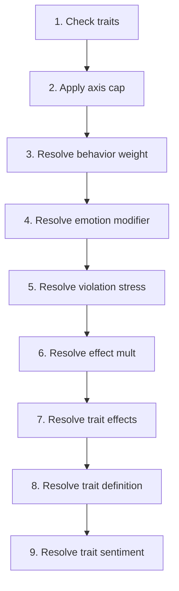

# Trait

📄 source: `scripts/systems/trait_system.gd` | Priority: 100 | Tick interval: n/a

## Overview

The **Trait** system implements a domain-specific simulation model to simulate discrete trait emergence and effects system.
It runs **at an unspecified cadence** at priority **100**.

**Core entity data**: `active_traits` (read/write (inferred)), `display_traits` (read/write (inferred)), `emotion_data` (read/write (inferred)), `emotions` (read/write (inferred)), `personality` (read/write (inferred)), `traits_dirty` (read/write (inferred))

> Discrete trait emergence and effects system.

## Tick Pipeline

1. Check traits
   📄 source: `scripts/systems/trait_system.gd:L51`
2. Apply axis cap
   📄 source: `scripts/systems/trait_system.gd:L124`
3. Resolve behavior weight
   📄 source: `scripts/systems/trait_system.gd:L223`
4. Resolve emotion modifier
   📄 source: `scripts/systems/trait_system.gd:L235`
5. Resolve violation stress
   📄 source: `scripts/systems/trait_system.gd:L247`
6. Resolve effect mult
   📄 source: `scripts/systems/trait_system.gd:L260`
7. Resolve trait effects
   📄 source: `scripts/systems/trait_system.gd:L284`
8. Resolve trait definition
   📄 source: `scripts/systems/trait_system.gd:L306`
9. Resolve trait sentiment
   📄 source: `scripts/systems/trait_system.gd:L312`

### Pipeline Diagram

## Formulas

No extracted formulas for this module.

## Config Reference

No GameConfig references extracted

## Cross-System Effects

### Imported Modules

- [`trait`](trait.md) via `preload` at `scripts/systems/trait_system.gd:L4`

### Shared Entity Fields

| Field | Access | Shared With |
| :-- | :-- | :-- |
| `active_traits` | read/write (inferred) | [`stress`](stress.md) |
| `emotion_data` | read/write (inferred) | [`behavior`](behavior.md), [`emotions`](emotions.md), [`family`](family.md), [`mental_break`](mental_break.md), [`stress`](stress.md) |
| `emotions` | read/write (inferred) | [`behavior`](behavior.md), [`emotions`](emotions.md), [`family`](family.md) |
| `personality` | read/write (inferred) | [`aging`](aging.md), [`emotions`](emotions.md), [`mental_break`](mental_break.md), [`stress`](stress.md) |

### Signals

No signal metadata extracted

### Downstream Impact

- [`personality_generator`](personality_generator.md) depends on this system's outputs.
- [`personality_maturation`](personality_maturation.md) depends on this system's outputs.
- [`trait`](trait.md) depends on this system's outputs.

## Entity Data Model

| Field | Access | Type | Represents | Typical Values |
| :-- | :-- | :-- | :-- | :-- |
| `active_traits` | read/write (inferred) | Variant | Trait/axis profile used for sensitivity and decision weighting. | System-defined value domain. |
| `display_traits` | read/write (inferred) | Variant | Trait/axis profile used for sensitivity and decision weighting. | System-defined value domain. |
| `emotion_data` | read/write (inferred) | Dictionary / custom data object | Affective state used for behavior modulation and social propagation. | Structured object with nested metrics/axes. |
| `emotions` | read/write (inferred) | Dictionary / custom data object | Affective state used for behavior modulation and social propagation. | System-defined value domain. |
| `personality` | read/write (inferred) | Dictionary / custom data object | Trait/axis profile used for sensitivity and decision weighting. | Structured object with nested metrics/axes. |
| `traits_dirty` | read/write (inferred) | Variant | Trait/axis profile used for sensitivity and decision weighting. | System-defined value domain. |
