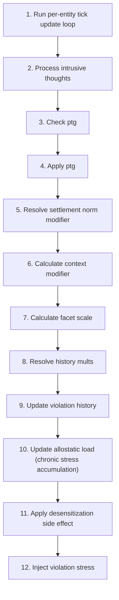

# Trait Violation

📄 source: `scripts/systems/trait_violation_system.gd` | Priority: 37 | Tick interval: 1

## Overview (개요)

The **Trait Violation** system implements Standard exponential decay, McEwen (1998) allostatic load model, Allostatic load model to simulate scripts/systems/trait_violation_system.gd Phase 3B — CK3식 Trait 반대행동 시스템 설계 근거: Cognitive Dissonance Theory (Festinger, 1957) 게임 레퍼런스: CK3 Stress System, RimWorld Thought System, DF Value Belief System 작성일: 2026-02-18 학술 근거: - Festinger (1957): Cognitive Dissonance - Bandura (1999): Moral Disengagement - McEwen (1998): Allostatic Load (탈감작/PTSD 분기 조건) - Post (1992): Kindling Theory - Tedeschi & Calhoun (1996): PTG - DSM-5: Intrusive Thoughts / PTSD re-experiencing - Weiner (1985): Attribution Theory (context modifier) - Tangney et al.
It runs every **1 ticks** (0.0 game-years) at priority **37**.

**Core entity data**: `active_traits` (read/write (inferred)), `emotions` (read/write (inferred)), `entity_name` (read), `has` (read), `has_method` (read/write (inferred)), `id` (read), `is_alive` (read/write (inferred)), `personality` (read/write (inferred)), `trauma_scars` (read), `violation_history` (read)

> scripts/systems/trait_violation_system.gd Phase 3B — CK3식 Trait 반대행동 시스템 설계 근거: Cognitive Dissonance Theory (Festinger, 1957) 게임 레퍼런스: CK3 Stress System, RimWorld Thought System, DF Value Belief System 작성일: 2026-02-18 학술 근거: - Festinger (1957): Cognitive Dissonance - Bandura (1999): Moral Disengagement - McEwen (1998): Allostatic Load (탈감작/PTSD 분기 조건) - Post (1992): Kindling Theory - Tedeschi & Calhoun (1996): PTG - DSM-5: Intrusive Thoughts / PTSD re-experiencing - Weiner (1985): Attribution Theory (context modifier) - Tangney et al.

## Tick Pipeline (틱 파이프라인)

1. Run per-entity tick update loop
   📄 source: `scripts/systems/trait_violation_system.gd:L251`
2. Process intrusive thoughts
   📄 source: `scripts/systems/trait_violation_system.gd:L269`
   Math context: x(t) = x₀·e^{-λt}, Transforms personality traits into downstream modulation coefficients.
3. Check ptg
   📄 source: `scripts/systems/trait_violation_system.gd:L347`
4. Apply ptg
   📄 source: `scripts/systems/trait_violation_system.gd:L382`
   Math context: Transforms personality traits into downstream modulation coefficients.
5. Resolve settlement norm modifier
   📄 source: `scripts/systems/trait_violation_system.gd:L409`
6. Calculate context modifier
   📄 source: `scripts/systems/trait_violation_system.gd:L417`
7. Calculate facet scale
   📄 source: `scripts/systems/trait_violation_system.gd:L445`
   Math context: Transforms personality traits into downstream modulation coefficients.
8. Resolve history mults
   📄 source: `scripts/systems/trait_violation_system.gd:L467`
9. Update violation history
   📄 source: `scripts/systems/trait_violation_system.gd:L479`
10. Update allostatic load (chronic stress accumulation)
   📄 source: `scripts/systems/trait_violation_system.gd:L516`
   Math context: load(t+1) = clamp(load(t) + chronic_stress - recovery), allostatic accumulation model
11. Apply desensitization side effect
   📄 source: `scripts/systems/trait_violation_system.gd:L525`
12. Inject violation stress
   📄 source: `scripts/systems/trait_violation_system.gd:L533`

### Pipeline Diagram (파이프라인 다이어그램)



## Formulas (수식)

### Transforms personality traits into downstream modulation coefficients.

$$
365일 × 12 tick/day)
$$

**Interpretation**: Transforms personality traits into downstream modulation coefficients.

**GDScript**:
```gdscript
violation_history 감쇠 시작 tick 수 (1년 = 365일 × 12 tick/day)
```

| Variable | Meaning |
| :-- | :-- |
| `violation_history` | violation history |
| `tick` | tick |
| `day` | day |

📄 source: `scripts/systems/trait_violation_system.gd:L37`

### Transforms personality traits into downstream modulation coefficients.

$$
base_stress  \cdot  facet_scale  \cdot  desensitize_mult  \cdot  ptsd_mult
$$

**Interpretation**: Transforms personality traits into downstream modulation coefficients.

**GDScript**:
```gdscript
var stress: float = base_stress * facet_scale * desensitize_mult * ptsd_mult
		stress *= ctx_mult * witness_mult * victim_mult
```

| Variable | Meaning |
| :-- | :-- |
| `stress` | stress |
| `base_stress` | base stress |
| `facet_scale` | facet scale |
| `desensitize_mult` | desensitize mult |
| `ptsd_mult` | ptsd mult |
| `ctx_mult` | ctx mult |
| `witness_mult` | witness mult |
| `victim_mult` | victim mult |

📄 source: `scripts/systems/trait_violation_system.gd:L213`

### Applies time-based exponential decay using half-life or decay-rate parameters.

**Model**: Standard exponential decay (Standard first-order decay dynamics)

$$
x(t) = x₀·e^{-λt}
$$

**Interpretation**: Applies time-based exponential decay using half-life or decay-rate parameters.

**GDScript**:
```gdscript
var decay_factor: float = exp(-float(ticks_since) / float(VIOLATION_HISTORY_DECAY_TICKS))
		var chance: float = INTRUSIVE_BASE_CHANCE * (ptsd_mult - 1.0) * decay_factor
```

| Variable | Meaning |
| :-- | :-- |
| `decay_factor` | decay factor |
| `ticks_since` | ticks since |
| `chance` | chance |
| `ptsd_mult` | ptsd mult |

📄 source: `scripts/systems/trait_violation_system.gd:L283`

### Transforms personality traits into downstream modulation coefficients.

$$
15.0 + _rng.randf()  \cdot  25.0  # 15~40
$$

**Interpretation**: Transforms personality traits into downstream modulation coefficients.

**GDScript**:
```gdscript
var stress_amount: float = 15.0 + _rng.randf() * 25.0  # 15~40
```

| Variable | Meaning |
| :-- | :-- |
| `stress_amount` | stress amount |
| `_rng` |  rng |

📄 source: `scripts/systems/trait_violation_system.gd:L291`

### Applies decay dynamics to attenuate accumulated state over time.

**Interpretation**: Applies decay dynamics to attenuate accumulated state over time.

**GDScript**:
```gdscript
record["desensitize_mult"] = lerpf(dm, 1.0, 0.001)
```

| Variable | Meaning |
| :-- | :-- |
| `record` | record |
| `dm` | dm |

📄 source: `scripts/systems/trait_violation_system.gd:L330`

### Applies decay dynamics to attenuate accumulated state over time.

**Interpretation**: Applies decay dynamics to attenuate accumulated state over time.

**GDScript**:
```gdscript
record["ptsd_mult"] = lerpf(pm, 1.0, 0.001)
```

| Variable | Meaning |
| :-- | :-- |
| `record` | record |
| `pm` | pm |

📄 source: `scripts/systems/trait_violation_system.gd:L334`

### Transforms personality traits into downstream modulation coefficients.

$$
0.0~1.0 (0=금기, 1=허용) → modifier = 1.0 + (0.5 - norm)
$$

**Interpretation**: Transforms personality traits into downstream modulation coefficients.

**GDScript**:
```gdscript
norm = 0.0~1.0 (0=금기, 1=허용) → modifier = 1.0 + (0.5 - norm)
```

| Variable | Meaning |
| :-- | :-- |
| `norm` | norm |
| `modifier` | modifier |

📄 source: `scripts/systems/trait_violation_system.gd:L408`

### Transforms personality traits into downstream modulation coefficients.

$$
return (facet_val - threshold) / (1.0 - threshold)
$$

**Interpretation**: Transforms personality traits into downstream modulation coefficients.

**GDScript**:
```gdscript
return (facet_val - threshold) / (1.0 - threshold)
```

| Variable | Meaning |
| :-- | :-- |
| `facet_val` | facet val |
| `threshold` | threshold |

📄 source: `scripts/systems/trait_violation_system.gd:L463`

### Accumulates chronic stress burden over time and models recovery-driven load reduction.

**Model**: McEwen (1998) allostatic load model (McEwen, B. S. (1998). Protective and Damaging Effects of Stress Mediators)

$$
load(t+1) = clamp(load(t) + chronic_stress - recovery)
$$

**Interpretation**: Accumulates chronic stress burden over time and models recovery-driven load reduction.

**GDScript**:
```gdscript
return clampf(float(entity.emotions.get("stress", 0.0)), 0.0, 1.0)
```

| Variable | Meaning |
| :-- | :-- |
| `entity` | entity |
| `emotions` | emotions |

📄 source: `scripts/systems/trait_violation_system.gd:L520`

## Configuration Reference (설정)

No explicit `GameConfig` references extracted.

## Cross-System Effects (시스템 간 상호작용)

### Imported Modules (모듈 임포트)

No import relationships extracted for this module.

### Shared Entity Fields (공유 엔티티 필드)

| Field | Access | Shared With |
| :-- | :-- | :-- |
| `active_traits` | read/write (inferred) | [`stress`](stress.md), [`trait`](trait.md) |
| `emotions` | read/write (inferred) | [`behavior`](behavior.md), [`emotions`](emotions.md), [`family`](family.md), [`trait`](trait.md), [`trauma_scar`](trauma_scar.md) |
| `entity_name` | read | [`behavior`](behavior.md), [`aging`](aging.md), [`chronicle`](chronicle.md), [`emotions`](emotions.md), [`family`](family.md), [`gathering`](gathering.md), [`job_assignment`](job_assignment.md), [`mental_break`](mental_break.md), [`mortality`](mortality.md), [`movement`](movement.md), [`needs`](needs.md), [`population`](population.md), [`stress`](stress.md), [`trauma_scar`](trauma_scar.md) |
| `id` | read | [`behavior`](behavior.md), [`aging`](aging.md), [`emotions`](emotions.md), [`family`](family.md), [`gathering`](gathering.md), [`job_assignment`](job_assignment.md), [`migration`](migration.md), [`mortality`](mortality.md), [`movement`](movement.md), [`needs`](needs.md), [`population`](population.md), [`social_events`](social_events.md), [`trauma_scar`](trauma_scar.md) |
| `is_alive` | read/write (inferred) | [`chronicle`](chronicle.md), [`family`](family.md), [`trauma_scar`](trauma_scar.md) |
| `personality` | read/write (inferred) | [`aging`](aging.md), [`emotions`](emotions.md), [`mental_break`](mental_break.md), [`stress`](stress.md), [`trait`](trait.md) |
| `trauma_scars` | read | [`trauma_scar`](trauma_scar.md) |

Reads shared fields: `entity_name`, `id`, `trauma_scars`

### Signals (시그널)

No emitted signals extracted for this module.

### Downstream Impact (다운스트림 영향)

- No explicit downstream dependencies extracted.

## Entity Data Model (엔티티 데이터 모델)

| Field | Access | Type | Represents | Typical Values |
| :-- | :-- | :-- | :-- | :-- |
| `active_traits` | read/write (inferred) | Variant | Trait/axis profile used for sensitivity and decision weighting. | System-defined value domain. |
| `emotions` | read/write (inferred) | Dictionary / custom data object | Affective state used for behavior modulation and social propagation. | System-defined value domain. |
| `entity_name` | read | Variant | Entity name. | System-defined value domain. |
| `has` | read | Variant | Has. | System-defined value domain. |
| `has_method` | read/write (inferred) | bool | Has method. | System-defined value domain. |
| `id` | read | int | Stable entity identity used for referencing across systems. | Positive integer identifiers. |
| `is_alive` | read/write (inferred) | bool | Is alive. | System-defined value domain. |
| `personality` | read/write (inferred) | Dictionary / custom data object | Trait/axis profile used for sensitivity and decision weighting. | Structured object with nested metrics/axes. |
| `trauma_scars` | read | Variant | Trauma scars. | System-defined value domain. |
| `violation_history` | read | Array | Violation history. | System-defined value domain. |
