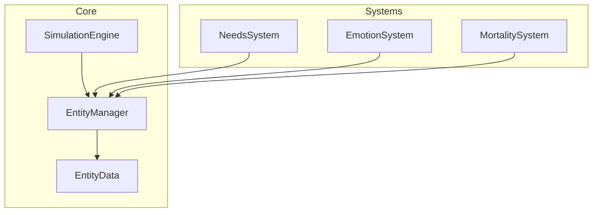

# WorldSim Documentation

자동 생성된 WorldSim 게임 시뮬레이션 시스템 문서입니다.

## 프로젝트 통계

| 항목 | 수량 |
|------|------|
| 시스템 (Systems) | 23 |
| 코어 모듈 (Core) | 27 |
| AI 모듈 | 1 |
| 데이터 파일 (Data) | 20 |
| 로케일 파일 (Locale) | 16 |
| 로케일 키 (Keys) | 1,465 |
| GDScript 라인 | 9,831 |

> 📅 Generated: 2026-02-18 | Source commit: `9e58d30fdaed`

## 주요 섹션

- **[시스템](systems/)** — 시뮬레이션 시스템 문서 (우선순위 순)
- **[설정 레퍼런스](config-reference.md)** — GameConfig 전체 상수
- **[데이터](data/)** — JSON 데이터 파일 분석
- **[시스템 상호작용](interactions/)** — 시스템 간 의존성 및 상호작용
- **[용어 사전](glossary/)** — 한영 대조 게임 용어
- **[코어](core/)** — 코어 모듈 레퍼런스

## 시뮬레이션 아키텍처

