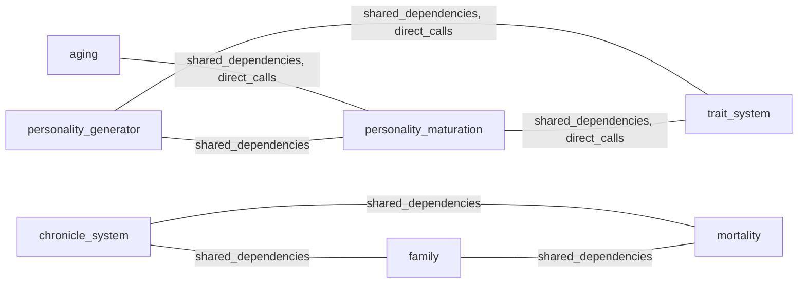

# System Interaction Index

Generated 7 interaction link(s) total, with 3 significant pair page(s) (2+ types).

## Master Dependency Graph

## Interaction Strength Table
| Pair | Strength | Types |
|------|----------|-------|
| `aging ↔ personality_maturation` | 2 | shared_dependencies, direct_calls |
| `personality_generator ↔ trait_system` | 2 | shared_dependencies, direct_calls |
| `personality_maturation ↔ trait_system` | 2 | shared_dependencies, direct_calls |
| `chronicle_system ↔ family` | 1 | shared_dependencies |
| `chronicle_system ↔ mortality` | 1 | shared_dependencies |
| `family ↔ mortality` | 1 | shared_dependencies |
| `personality_generator ↔ personality_maturation` | 1 | shared_dependencies |

## Manual Notes
<!-- MANUAL:START -->
<!-- MANUAL:END -->
