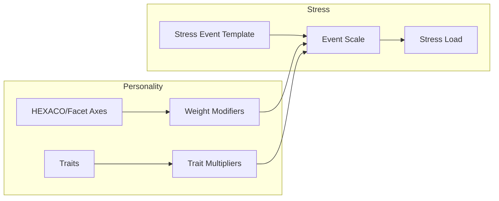

# Personality -> Stress

한국어 / English: 계산 파이프라인 중심 상호작용 문서 / Calculation-pipeline interaction documentation.

## Interaction Overview
Stress templates are personality-conditioned through axis/facet weights and trait multipliers before event load is accumulated.

## Personality -> Stress System
### How Personality Affects Stress
1. **Modifier Weights**: each stress event applies axis/facet weights using `high_amplifies` / `low_amplifies` directions.
   - Formula pattern: `scale *= (1 + weight * z)` or `scale *= (1 + weight * (1 - z))`.
2. **Trait Multipliers**: event templates apply per-trait multipliers to amplify/suppress stress gain.
   - Example: resilient/callous traits reduce loss-event impact while caregiver/sentimental traits amplify it.
3. **Event Load Seeding**: each event contributes base instant and per-tick stress components.
4. **Loss Amplification**: loss-tagged events apply stronger weighting in stress integration.

### Data Flow: Personality -> Stress
| Data Field | Source | Destination | Formula | Purpose |
|---|---|---|---|---|
| `partner_death.E_modifier` | `stressor_events.partner_death.personality_modifiers` | `stress_system.event_scale` | `1 + 0.4 * z_E` | Apply high_amplifies personality amplification |
| `maternal_death_partner.E_modifier` | `stressor_events.maternal_death_partner.personality_modifiers` | `stress_system.event_scale` | `1 + 0.35 * z_E` | Apply high_amplifies personality amplification |
| `child_death.E_modifier` | `stressor_events.child_death.personality_modifiers` | `stress_system.event_scale` | `1 + 0.25 * z_E` | Apply high_amplifies personality amplification |
| `stillborn.E_modifier` | `stressor_events.stillborn.personality_modifiers` | `stress_system.event_scale` | `1 + 0.25 * z_E` | Apply high_amplifies personality amplification |
| `acquaintance_death.d_psychopath_primary` | `stressor_events.acquaintance_death.personality_modifiers.traits` | `stress_system.event_scale` | `scale * 0.1` | Trait-specific multiplier on stress event impact |
| `child_death.d_psychopath_primary` | `stressor_events.child_death.personality_modifiers.traits` | `stress_system.event_scale` | `scale * 0.1` | Trait-specific multiplier on stress event impact |
| `maternal_death_partner.d_psychopath_primary` | `stressor_events.maternal_death_partner.personality_modifiers.traits` | `stress_system.event_scale` | `scale * 0.15` | Trait-specific multiplier on stress event impact |
| `parent_death.d_psychopath_primary` | `stressor_events.parent_death.personality_modifiers.traits` | `stress_system.event_scale` | `scale * 0.15` | Trait-specific multiplier on stress event impact |
| `child_death.base_load` | `stressor_events.child_death` | `stress_system.trace_builder` | `instant=550, per_tick=12` | Seed stress trace magnitude from event template |

## Calculation Flow Diagram

## Feedback Loops
- Personality-conditioned stress scaling is event-specific; highest-severity extracted sample is `child_death`.

## Source References
- 📄 source: `scripts/systems/personality_generator.gd:L5`
- 📄 source: `scripts/systems/personality_generator.gd:L7`
- 📄 source: `scripts/systems/personality_generator.gd:L8`
- 📄 source: `scripts/systems/personality_generator.gd:L142`
- 📄 source: `scripts/systems/personality_maturation.gd:L6`
- 📄 source: `scripts/systems/personality_maturation.gd:L8`
- 📄 source: `scripts/systems/personality_maturation.gd:L9`
- 📄 source: `scripts/systems/personality_maturation.gd:L57`
- 📄 source: `scripts/core/emotion_data.gd:L3`
- 📄 source: `scripts/core/emotion_data.gd:L37`
- 📄 source: `scripts/core/emotion_data.gd:L237`
- 📄 source: `scripts/core/emotion_data.gd:L253`
- 📄 source: `scripts/core/emotion_data.gd:L353`
- 📄 source: `scripts/core/entity_data.gd:L50`
- 📄 source: `scripts/core/entity_data.gd:L233`
- 📄 source: `scripts/core/personality_data.gd:L62`

## Manual Notes
<!-- MANUAL:START -->
<!-- MANUAL:END -->
