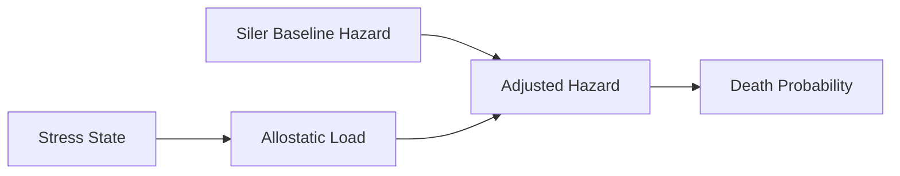

# Stress -> Mortality

한국어 / English: 계산 파이프라인 중심 상호작용 문서 / Calculation-pipeline interaction documentation.

## Interaction Overview
Stress-derived allostatic load scales mortality hazard before death probability checks.

## Stress -> Mortality System
### How Stress Changes Mortality Risk
1. **Baseline Hazard**: mortality starts from the Siler hazard curve by age.
2. **Allostatic Amplification**: chronic stress increases hazard via `mu * (1 + alpha * allostatic/100)`.
3. **Probability Conversion**: adjusted hazard converts to death probability with `q = 1 - exp(-mu)`.
4. **Event Emission**: death outcomes trigger cross-system aftermath processing.

### Data Flow: Stress -> Mortality
| Data Field | Source | Destination | Formula | Purpose |
|---|---|---|---|---|
| `allostatic_load` | `stress_system.entity_state.allostatic` | `mortality_system.hazard_adjustment` | `mu_adj = mu_base * (1 + alpha * allostatic/100)` | Amplify baseline hazard by chronic stress burden |
| `siler_baseline` | `mortality.siler_parameters.baseline` | `mortality_system.mu_base(age)` | `0.6*exp(-1.3*x) + 0.01 + 6e-05*exp(0.09*x)` | Compute age-dependent baseline mortality hazard |
| `annual_death_probability` | `mortality_system.mu_adj` | `mortality_system.death_roll` | `q = 1 - exp(-mu_adj)` | Convert adjusted hazard into death probability |

## Calculation Flow Diagram

## Feedback Loops
- Death events can create bereavement stressors in survivors, forming a mortality-stress feedback channel.

## Source References
- 📄 source: `scripts/systems/mortality_system.gd:L8`
- 📄 source: `scripts/systems/mortality_system.gd:L131`
- 📄 source: `scripts/systems/mortality_system.gd:L290`
- 📄 source: `scripts/core/emotion_data.gd:L37`
- 📄 source: `scripts/core/species_manager.gd:L29`
- 📄 source: `scripts/systems/mental_break_system.gd:L99`
- 📄 source: `scripts/systems/mortality_system.gd:L3`
- 📄 source: `scripts/systems/mortality_system.gd:L133`
- 📄 source: `scripts/systems/mortality_system.gd:L134`
- 📄 source: `scripts/systems/mortality_system.gd:L136`
- 📄 source: `scripts/systems/mortality_system.gd:L139`
- 📄 source: `scripts/systems/mortality_system.gd:L144`
- 📄 source: `scripts/systems/mortality_system.gd:L168`

## Manual Notes
<!-- MANUAL:START -->
<!-- MANUAL:END -->
