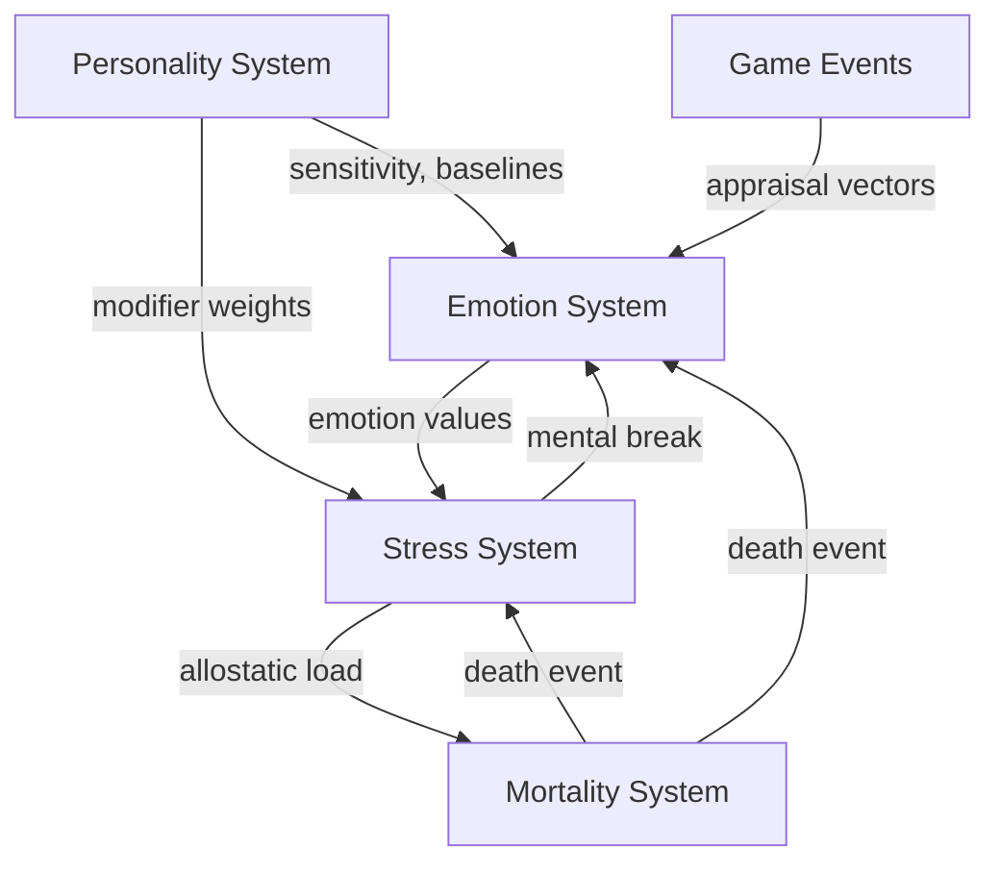

# System Interaction Index

한국어 / English: 시스템 계산 의존 그래프 / System calculation dependency graph.

Generated 7 calculation-pipeline interaction pages.

## 시스템 의존 그래프

## 상호작용 페이지
| Interaction Pair | Output Page |
|---|---|
| `Personality → Emotion` | [personality-emotion.md](personality-emotion.md) |
| `Personality → Stress` | [personality-stress.md](personality-stress.md) |
| `Emotion → Stress` | [emotion-stress.md](emotion-stress.md) |
| `Stress → Mortality` | [stress-mortality.md](stress-mortality.md) |
| `Personality → Mortality` | [personality-mortality.md](personality-mortality.md) |
| `Events → Emotion` | [events-emotion.md](events-emotion.md) |
| `Stress → Emotion` | [stress-emotion.md](stress-emotion.md) |

## 피드백 루프
- stress -> mental break -> emotion inject -> more stress
- death event -> bereavement stressor -> stress -> allostatic load -> mortality

## 수동 노트
<!-- MANUAL:START -->
<!-- MANUAL:END -->
