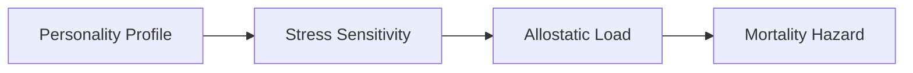

# Personality -> Mortality

한국어 / English: 계산 파이프라인 중심 상호작용 문서 / Calculation-pipeline interaction documentation.

## 상호작용 개요
Personality influences mortality indirectly through stress sensitivity and allostatic load buildup.

## Personality -> Mortality System (Indirect)
### How Personality Reaches Mortality
1. **Personality -> Stress**: personality axes/traits alter stress event scaling.
2. **Stress Integration**: repeated stress raises allostatic load over time.
3. **Mortality Amplification**: allostatic load scales hazard with the stress coupling term.
4. **Chain Formula**: `personality -> stress -> allostatic -> mortality`.

### Data Flow: Personality -> Mortality (via Stress)
| Data Field | Source | Destination | Formula | Purpose |
|---|---|---|---|---|
| `personality_modifiers` | `stressor_events.*.personality_modifiers` | `stress_system.event_scale` | `scale *= f(axis, facet, trait)` | Convert personality profile into stress sensitivity |
| `chronic_stress` | `stress_system.event_scale accumulation` | `stress_system.allostatic` | `allostatic(t+1)=clamp(allostatic+inc-recovery)` | Accumulate long-term physiological wear |
| `allostatic_to_hazard` | `stress_system.allostatic` | `mortality_system.hazard` | `mu_adj = mu_base * (1 + alpha * allostatic/100)` | Indirectly map personality to mortality risk |

## 계산 흐름 다이어그램

## 피드백 루프
- This path is indirect: personality has no direct mortality equation, but continuously shifts upstream stress dynamics.

## 소스 노트
- 📄 source: `scripts/systems/mortality_system.gd:L8`
- 📄 source: `scripts/systems/mortality_system.gd:L131`
- 📄 source: `scripts/systems/mortality_system.gd:L290`
- 📄 source: `scripts/systems/personality_generator.gd:L5`
- 📄 source: `scripts/systems/personality_generator.gd:L7`
- 📄 source: `scripts/systems/personality_generator.gd:L8`
- 📄 source: `scripts/systems/personality_generator.gd:L142`
- 📄 source: `scripts/systems/personality_maturation.gd:L6`
- 📄 source: `scripts/systems/personality_maturation.gd:L8`
- 📄 source: `scripts/systems/personality_maturation.gd:L9`
- 📄 source: `scripts/systems/personality_maturation.gd:L57`
- 📄 source: `scripts/core/emotion_data.gd:L3`
- 📄 source: `scripts/core/emotion_data.gd:L37`
- 📄 source: `scripts/core/emotion_data.gd:L237`
- 📄 source: `scripts/core/emotion_data.gd:L253`
- 📄 source: `scripts/core/emotion_data.gd:L353`

## 수동 노트
<!-- MANUAL:START -->
<!-- MANUAL:END -->
