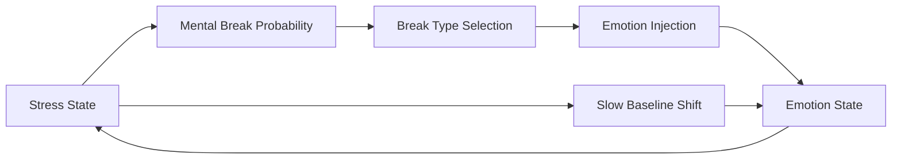

# Stress -> Emotion

한국어 / English: 계산 파이프라인 중심 상호작용 문서 / Calculation-pipeline interaction documentation.

## 상호작용 개요
Stress can trigger mental-break behavior and inject new emotion impulses, creating recursive feedback.

## Stress -> Emotion System
### How Stress Feeds Back Into Emotion
1. **Mental Break Trigger**: break probability follows `p(break) = tick_prob / (1 + exp(-(stress - threshold) / beta))`.
2. **Behavior Routing**: sampled break behavior drives emotion/event injection pathways.
3. **Baseline Shift**: sustained stress/allostatic load shifts slow emotional targets.
4. **Loop Closure**: injected emotions feed back into stress contribution equations.

### Data Flow: Stress -> Emotion
| Data Field | Source | Destination | Formula | Purpose |
|---|---|---|---|---|
| `stress` | `stress_system.entity_state.stress` | `mental_break_trigger` | `p(break) = tick_prob / (1 + exp(-(stress - threshold) / beta))` | Compute per-tick mental break probability |
| `break_type` | `mental_break_trigger.sample_behavior` | `emotion_system.break_event` | `emit stress-driven emotion event` | Inject acute emotion impulse after break onset |
| `allostatic_ratio` | `stress_system.entity_state.allostatic/100` | `emotion_system.slow_layer_shift` | `mu_shift = f(stress, allostatic)` | Shift slow emotion baselines under chronic stress |
| `post_break_emotions` | `emotion_system.fast/slow channels` | `stress_system._calc_emotion_contribution()` | `gamma_VA * sum(w_e * emotion_e)` | Close stress-emotion feedback loop |

## 계산 흐름 다이어그램

## 피드백 루프
- Extracted mental-break behavior templates available: 5.
- Core loop: stress -> mental break -> emotion inject -> stress.

## 소스 노트
- 📄 source: `scripts/systems/emotion_system.gd:L10`
- 📄 source: `scripts/core/emotion_data.gd:L3`
- 📄 source: `scripts/core/emotion_data.gd:L11`
- 📄 source: `scripts/core/emotion_data.gd:L19`
- 📄 source: `scripts/core/emotion_data.gd:L37`
- 📄 source: `scripts/core/emotion_data.gd:L48`
- 📄 source: `scripts/core/emotion_data.gd:L155`
- 📄 source: `scripts/core/emotion_data.gd:L160`
- 📄 source: `scripts/core/emotion_data.gd:L195`
- 📄 source: `scripts/core/emotion_data.gd:L203`
- 📄 source: `scripts/core/emotion_data.gd:L211`

## 수동 노트
<!-- MANUAL:START -->
<!-- MANUAL:END -->
