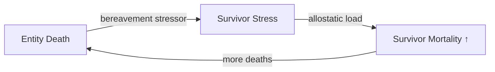
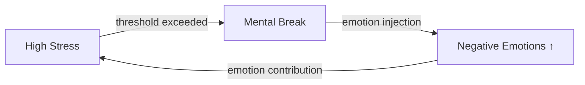

# The WorldSim Pipeline: Personality → Emotion → Stress → Mortality

## 개요 / Overview

WorldSim simulates a complete psychophysiological pipeline for each entity:

1. **Personality** (static): HEXACO axes + discrete traits define individual differences
2. **Emotion** (fast): Events trigger emotions via Lazarus appraisal, modulated by personality
3. **Stress** (medium): Emotions, needs, and stressors accumulate stress, modulated by personality
4. **Mortality** (slow): Chronic stress (allostatic load) increases death risk via Siler hazard model

```mermaid
graph TD
    subgraph "Layer 1: Personality (Static)"
        HEX[HEXACO 6 Axes<br/>24 Facets] --> TRAITS[Discrete Traits<br/>~85 traits]
    end

    subgraph "Layer 2: Emotion (Fast)"
        EVT[Game Events] --> APR[Appraisal<br/>8 dimensions]
        APR --> IMP[Impulse Calculation<br/>8 Plutchik emotions]
        IMP --> FAST[Fast Layer<br/>exponential decay]
        FAST --> SLOW[Slow Layer<br/>O-U mean reversion]
        SLOW --> MEM[Memory Traces<br/>long-term storage]
    end

    subgraph "Layer 3: Stress (Medium)"
        CONT[Continuous Stressors<br/>hunger, energy, social] --> STR[Stress Accumulation]
        EMSTR[Emotion Contribution<br/>VA-weighted] --> STR
        STR --> REC[Recovery<br/>sleep, safety, support]
        REC --> ALLO[Allostatic Load<br/>chronic wear]
        ALLO --> GAS[GAS Stage<br/>alarm→resist→exhaust]
    end

    subgraph "Layer 4: Mortality (Slow)"
        SILER[Siler Hazard<br/>μ(x) bathtub curve] --> DEATH[Death Probability<br/>per tick]
    end

    HEX -->|sensitivity| IMP
    HEX -->|baselines| SLOW
    TRAITS -->|emotion modifiers| IMP
    TRAITS -->|stress modifiers| STR
    FAST -->|emotion values| EMSTR
    ALLO -->|load factor| SILER
    DEATH -->|death event| EVT
```

## Stage 1: Personality (Static Foundation) / 성격 (정적 기반)

**Model**: Ashton & Lee (2007) HEXACO
**Computation**: Once at entity creation + yearly maturation
**Output**: 6 axis z-scores, 24 facet scores, set of active traits

The HEXACO model provides 6 orthogonal personality axes:

| Axis | Name | Key Effect |
|------|------|-----------|
| H | Honesty-Humility | Social behavior, corruption resistance |
| E | Emotionality | Emotion sensitivity, fear/sadness amplification |
| X | Extraversion | Joy/social baselines, stress recovery |
| A | Agreeableness | Trust, conflict avoidance |
| C | Conscientiousness | Work quality, stress from disorder |
| O | Openness to Experience | Novelty response, adaptability |

Traits activate when facet scores exceed thresholds (e.g., `H_sincerity > 0.92` → "Sincere" trait).

📄 source: `scripts/systems/personality_generator.gd:L18`
📄 source: `scripts/systems/personality_maturation.gd:L41`
📄 source: `scripts/systems/trait_system.gd:L51`
📄 source: `data/species/human/personality/trait_definitions.json`

---

## Stage 2: Emotion (Fast Response) / 감정 (빠른 반응)

**Models**: Plutchik (1980), Lazarus (1991), Scherer (2009)
**Tick interval**: 12 ticks

### Input / 입력
- Game events with appraisal vectors (8 dimensions)
- Personality sensitivity multipliers
- Trait emotion modifiers

### Computation / 계산
1. **Appraisal**: emotion impulses from appraisal dimensions

| Emotion | Formula |
|---------|---------|
| joy | `I * max(g, 0)` |
| trust | `I * max(b, 0)` |
| fear | `I * max(-g, 0) * (1 - c) * fr` |
| surprise | `I * n` |
| sadness | `I * max(-g, 0) * (1 - c)` |
| disgust | `I * max(m + p, 0)` |
| anger | `I * max(-g, 0) * max(-a, 0) * (1 - c)` |
| anticipation | `I * fr * max(g, 0)` |

2. **Personality scaling**: `impulse *= exp(coeff * z_axis)`
3. **Fast decay**: `fast *= exp(-λ * dt)` then add impulse
4. **Slow update**: O-U process: `dslow = θ(μ - slow)dt + σdW`
5. **Inhibition**: opposite pair suppression at γ = 0.3
6. **Contagion**: spatial spread with κ coefficients

### Output / 출력
- 8 emotion values (0-100 each)
- Valence-arousal coordinates
- Mental break trigger probability update

📄 source: `scripts/systems/emotion_system.gd:L103`
📄 source: `data/emotions/event_presets.json`
📄 source: `data/species/human/emotions/decay_parameters.json`

---

## Stage 3: Stress (Medium Accumulation) / 스트레스 (중간 축적)

**Models**: Lazarus (1984), Selye (1956), McEwen (1998), Hobfoll (1989)
**Tick interval**: 2 ticks

### Input / 입력
- Emotion values (from Stage 2)
- Continuous need states (hunger, energy, social)
- Stressor events
- Personality modifiers

### Computation / 계산
1. **Emotion contribution**: `stress += γ_VA * Σ(w_e * emotion_e)`
2. **Continuous stressors**: hunger/energy/social deficit → stress
3. **Event stressors**: `severity = base_instant + per_tick/decay * 10; if loss: × 2.5`
4. **Recovery**: `recovery = base * (1 + sleep + safe + support) * resilience`
5. **Allostatic load**: chronic accumulation when stress exceeds reserve
6. **GAS stages**: alarm → resistance → exhaustion

### Output / 출력
- Current stress level (0-100)
- Allostatic load (0-100)
- GAS stage (alarm/resistance/exhaustion)
- Yerkes-Dodson efficiency multiplier

📄 source: `scripts/systems/stress_system.gd:L71`
📄 source: `scripts/systems/stress_system.gd:L213`
📄 source: `data/stressor_events.json`

---

## Stage 4: Mortality (Slow Selection) / 사망 (느린 선택)

**Model**: Siler (1979)
**Tick interval**: 1 ticks

### Input / 입력
- Entity age
- Allostatic load (from Stage 3)
- Tech level, nutrition, care status, season

### Computation / 계산
$$
\mu(x) = a_1 e^{-b_1 x} + a_2 + a_3 e^{b_3 x}
$$
Modified by: tech × care × season × stress × nutrition

$$
P(\text{death}) = 1 - e^{-\mu_{\text{final}}(x) / \text{TICKS\_PER\_YEAR}}
$$

### Output / 출력
- Death probability per tick
- Death event (triggers bereavement stressors on survivors)

📄 source: `scripts/systems/mortality_system.gd:L130`
📄 source: `scripts/systems/mortality_system.gd`
📄 source: `data/species/human/mortality/siler_parameters.json`

## Feedback Loops / 피드백 루프

### Bereavement Cascade / 애도 연쇄


### Mental Break Loop / 정신 붕괴 루프


## Example: Entity Loses Partner / 예시: 동반자 상실

**Event**: `partner_death` (intensity=95, is_trauma=true, is_loss=true)

### Stage 2: Emotion
- Appraisal: g=-0.9, n=0.3, c=0.1, a=-0.8, b=-0.7, fr=0.4
- Impulses (computed): sadness=76.95, fear=30.78, anger=61.56, trust impulse=0
- Fast layer: sadness_fast += 80, fear_fast += 30, anger_fast += 20
- Slow layer: trust_slow -= 25, joy_slow -= 40
- Memory trace created (trauma half-life: 365 days)

### Stage 3: Stress
- Base instant: 450
- Event severity: 450 + (10 / 0.01) * 10 = 10450
- COR loss aversion: × 2.5 → severity 26125
- Personality modifier (high E_axis): × 1.4 → 36575
- Emotion contribution proxy: Σ(w_e * fast_e) = 136
- Recovery slowed: grief state degrades sleep/support recovery factors

### Stage 4: Mortality
- Allostatic load proxy increases by ~3.66 per stress tick (severity-normalized)
- At allostatic_load=60: mortality hazard ×1.6
- 10-year survival (age 35, baseline Siler params): 89.2% → 83.3%

## Pipeline Statistics / 파이프라인 통계

| Metric | Value |
|--------|-------|
| Total systems in pipeline | 4 |
| Total formulas | 13 |
| Academic models referenced | 16 |
| Entity data fields | 19 |
| Cross-system data flows | 5 |
| Feedback loops | 2 |

- Personality coverage: 6 HEXACO axes, 187 discovered traits

<!-- MANUAL:START -->

<!-- MANUAL:END -->
