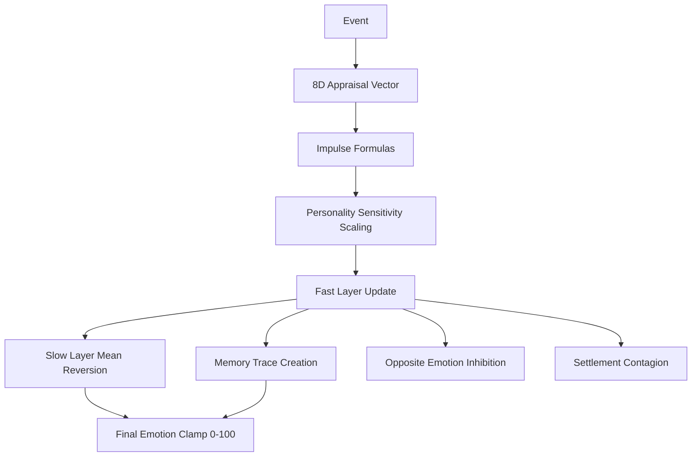

# Emotion System — Detailed Documentation

Localization: 한국어 / English

## Architecture

The emotion system implements **Plutchik's 8 basic emotions** with a **3-layer temporal model**:

| Layer | Role | Dynamics | Time Scale |
|-------|------|----------|------------|
| **Fast** | Episodic reactions | Exponential decay | Minutes to hours |
| **Slow** | Mood / baseline | Ornstein-Uhlenbeck mean reversion | Days to weeks |
| **Memory Traces** | Emotional memories | Very slow decay, trauma-persistent | Weeks to years |

The combined emotion value: `emotion = clamp(fast + slow + memory_traces, 0, 100)`

📄 source: `scripts/systems/emotion_system.gd:L103`

### Academic Models
- **Plutchik (1980, 2001)**: 8 basic emotions, opposite pairs, intensity levels
- **Lazarus (1991)**: Appraisal theory — events evaluated on 8 dimensions
- **Scherer (2009)**: Component Process Model — appraisal to impulse mapping
- **Verduyn & Brans (2012)**: Emotion duration research (half-life values)
- **Uhlenbeck & Ornstein (1930)**: Stochastic mean-reversion process (slow layer)
- Verduyn & Brans (2012) — emotion duration research (fast half-lives)
- Plutchik (1980, 2001) — 8 basic emotions, opposite pairs, intensity levels
- Russell (1980) — Circumplex Model of Affect (Valence-Arousal)
- Fan et al. (2016) — emotional contagion rates (anger > fear > joy)
- Ashton & Lee (2007) — HEXACO personality model
- Lazarus (1991) Emotion and Adaptation — Appraisal Theory
- Scherer (2009) Component Process Model
- Plutchik (1980) 8 Basic Emotions
- Plutchik (1980) emotion impulse dynamics — Plutchik, R. (1980). A general psychoevolutionary theory of emotion; Lazarus, R. S. (1991). Emotion and Adaptation
- McEwen (1998) allostatic load model — McEwen, B. S. (1998). Protective and Damaging Effects of Stress Mediators
- Standard exponential decay — Standard first-order decay dynamics
- Siler (1979) bathtub-curve mortality — Siler, W. (1979). A Competing-Risk Model for Animal Mortality
- Lazarus & Folkman (1984) cognitive appraisal stress model — Lazarus, R. S., & Folkman, S. (1984). Stress, Appraisal, and Coping
- Uhlenbeck & Ornstein (1930) mean-reverting process — Uhlenbeck, G. E., & Ornstein, L. S. (1930). On the Theory of the Brownian Motion
- Selye (1956) General Adaptation Syndrome resistance — Selye, H. (1956). The Stress of Life
- Yerkes & Dodson (1908) arousal-performance law — Yerkes, R. M., & Dodson, J. D. (1908). The relation of strength of stimulus to rapidity of habit-formation

## The 8 Basic Emotions

| Emotion | Opposite | Fast Half-life | Slow Half-life | Contagion κ |
|---------|----------|---------------:|---------------:|------------:|
| Joy | Sadness | 0.75 | 48 | 0.08 |
| Trust | Disgust | 2 | 72 | 0.06 |
| Fear | Anger | 0.3 | 24 | 0.1 |
| Surprise | Anticipation | 0.05 | 6 | 0.03 |
| Sadness | Joy | 0.5 | 120 | 0.04 |
| Disgust | Trust | 0.1 | 12 | 0.06 |
| Anger | Fear | 0.4 | 12 | 0.12 |
| Anticipation | Surprise | 3 | 36 | 0.03 |

## Fast Layer — Episodic Emotion

The fast layer responds immediately to events and decays exponentially:

$$
\text{fast}(t+1) = \text{fast}(t) \cdot e^{-\lambda \cdot \Delta t} + \text{impulse}
$$

where $\lambda = \ln(2) / \text{half\_life\_hours}$

### Decay Rates by Emotion

| Emotion | Half-life (hours) | Decay rate λ |
|---------|------------------:|-------------:|
| Joy | 0.75 | 0.924 |
| Trust | 2 | 0.347 |
| Fear | 0.3 | 2.31 |
| Surprise | 0.05 | 13.863 |
| Sadness | 0.5 | 1.386 |
| Disgust | 0.1 | 6.931 |
| Anger | 0.4 | 1.733 |
| Anticipation | 3 | 0.231 |

📄 source: `scripts/systems/emotion_system.gd:L103`

## Slow Layer — Mood Baseline (Ornstein-Uhlenbeck)

The slow layer models mood as a mean-reverting stochastic process:

$$
d\text{slow} = \theta \cdot (\mu - \text{slow}) \cdot dt + \sigma \cdot dW
$$

Where:
- $\theta$: mean-reversion speed (derived from slow half-life)
- $\mu$: personality-derived baseline
- $\sigma$: noise amplitude
- $dW$: Wiener process increment

### Personality Baselines

Each emotion's slow baseline is derived from HEXACO personality:

$$
\text{baseline} = \text{clamp}(\text{base} + \text{scale} \cdot z_{\text{axis}}, \text{min}, \text{max})
$$

| Emotion | Base | Scale | Axis | Min | Max |
|---------|-----:|------:|------|----:|----:|
| Joy | 5 | 3 | X | 0 | 15 |
| Trust | 5 | 1.5 | X | 0 | 12 |
| Fear | 2 | 2 | E | 0 | 10 |
| Surprise | 0 | n/a | - | n/a | n/a |
| Sadness | 2 | 1.5 | E | 0 | 10 |
| Disgust | 0 | n/a | - | n/a | n/a |
| Anger | 2 | -2 | A | 0 | 10 |
| Anticipation | 5 | 1 | X | 0 | 10 |

📄 source: `scripts/systems/emotion_system.gd:L103`

## Memory Traces — Long-term Emotional Memory

When a fast emotion exceeds the **memory trace threshold** (n/a),
a fraction (n/a) is stored as a memory trace with very slow decay.

- **Normal memories**: half-life = n/a days
- **Trauma memories**: half-life = n/a days (for events with `is_trauma: true`)

📄 source: `scripts/systems/emotion_system.gd:L507`

## Event → Emotion Pipeline

### Step 1: Event Appraisal

Each event has an 8-dimensional appraisal vector:

| Dimension | Symbol | Range | Meaning |
|-----------|--------|-------|---------|
| Goal Congruence | g | -1 to +1 | Does this event help (+) or hinder (-) the entity's goals? |
| Novelty | n | 0 to 1 | How unexpected/new is this event? |
| Controllability | c | 0 to 1 | Can the entity control/influence the situation? |
| Agency | a | -1 to +1 | Who caused this? Self (+1) vs external (-1). |
| Norm Violation | m | 0 to 1 | Does this violate social/moral norms? |
| Pathogen | p | 0 to 1 | Is there contamination/disease threat? |
| Social Bond | b | -1 to +1 | Does this strengthen (+) or weaken (-) social bonds? |
| Future Relevance | fr | 0 to 1 | How important is this for future wellbeing? |

### Step 2: Impulse Calculation

Appraisal dimensions map to Plutchik emotions via these formulas:

| Emotion | Formula | Interpretation |
|---------|---------|----------------|
| Joy | `I * max(g, 0)` | Intensity-scaled positive goal congruence. |
| Trust | `I * max(b, 0)` | Intensity-scaled positive social bond. |
| Fear | `I * max(-g, 0) * (1 - c) * fr` | Intensity-scaled negative goal congruence, low controllability, future relevance. |
| Surprise | `I * n` | Intensity-scaled novelty. |
| Sadness | `I * max(-g, 0) * (1 - c)` | Intensity-scaled negative goal congruence, low controllability. |
| Disgust | `I * max(m + p, 0)` | Intensity-scaled norm/pathogen threat. |
| Anger | `I * max(-g, 0) * max(-a, 0) * (1 - c)` | Intensity-scaled negative goal congruence, low controllability, external agency/blame. |
| Anticipation | `I * fr * max(g, 0)` | Intensity-scaled positive goal congruence, future relevance. |

where `I = intensity / 100`

### Step 3: Personality Sensitivity

Each emotion's impulse is scaled by HEXACO personality:

$$
\text{sensitivity} = e^{\text{coeff} \cdot z_{\text{axis}}}
$$

| Emotion | Couplings |
|---------|-----------|
| Joy | X: 0.3 |
| Trust | X: 0.2, A: 0.15 |
| Fear | E: 0.4 |
| Surprise | O: 0.2 |
| Sadness | E: 0.4 |
| Disgust | H: 0.25 |
| Anger | A: -0.35 |
| Anticipation | O: 0.2, C: 0.15 |

📄 source: `scripts/systems/emotion_system.gd:L215`

## Opposite Emotion Inhibition

When one emotion rises by delta, its opposite is suppressed by γ·delta where γ = 0.3.

| Emotion | Opposite | Inhibition |
|---------|----------|------------|
| Joy ↑ | Sadness ↓ | -0.3 * delta |
| Trust ↑ | Disgust ↓ | -0.3 * delta |
| Fear ↑ | Anger ↓ | -0.3 * delta |
| Surprise ↑ | Anticipation ↓ | -0.3 * delta |

📄 source: `scripts/systems/emotion_system.gd:L103`

## Emotional Contagion

Emotions spread between nearby entities in a settlement:

$$
\text{contagion} = \kappa_e \cdot \text{source\_intensity} \cdot e^{-d / d_{\text{scale}}}
$$

- $\kappa_e$: per-emotion contagion coefficient
- $d$: distance between entities
- $d_{scale}$: spatial decay parameter (5)
- Minimum source intensity: 10

**Anger is the most contagious** (κ=0.12), consistent with Fan et al. (2016).

📄 source: `scripts/systems/emotion_system.gd:L338`

## Mental Break

When stress exceeds a threshold, entities may experience a mental break:

$$
P(\text{break}) = \frac{\text{tick\_prob}}{1 + e^{-(\text{stress} - \text{threshold}) / \beta}}
$$

- tick_prob: 0.01
- beta: 60 (sigmoid steepness)
- threshold: n/a

### Break Types

| Type | Duration | Energy Drain | Description |
|------|---------:|-------------:|-------------|
| Outrage Violence | 0.5h | 4 | Outrage — immediate violence |
| Panic | 2h | 3 | Panic — flee randomly |
| Purge | 2h | 2 | Purge — expel contaminated |
| Rage | 1h | 5 | Rage — attack/destroy nearby |
| Shutdown | 6h | 0.5 | Shutdown — collapse, idle |

📄 source: `scripts/systems/emotion_system.gd:L405`

## Event Presets

| Event | Category | Intensity | Primary Emotions | Trauma |
|-------|----------|----------:|------------------|--------|
| ate_food | survival | 20 | Joy (0.12) | No |
| betrayal | conflict | 80 | Disgust (0.72), Sadness (0.58), Anger (0.58), Surprise (0.56), Fear (0.29) | Yes |
| building_completed | achievement | 30 | Joy (0.24), Anticipation (0.12), Surprise (0.09), Trust (0.06) | No |
| child_born | family | 60 | Joy (0.54), Trust (0.54), Anticipation (0.49), Surprise (0.42) | No |
| child_death | loss | 95 | Sadness (0.95), Trust (0.95), Fear (0.76), Surprise (0.66), Anger (0.48) | Yes |
| combat_threat | danger | 70 | Sadness (0.39), Surprise (0.28), Fear (0.24), Anger (0.2) | No |
| community_festival | social | 40 | Trust (0.32), Joy (0.24), Surprise (0.12), Anticipation (0.05) | No |
| food_acquired | resource | 25 | Joy (0.18), Anticipation (0.05), Surprise (0.03) | No |
| friend_death | loss | 50 | Sadness (0.3), Surprise (0.25), Trust (0.25), Fear (0.09), Anger (0.06) | No |
| job_assigned | work | 15 | Joy (0.05), Surprise (0.05), Anticipation (0.02) | No |
| migration_started | exploration | 40 | Surprise (0.32), Joy (0.12), Anticipation (0.11) | No |
| new_territory | exploration | 35 | Surprise (0.32), Joy (0.18), Anticipation (0.14) | No |
| parent_death | loss | 70 | Sadness (0.56), Trust (0.49), Surprise (0.35), Fear (0.28), Anger (0.17) | Yes |
| partner_death | loss | 90 | Sadness (0.9), Trust (0.9), Fear (0.81), Surprise (0.72), Anger (0.45) | Yes |
| partner_found | social | 40 | Joy (0.36), Trust (0.32), Anticipation (0.25), Surprise (0.24) | No |
| rested_well | survival | 15 | Joy (0.08) | No |
| settlement_founded | achievement | 45 | Joy (0.36), Surprise (0.32), Anticipation (0.29), Trust (0.27) | No |
| severe_hunger | survival | 50 | Sadness (0.28), Fear (0.2), Surprise (0.05) | No |
| social_interaction | social | 15 | Trust (0.08), Joy (0.06), Surprise (0.02) | No |
| starvation_warning | survival | 75 | Sadness (0.68), Fear (0.61), Surprise (0.15) | No |
| stone_acquired | resource | 20 | Joy (0.1), Anticipation (0.02) | No |
| theft_victim | conflict | 55 | Disgust (0.44), Surprise (0.28), Sadness (0.23), Anger (0.18), Fear (0.07) | No |
| wood_acquired | resource | 20 | Joy (0.1), Anticipation (0.02) | No |

📄 source: `data/emotions/event_presets.json`

<!-- MANUAL:START -->

<!-- MANUAL:END -->
