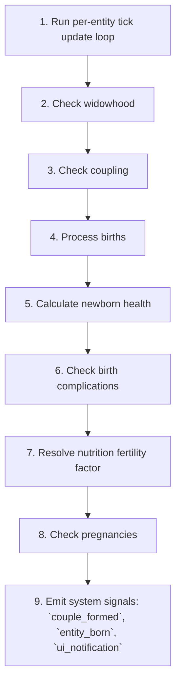

# Family

📄 source: `scripts/systems/family_system.gd` | Priority: 52 | Tick interval: 365

## Overview (개요)

The **Family** system implements Standard exponential decay to simulate handles pregnancy, birth, widowhood, and maternal complications.
It runs every **365 ticks** (0.1 game-years) at priority **52**.

**Core entity data**: `age` (read/write (inferred)), `age_stage` (read/write (inferred)), `emotion_data` (read/write (inferred)), `emotions` (read/write (inferred)), `entity_name` (read/write (inferred)), `gender` (read/write (inferred)), `hunger` (read/write (inferred)), `id` (read/write (inferred)), `is_alive` (read/write (inferred)), `last_birth_tick` (read/write (inferred)), `partner_id` (read/write (inferred)), `pregnancy_tick` (read/write (inferred)), `settlement_id` (read/write (inferred))

> Handles pregnancy, birth, widowhood, and maternal complications.

## Tick Pipeline (틱 파이프라인)

1. Run per-entity tick update loop
   📄 source: `scripts/systems/family_system.gd:L57`
2. Check widowhood
   📄 source: `scripts/systems/family_system.gd:L117`
3. Check coupling
   📄 source: `scripts/systems/family_system.gd:L142`
4. Process births
   📄 source: `scripts/systems/family_system.gd:L214`
5. Calculate newborn health
   📄 source: `scripts/systems/family_system.gd:L410`
   Math context: x(t) = x₀·e^{-λt}, Computes a gameplay state update from mathematical relationships in the source logic.
6. Check birth complications
   📄 source: `scripts/systems/family_system.gd:L451`
   Math context: Computes a gameplay state update from mathematical relationships in the source logic.
7. Resolve nutrition fertility factor
   📄 source: `scripts/systems/family_system.gd:L481`
8. Check pregnancies
   📄 source: `scripts/systems/family_system.gd:L501`
   Math context: Computes a gameplay state update from mathematical relationships in the source logic.
9. Emit system signals: `couple_formed`, `entity_born`, `ui_notification`
   📄 source: `scripts/systems/family_system.gd:L192`

### Pipeline Diagram (파이프라인 다이어그램)



## Formulas (수식)

### Computes a gameplay state update from mathematical relationships in the source logic.

**Interpretation**: Computes a gameplay state update from mathematical relationships in the source logic.

**GDScript**:
```gdscript
Gaussian gestation duration with preterm birth mechanics (T-2000).
```

| Variable | Meaning |
| :-- | :-- |
| `gestation` | gestation |
| `duration` | duration |
| `with` | with |
| `preterm` | preterm |
| `birth` | birth |

📄 source: `scripts/systems/family_system.gd:L4`

### Computes a gameplay state update from mathematical relationships in the source logic.

**Interpretation**: Computes a gameplay state update from mathematical relationships in the source logic.

**GDScript**:
```gdscript
var base: float = _rng.randfn(280.0, 10.0)
```

| Variable | Meaning |
| :-- | :-- |
| `base` | base |
| `_rng` |  rng |

📄 source: `scripts/systems/family_system.gd:L232`

### Computes a gameplay state update from mathematical relationships in the source logic.

**Interpretation**: Computes a gameplay state update from mathematical relationships in the source logic.

**GDScript**:
```gdscript
var num_babies: int = 2 if _rng.randf() < TWINS_CHANCE else 1
```

| Variable | Meaning |
| :-- | :-- |
| `num_babies` | num babies |
| `_rng` |  rng |

📄 source: `scripts/systems/family_system.gd:L280`

### Computes a gameplay state update from mathematical relationships in the source logic.

**Interpretation**: Computes a gameplay state update from mathematical relationships in the source logic.

**GDScript**:
```gdscript
var mother_nutrition: float = clampf(mother.hunger, 0.0, 1.0)
```

| Variable | Meaning |
| :-- | :-- |
| `mother_nutrition` | nutrition state input |
| `mother` | mother |
| `hunger` | nutrition state input |

📄 source: `scripts/systems/family_system.gd:L334`

### Computes a gameplay state update from mathematical relationships in the source logic.

**Interpretation**: Computes a gameplay state update from mathematical relationships in the source logic.

**GDScript**:
```gdscript
child.frailty = lerpf(2.0, 0.8, health)
```

| Variable | Meaning |
| :-- | :-- |
| `child` | child |
| `frailty` | frailty |
| `health` | health |

📄 source: `scripts/systems/family_system.gd:L336`

### Applies time-based exponential decay using half-life or decay-rate parameters.

**Model**: Standard exponential decay (Standard first-order decay dynamics)

$$
x(t) = x₀·e^{-λt}
$$

**Interpretation**: Applies time-based exponential decay using half-life or decay-rate parameters.

**GDScript**:
```gdscript
var w50: float = lerpf(35.0, 24.0, tech / 10.0)
	var survival_base: float = 1.0 / (1.0 + exp(-(float(gestation_weeks) - w50) / 2.0))
```

| Variable | Meaning |
| :-- | :-- |
| `w50` | w50 |
| `tech` | tech |
| `survival_base` | survival base |
| `gestation_weeks` | gestation weeks |

📄 source: `scripts/systems/family_system.gd:L414`

### Computes a gameplay state update from mathematical relationships in the source logic.

$$
lerpf(0.9, 0.3, tech / 10.0)
$$

**Interpretation**: Computes a gameplay state update from mathematical relationships in the source logic.

**GDScript**:
```gdscript
damage = lerpf(0.9, 0.3, tech / 10.0)
```

| Variable | Meaning |
| :-- | :-- |
| `damage` | age-related input |
| `tech` | tech |

📄 source: `scripts/systems/family_system.gd:L420`

### Computes a gameplay state update from mathematical relationships in the source logic.

$$
lerpf(0.5, 0.1, tech / 10.0)
$$

**Interpretation**: Computes a gameplay state update from mathematical relationships in the source logic.

**GDScript**:
```gdscript
damage = lerpf(0.5, 0.1, tech / 10.0)
```

| Variable | Meaning |
| :-- | :-- |
| `damage` | age-related input |
| `tech` | tech |

📄 source: `scripts/systems/family_system.gd:L422`

### Computes a gameplay state update from mathematical relationships in the source logic.

$$
lerpf(0.2, 0.02, tech / 10.0)
$$

**Interpretation**: Computes a gameplay state update from mathematical relationships in the source logic.

**GDScript**:
```gdscript
damage = lerpf(0.2, 0.02, tech / 10.0)
```

| Variable | Meaning |
| :-- | :-- |
| `damage` | age-related input |
| `tech` | tech |

📄 source: `scripts/systems/family_system.gd:L424`

### Computes a gameplay state update from mathematical relationships in the source logic.

**Interpretation**: Computes a gameplay state update from mathematical relationships in the source logic.

**GDScript**:
```gdscript
var nutrition_factor: float = lerpf(0.6, 1.1, clampf(mother_nutrition, 0.0, 1.0))
```

| Variable | Meaning |
| :-- | :-- |
| `nutrition_factor` | nutrition state input |
| `mother_nutrition` | nutrition state input |

📄 source: `scripts/systems/family_system.gd:L429`

### Computes a gameplay state update from mathematical relationships in the source logic.

**Interpretation**: Computes a gameplay state update from mathematical relationships in the source logic.

**GDScript**:
```gdscript
var genetics_factor: float = clampf(genetics_z, 0.7, 1.3)
```

| Variable | Meaning |
| :-- | :-- |
| `genetics_factor` | genetics factor |
| `genetics_z` | genetics z |

📄 source: `scripts/systems/family_system.gd:L443`

### Computes a gameplay state update from mathematical relationships in the source logic.

$$
survival_base  \cdot  (1.0 - damage)  \cdot  nutrition_factor  \cdot  age_factor  \cdot  genetics_factor
$$

**Interpretation**: Computes a gameplay state update from mathematical relationships in the source logic.

**GDScript**:
```gdscript
var health: float = survival_base * (1.0 - damage) * nutrition_factor * age_factor * genetics_factor
	return clampf(health, 0.0, 1.0)
```

| Variable | Meaning |
| :-- | :-- |
| `health` | health |
| `survival_base` | survival base |
| `damage` | age-related input |
| `nutrition_factor` | nutrition state input |
| `age_factor` | age-related input |
| `genetics_factor` | genetics factor |

📄 source: `scripts/systems/family_system.gd:L445`

### Computes a gameplay state update from mathematical relationships in the source logic.

$$
lerpf(MATERNAL_DEATH_BASE, 0.0002, tech / 10.0)
$$

**Interpretation**: Computes a gameplay state update from mathematical relationships in the source logic.

**GDScript**:
```gdscript
var base_risk: float = lerpf(MATERNAL_DEATH_BASE, 0.0002, tech / 10.0)
```

| Variable | Meaning |
| :-- | :-- |
| `base_risk` | base risk |
| `tech` | tech |

📄 source: `scripts/systems/family_system.gd:L455`

### Computes a gameplay state update from mathematical relationships in the source logic.

**Interpretation**: Computes a gameplay state update from mathematical relationships in the source logic.

**GDScript**:
```gdscript
Start pregnancy with Gaussian gestation duration
```

| Variable | Meaning |
| :-- | :-- |
| `pregnancy` | pregnancy |
| `with` | with |
| `gestation` | gestation |
| `duration` | duration |

📄 source: `scripts/systems/family_system.gd:L534`

### Computes a gameplay state update from mathematical relationships in the source logic.

**Interpretation**: Computes a gameplay state update from mathematical relationships in the source logic.

**GDScript**:
```gdscript
var mother_nutrition: float = clampf(entity.hunger, 0.0, 1.0)
```

| Variable | Meaning |
| :-- | :-- |
| `mother_nutrition` | nutrition state input |
| `entity` | entity |
| `hunger` | nutrition state input |

📄 source: `scripts/systems/family_system.gd:L536`

## Configuration Reference (설정)

| Constant | Default | Controls | Behavior Effect |
| :-- | :-- | :-- | :-- |
| `BIRTH_FOOD_COST` | 3.0 | Population | Adjusts baseline system behavior under this module. |
| `PREGNANCY_DURATION` | 3360 | Behavior tuning constant. | Adjusts baseline system behavior under this module. |
| `TICKS_PER_YEAR` | 4380 | Simulation-time conversion or cadence. | Adjusts baseline system behavior under this module. |
| `get_age_years` | (not found) | Behavior tuning constant. | Adjusts baseline system behavior under this module. |

## Cross-System Effects (시스템 간 상호작용)

### Imported Modules (모듈 임포트)

- `scripts/core/game_calendar.gd` via `preload` at `scripts/systems/family_system.gd:L6`

### Shared Entity Fields (공유 엔티티 필드)

| Field | Access | Shared With |
| :-- | :-- | :-- |
| `age` | read/write (inferred) | [`aging`](aging.md), [`mortality`](mortality.md), [`needs`](needs.md) |
| `age_stage` | read/write (inferred) | [`behavior`](behavior.md), [`aging`](aging.md), [`childcare`](childcare.md), [`construction`](construction.md), [`gathering`](gathering.md), [`job_assignment`](job_assignment.md), [`mortality`](mortality.md), [`movement`](movement.md), [`needs`](needs.md) |
| `emotion_data` | read/write (inferred) | [`behavior`](behavior.md), [`emotions`](emotions.md), [`mental_break`](mental_break.md), [`stress`](stress.md), [`trait`](trait.md) |
| `emotions` | read/write (inferred) | [`behavior`](behavior.md), [`emotions`](emotions.md), [`trait`](trait.md), [`trait_violation`](trait_violation.md), [`trauma_scar`](trauma_scar.md) |
| `entity_name` | read/write (inferred) | [`behavior`](behavior.md), [`aging`](aging.md), [`chronicle`](chronicle.md), [`emotions`](emotions.md), [`gathering`](gathering.md), [`job_assignment`](job_assignment.md), [`mental_break`](mental_break.md), [`mortality`](mortality.md), [`movement`](movement.md), [`needs`](needs.md), [`population`](population.md), [`stress`](stress.md), [`trait_violation`](trait_violation.md), [`trauma_scar`](trauma_scar.md) |
| `hunger` | read/write (inferred) | [`behavior`](behavior.md), [`childcare`](childcare.md), [`mental_break`](mental_break.md), [`mortality`](mortality.md), [`movement`](movement.md), [`needs`](needs.md), [`stress`](stress.md) |
| `id` | read/write (inferred) | [`behavior`](behavior.md), [`aging`](aging.md), [`emotions`](emotions.md), [`gathering`](gathering.md), [`job_assignment`](job_assignment.md), [`migration`](migration.md), [`mortality`](mortality.md), [`movement`](movement.md), [`needs`](needs.md), [`population`](population.md), [`social_events`](social_events.md), [`trait_violation`](trait_violation.md), [`trauma_scar`](trauma_scar.md) |
| `is_alive` | read/write (inferred) | [`chronicle`](chronicle.md), [`trait_violation`](trait_violation.md), [`trauma_scar`](trauma_scar.md) |
| `partner_id` | read/write (inferred) | [`behavior`](behavior.md) |
| `settlement_id` | read/write (inferred) | [`behavior`](behavior.md), [`emotions`](emotions.md), [`migration`](migration.md), [`needs`](needs.md), [`population`](population.md), [`stress`](stress.md) |

### Signals (시그널)

| Signal | Parameters | Subscribers | Source Line |
| :-- | :-- | :-- | :-- |
| `couple_formed` | entity_a_id: int, entity_a_name: String, entity_b_id: int, entity_b_name: String, tick: int | No known subscribers | L192 |
| `entity_born` | entity_id: int, entity_name: String, parent_ids: Array, tick: int | No known subscribers | L378 |
| `ui_notification` | message: String, type: String | No known subscribers | L200 |
| `ui_notification` | message: String, type: String | No known subscribers | L303 |
| `ui_notification` | message: String, type: String | No known subscribers | L404 |

### Downstream Impact (다운스트림 영향)

- No explicit downstream dependencies extracted.

## Entity Data Model (엔티티 데이터 모델)

| Field | Access | Type | Represents | Typical Values |
| :-- | :-- | :-- | :-- | :-- |
| `age` | read/write (inferred) | int | Lifecycle progression used for stage-specific behavior and events. | Non-negative tick counts. |
| `age_stage` | read/write (inferred) | String enum | Lifecycle progression used for stage-specific behavior and events. | Named categorical states. |
| `emotion_data` | read/write (inferred) | Dictionary / custom data object | Affective state used for behavior modulation and social propagation. | Structured object with nested metrics/axes. |
| `emotions` | read/write (inferred) | Dictionary / custom data object | Affective state used for behavior modulation and social propagation. | System-defined value domain. |
| `entity_name` | read/write (inferred) | Variant | Entity name. | System-defined value domain. |
| `gender` | read/write (inferred) | Variant | Gender. | System-defined value domain. |
| `hunger` | read/write (inferred) | float | Nutritional deprivation level driving survival and action priorities. | Normalized scalar (commonly 0.0-1.0 or 0-100 by system). |
| `id` | read/write (inferred) | int | Stable entity identity used for referencing across systems. | Positive integer identifiers. |
| `is_alive` | read/write (inferred) | bool | Is alive. | System-defined value domain. |
| `last_birth_tick` | read/write (inferred) | Variant | Last birth tick. | System-defined value domain. |
| `partner_id` | read/write (inferred) | int | Stable entity identity used for referencing across systems. | Positive integer identifiers. |
| `pregnancy_tick` | read/write (inferred) | Variant | Pregnancy tick. | System-defined value domain. |
| `settlement_id` | read/write (inferred) | int | Stable entity identity used for referencing across systems. | Positive integer identifiers. |
