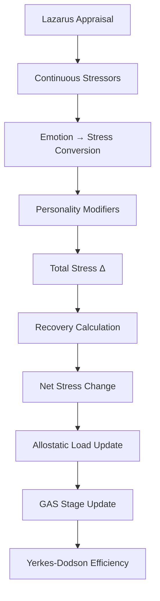

# Stress System — Detailed Documentation

## 개요

The stress system implements a **multi-source stress accumulation and recovery model** based on:
- **Lazarus & Folkman (1984) cognitive appraisal stress model**
- **Selye (1956) General Adaptation Syndrome resistance**
- **McEwen (1998) allostatic load model**
- **Yerkes & Dodson (1908) arousal-performance law**
- **Hobfoll (1989) Conservation of Resources — loss aversion 2.5x multiplier**

Localization: 한국어 / English labels are shown where source data provides both.

## 스트레스 파이프라인 (per tick)

📄 source: `scripts/systems/stress_system.gd:L55`

## Lazarus 평가 스케일

The demand/resource ratio determines stress:

$$
\text{appraisal} = \frac{D}{R}
$$

Where:
- $D$ = demand composite (weighted by HEXACO personality modulation)
- $R$ = resource composite

| Ratio | Interpretation | Effect |
|:------|:---------------|:-------|
| < 0.5 | Low demand relative to resources | Eustress zone |
| 0.5 - 1.0 | Balanced | Normal stress |
| 1.0 - 2.0 | Demand exceeds resources | Distress |
| > 2.0 | Overwhelmed | Severe stress, GAS alarm |

📄 source: `scripts/systems/stress_system.gd:L124`

## 지속 스트레스원

These stressors accumulate every tick based on entity state:

| Stressor | Condition | Formula | Source |
|:---------|:----------|:--------|:-------|
| Hunger | food_satiety < threshold (`HUNGER_EAT_THRESHOLD=0.5`) | `stress += (threshold - satiety) * hunger_mult` | Needs system |
| Energy | energy < threshold | `stress += (threshold - energy) * energy_mult` | Needs system |
| Social isolation | social_need < threshold | `stress += (threshold - social) * social_mult` | Social system |
| Overcrowding | density > threshold | `stress += (density - threshold) * crowd_mult` | Settlement |

📄 source: `scripts/systems/stress_system.gd:L155`

## 감정→스트레스 기여

Negative emotions contribute to stress via weighted sum:

$$
\text{emotion\_stress} = \gamma_{VA} \sum_e w_e \cdot \text{emotion}_e
$$

Where:
- $\gamma_{VA}$ = `3` (from `VA_GAMMA`)
- $w_e$ = per-emotion weight

| Emotion | Weight | Rationale |
|:--------|------:|:----------|
| Fear | 0.090 | 최고 스트레스 기여 — 고각성 부정 감정 (highest stress contribution, high arousal negative) |
| Anger | 0.060 | 고각성 부정 감정 (high arousal, negative valence) |
| Sadness | 0.050 | 저각성 부정 감정 (low arousal, negative valence) |
| Disgust | 0.040 | 중간 기여 부정 감정 (moderate negative contribution) |
| Surprise | 0.030 | 낮은 기여 (low contribution, valence-neutral) |
| Joy | -0.050 | 스트레스 감소 경로 (stress reduction pathway, negative weight) |
| Trust | -0.040 | 스트레스 감소 경로 (stress reduction pathway, negative weight) |
| Anticipation | -0.020 | 미약한 스트레스 감소 (mild stress reduction, anticipatory) |

📄 source: `scripts/systems/stress_system.gd:L208`
📄 source: `data/species/human/emotions/decay_parameters.json`

## 스트레스 회복

Recovery occurs when conditions are met:

$$
\text{recovery} = \text{base\_recovery} \cdot (1 + \text{sleep\_bonus} + \text{safety\_bonus} + \text{support\_bonus}) \cdot \text{resilience}
$$

| Bonus | Condition | Value | Source |
|:------|:----------|------:|:-------|
| Sleep | entity sleeping | +1.5 | Needs system |
| Safety | entity in safe location | +0.8 | Settlement |
| Social support | positive social bonds nearby | +support_score * 0.12 | Social system |
| Resilience | personality-derived factor | ×dynamic | CD-RISC based |

Base recovery term:
- `BASE_DECAY_PER_TICK` = 1.2

📄 source: `scripts/systems/stress_system.gd:L235`

## 알로스타틱 부하 (Chronic Stress)

Allostatic load represents cumulative physiological wear from chronic stress:

$$
\text{allostatic}_{t+1} = \begin{cases}
\text{allostatic}_t + \alpha \cdot (\text{stress} - \text{threshold}) & \text{if stress > threshold} \\
\text{allostatic}_t \cdot (1 - \beta) & \text{if stress < threshold and safe}
\end{cases}
$$

- Range: 0-100
- Accumulates when stress exceeds `250`
- Recovery starts under `120` in safe conditions
- Parameters: `alpha=0.035`, `beta=0.003`
- High allostatic load increases mortality risk (feeds into Siler model)

📄 source: `scripts/systems/stress_system.gd:L279`

## 일반 적응 증후군 (Selye 1956)

| Stage | Condition | Reserve Effect | Duration |
|:------|:----------|:---------------|:---------|
| Alarm | Acute stress event (stress >= 200) | Reserve depletes rapidly | Short |
| Resistance | Sustained stress (stress >= 350) | Reserve depletes slowly | Variable |
| Exhaustion | Reserve depleted or break-risk stress >= 500 | Collapse, mental break risk | Until recovery |

$$
\text{reserve}_{t+1} = \text{reserve}_t - \text{drain}(\text{stress}, \text{stage})
$$

- Reserve range: 0-100
- Stage transitions are driven by reserve and prolonged stress exposure

📄 source: `scripts/systems/stress_system.gd:L257`

## Yerkes-Dodson 효율 곡선

Moderate stress improves performance (eustress):

$$
\text{efficiency} = 1.0 + \text{eustress\_bonus} \cdot e^{-\left(\frac{\text{stress} - \text{optimal}}{\sigma}\right)^2}
$$

- Extracted optimal stress (`EUSTRESS_OPTIMAL`): `150`
- Too little stress → low motivation
- Optimal stress → peak performance
- Too much stress → impaired performance

📄 source: `scripts/systems/stress_system.gd:L373`

## 스트레스 이벤트

### 카테고리별

📄 source: `data/stressor_events.json`

#### Death Events (highest severity)

| Event | Name | Severity | Instant | Per-tick | Is Loss |
|:------|:-----|---------:|--------:|---------:|:-------:|
| child_death | 자녀 사망 | 38875 | 550 | 12 | Yes |
| maternal_death_partner | 출산 중 파트너 사망 | 38750 | 500 | 12 | Yes |
| partner_death | 파트너 사망 | 26125 | 450 | 10 | Yes |
| parent_death | 부모 사망 | 17541.667 | 350 | 8 | Yes |
| stillborn | 사산 | 14208.333 | 350 | 8 | Yes |
| sibling_death | 형제자매 사망 | 10625 | 250 | 6 | Yes |
| close_friend_death | 절친 사망 | 6750 | 200 | 5 | Yes |
| acquaintance_death | 지인 사망 | 360 | 60 | 1.5 | No |

#### Social Events

| Event | Name | Severity | Instant | Per-tick | Is Loss |
|:------|:-----|---------:|--------:|---------:|:-------:|
| exile_banishment | 추방 | 14083.333 | 300 | 8 | Yes |
| partnership_breakup | 결별 | 8125 | 250 | 6 | Yes |
| betrayal_discovered | 배신 발각 | 6750 | 200 | 5 | Yes |
| theft_victim | 도난 피해 | 1500 | 100 | 2 | Yes |
| rejection_social | 사회적 거부 | 580 | 80 | 2 | No |
| argument | 말다툼 | 165 | 40 | 1 | No |

#### Survival Events

| Event | Name | Severity | Instant | Per-tick | Is Loss |
|:------|:-----|---------:|--------:|---------:|:-------:|
| severe_injury | 중상 | 1483.333 | 150 | 4 | No |
| combat_engaged | 전투 참여 | 1330 | 80 | 15 | No |
| starvation_crisis | 기아 위기 | 1300 | 100 | 6 | No |
| predator_encounter | 포식자 조우 | 963.333 | 130 | 5 | No |

#### Psychological Events

| Event | Name | Severity | Instant | Per-tick | Is Loss |
|:------|:-----|---------:|--------:|---------:|:-------:|
| overcrowding | 과밀 스트레스 | 333.333 | 0 | 2 | No |
| forced_action_by_god | 신의 강제 명령 | 60 | 60 | 0 | No |

#### Eustress Events

| Event | Name | Severity | Instant | Per-tick | Is Loss |
|:------|:-----|---------:|--------:|---------:|:-------:|
| building_completed | 건축 완료 | -25 | -25 | 0 | No |
| successful_hunt | 사냥 성공 | -30 | -30 | 0 | No |
| childbirth_father | 자녀 출생 (아버지) | -80 | -80 | 0 | No |
| childbirth_mother | 출산 (산모) | -120 | -120 | 0 | No |

## 성격 보정

Each stressor's impact is modulated by HEXACO personality:

### Axis Modifiers

| Stressor | Axis | Weight | Direction |
|:---------|:----:|------:|:----------|
| child_death | E | 0.25 | high_amplifies |
| maternal_death_partner | E | 0.35 | high_amplifies |
| partner_death | A | 0.1 | high_amplifies |
| partner_death | E | 0.4 | high_amplifies |
| parent_death | E | 0.2 | high_amplifies |
| stillborn | E | 0.25 | high_amplifies |
| sibling_death | E | 0.2 | high_amplifies |
| betrayal_discovered | A | 0.15 | high_amplifies |
| argument | A | 0.15 | low_amplifies |
| forced_action_by_god | C | 0.2 | low_amplifies |

### Trait Modifiers

| Stressor | Trait | Multiplier | Effect |
|:---------|:------|-----------:|:-------|
| child_death | c_caregiver | 1.5 | +50% stress |
| child_death | c_healer | 1.3 | +30% stress |
| child_death | c_stoic_loner | 0.55 | -45% stress |
| child_death | d_callous | 0.2 | -80% stress |
| child_death | d_psychopath_primary | 0.1 | -90% stress |
| child_death | f_sentimental | 1.4 | +40% stress |
| child_death | f_tough_minded | 0.65 | -35% stress |
| maternal_death_partner | c_caregiver | 1.3 | +30% stress |
| maternal_death_partner | d_callous | 0.25 | -75% stress |
| maternal_death_partner | d_psychopath_primary | 0.15 | -85% stress |
| partner_death | c_compassionate_reconciler | 1.35 | +35% stress |
| partner_death | c_healer | 1.2 | +20% stress |
| partner_death | c_stoic_loner | 0.6 | -40% stress |
| partner_death | d_callous | 0.25 | -75% stress |
| partner_death | d_narcissist_grandiose | 0.5 | -50% stress |
| partner_death | d_psychopath_primary | 0.15 | -85% stress |
| partner_death | d_psychopath_secondary | 0.3 | -70% stress |
| partner_death | f_dependent | 1.25 | +25% stress |
| partner_death | f_self_reliant | 0.75 | -25% stress |
| partner_death | f_sentimental | 1.3 | +30% stress |
| partner_death | f_tough_minded | 0.7 | -30% stress |
| parent_death | c_caregiver | 1.2 | +20% stress |
| parent_death | d_callous | 0.25 | -75% stress |
| parent_death | d_psychopath_primary | 0.15 | -85% stress |
| parent_death | f_dependent | 1.35 | +35% stress |
| parent_death | f_self_reliant | 0.7 | -30% stress |
| parent_death | f_sentimental | 1.3 | +30% stress |
| parent_death | f_tough_minded | 0.65 | -35% stress |
| stillborn | c_caregiver | 1.3 | +30% stress |
| stillborn | d_callous | 0.25 | -75% stress |
| stillborn | d_psychopath_primary | 0.15 | -85% stress |
| stillborn | f_sentimental | 1.35 | +35% stress |
| sibling_death | d_callous | 0.3 | -70% stress |
| sibling_death | d_psychopath_primary | 0.2 | -80% stress |
| sibling_death | f_sentimental | 1.25 | +25% stress |
| close_friend_death | d_callous | 0.3 | -70% stress |
| close_friend_death | d_psychopath_primary | 0.2 | -80% stress |
| close_friend_death | f_sentimental | 1.2 | +20% stress |
| acquaintance_death | d_callous | 0.2 | -80% stress |
| acquaintance_death | d_psychopath_primary | 0.1 | -90% stress |
| acquaintance_death | f_sentimental | 1.15 | +15% stress |
| exile_banishment | c_nomad | 0.5 | -50% stress |
| exile_banishment | d_psychopath_primary | 0.35 | -65% stress |
| exile_banishment | f_gregarious | 1.3 | +30% stress |
| exile_banishment | f_solitary | 0.55 | -45% stress |
| partnership_breakup | d_psychopath_primary | 0.2 | -80% stress |
| partnership_breakup | f_dependent | 1.35 | +35% stress |
| partnership_breakup | f_self_reliant | 0.65 | -35% stress |
| betrayal_discovered | d_machiavellian | 0.5 | -50% stress |
| betrayal_discovered | d_psychopath_primary | 0.3 | -70% stress |
| betrayal_discovered | f_anxious | 1.2 | +20% stress |
| betrayal_discovered | f_sincere | 1.3 | +30% stress |
| theft_victim | c_hoarder | 1.4 | +40% stress |
| theft_victim | d_psychopath_primary | 0.4 | -60% stress |
| theft_victim | f_fair_minded | 1.25 | +25% stress |
| rejection_social | f_confident | 0.65 | -35% stress |
| rejection_social | f_dependent | 1.25 | +25% stress |
| rejection_social | f_insecure | 1.35 | +35% stress |
| rejection_social | f_self_reliant | 0.7 | -30% stress |
| argument | f_calm | 0.65 | -35% stress |
| argument | f_hot_tempered | 1.3 | +30% stress |
| argument | f_patient | 0.6 | -40% stress |
| argument | f_stubborn | 1.2 | +20% stress |
| severe_injury | c_berserker | 0.55 | -45% stress |
| severe_injury | d_psychopath_primary | 0.5 | -50% stress |
| severe_injury | f_fearful | 1.25 | +25% stress |
| severe_injury | f_fearless | 0.7 | -30% stress |
| combat_engaged | c_berserker | 0.3 | -70% stress |
| combat_engaged | c_mercenary | 0.4 | -60% stress |
| combat_engaged | c_pacifist | 1.6 | +60% stress |
| combat_engaged | f_fearful | 1.35 | +35% stress |
| combat_engaged | f_fearless | 0.5 | -50% stress |
| combat_engaged | f_gentle | 1.3 | +30% stress |
| starvation_crisis | c_survivalist | 0.7 | -30% stress |
| starvation_crisis | f_anxious | 1.2 | +20% stress |
| starvation_crisis | f_calm | 0.75 | -25% stress |
| predator_encounter | c_adventurer | 0.6 | -40% stress |
| predator_encounter | c_berserker | 0.4 | -60% stress |
| predator_encounter | f_fearful | 1.4 | +40% stress |
| predator_encounter | f_fearless | 0.5 | -50% stress |
| overcrowding | c_hermit_sage | 1.5 | +50% stress |
| overcrowding | f_gregarious | 0.6 | -40% stress |
| overcrowding | f_solitary | 1.4 | +40% stress |
| forced_action_by_god | c_zealot | 0.5 | -50% stress |
| forced_action_by_god | f_flexible | 0.6 | -40% stress |
| forced_action_by_god | f_stubborn | 1.3 | +30% stress |
| building_completed | c_labor_hero | 1.15 | +15% stress |
| building_completed | c_master_craftsman | 1.2 | +20% stress |
| successful_hunt | c_adventurer | 1.1 | +10% stress |
| successful_hunt | c_survivalist | 1.15 | +15% stress |
| childbirth_father | c_caregiver | 1.15 | +15% stress |
| childbirth_father | d_psychopath_primary | 0.2 | -80% stress |
| childbirth_mother | c_caregiver | 1.2 | +20% stress |

📄 source: `scripts/systems/stress_system.gd:L495`

<!-- MANUAL:START -->

<!-- MANUAL:END -->
