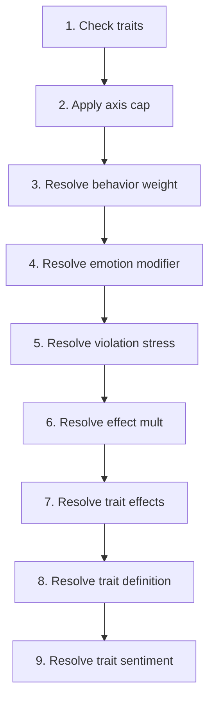

# Trait

📄 소스: `scripts/systems/trait_system.gd` | 우선순위: 100 | 틱 간격: n/a

## 개요

The **Trait** system implements a domain-specific simulation model to simulate discrete trait emergence and effects system.
It runs **at an unspecified cadence** at priority **100**.

**핵심 엔티티 데이터**: `active_traits` (read/write (inferred)), `display_traits` (read/write (inferred)), `emotion_data` (read/write (inferred)), `emotions` (read/write (inferred)), `personality` (read/write (inferred)), `traits_dirty` (read/write (inferred))

> Discrete trait emergence and effects system.

## 틱 파이프라인

1. Check traits
   📄 source: `scripts/systems/trait_system.gd:L51`
2. Apply axis cap
   📄 source: `scripts/systems/trait_system.gd:L124`
3. Resolve behavior weight
   📄 source: `scripts/systems/trait_system.gd:L223`
4. Resolve emotion modifier
   📄 source: `scripts/systems/trait_system.gd:L235`
5. Resolve violation stress
   📄 source: `scripts/systems/trait_system.gd:L247`
6. Resolve effect mult
   📄 source: `scripts/systems/trait_system.gd:L260`
7. Resolve trait effects
   📄 source: `scripts/systems/trait_system.gd:L284`
8. Resolve trait definition
   📄 source: `scripts/systems/trait_system.gd:L306`
9. Resolve trait sentiment
   📄 source: `scripts/systems/trait_system.gd:L312`

### 파이프라인 다이어그램

## 수식

No extracted formulas for this module.

## 설정 레퍼런스

GameConfig 참조가 추출되지 않음

## 시스템 간 상호작용

### 모듈 임포트

- [`trait`](trait.md) via `preload` at `scripts/systems/trait_system.gd:L4`

### 공유 엔티티 필드

| Field | Access | Shared With |
| :-- | :-- | :-- |
| `active_traits` | read/write (inferred) | [`stress`](stress.md) |
| `emotion_data` | read/write (inferred) | [`behavior`](behavior.md), [`emotions`](emotions.md), [`family`](family.md), [`mental_break`](mental_break.md), [`stress`](stress.md) |
| `emotions` | read/write (inferred) | [`behavior`](behavior.md), [`emotions`](emotions.md), [`family`](family.md) |
| `personality` | read/write (inferred) | [`aging`](aging.md), [`emotions`](emotions.md), [`mental_break`](mental_break.md), [`stress`](stress.md) |

### 시그널

시그널 메타데이터가 추출되지 않음

### 다운스트림 영향

- [`personality_generator`](personality_generator.md) depends on this system's outputs.
- [`personality_maturation`](personality_maturation.md) depends on this system's outputs.
- [`trait`](trait.md) depends on this system's outputs.

## 엔티티 데이터 모델

| Field | Access | Type | Represents | Typical Values |
| :-- | :-- | :-- | :-- | :-- |
| `active_traits` | read/write (inferred) | Variant | Trait/axis profile used for sensitivity and decision weighting. | System-defined value domain. |
| `display_traits` | read/write (inferred) | Variant | Trait/axis profile used for sensitivity and decision weighting. | System-defined value domain. |
| `emotion_data` | read/write (inferred) | Dictionary / custom data object | Affective state used for behavior modulation and social propagation. | Structured object with nested metrics/axes. |
| `emotions` | read/write (inferred) | Dictionary / custom data object | Affective state used for behavior modulation and social propagation. | System-defined value domain. |
| `personality` | read/write (inferred) | Dictionary / custom data object | Trait/axis profile used for sensitivity and decision weighting. | Structured object with nested metrics/axes. |
| `traits_dirty` | read/write (inferred) | Variant | Trait/axis profile used for sensitivity and decision weighting. | System-defined value domain. |
