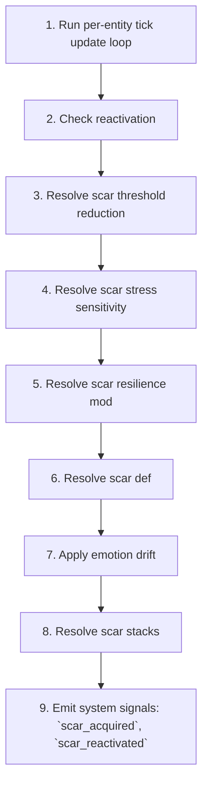

# Trauma Scar

📄 source: `scripts/systems/trauma_scar_system.gd` | Priority: 36 | Tick interval: 10

## Overview (개요)

The **Trauma Scar** system implements a domain-specific simulation model to simulate kindling effect: each existing stack increases next acquisition chance by this factor Global scale for tuning scar acquisition rates.
It runs every **10 ticks** (0.0 game-years) at priority **36**.

**Core entity data**: `emotions` (read/write (inferred)), `entity_name` (read/write (inferred)), `id` (read/write (inferred)), `is_alive` (read/write (inferred)), `trauma_scars` (read/write (inferred))

> Kindling effect: each existing stack increases next acquisition chance by this factor Global scale for tuning scar acquisition rates

## Tick Pipeline (틱 파이프라인)

1. Run per-entity tick update loop
   📄 source: `scripts/systems/trauma_scar_system.gd:L159`
2. Check reactivation
   📄 source: `scripts/systems/trauma_scar_system.gd:L91`
3. Resolve scar threshold reduction
   📄 source: `scripts/systems/trauma_scar_system.gd:L116`
4. Resolve scar stress sensitivity
   📄 source: `scripts/systems/trauma_scar_system.gd:L128`
   Math context: Computes a gameplay state update from mathematical relationships in the source logic.
5. Resolve scar resilience mod
   📄 source: `scripts/systems/trauma_scar_system.gd:L142`
6. Resolve scar def
   📄 source: `scripts/systems/trauma_scar_system.gd:L154`
7. Apply emotion drift
   📄 source: `scripts/systems/trauma_scar_system.gd:L172`
   Math context: Updates emotional state dynamics across fast, slow, or memory-trace layers.
8. Resolve scar stacks
   📄 source: `scripts/systems/trauma_scar_system.gd:L184`
9. Emit system signals: `scar_acquired`, `scar_reactivated`
   📄 source: `scripts/systems/trauma_scar_system.gd:L80`

### Pipeline Diagram (파이프라인 다이어그램)



## Formulas (수식)

### Computes a gameplay state update from mathematical relationships in the source logic.

**Interpretation**: Computes a gameplay state update from mathematical relationships in the source logic.

**GDScript**:
```gdscript
chance = clampf(chance, 0.0, 1.0)
```

| Variable | Meaning |
| :-- | :-- |
| `chance` | chance |

📄 source: `scripts/systems/trauma_scar_system.gd:L60`

### Computes a gameplay state update from mathematical relationships in the source logic.

$$
(1.0 + delta  \cdot  (1.0 + 0.5  \cdot  float(stacks - 1)))
$$

**Interpretation**: Computes a gameplay state update from mathematical relationships in the source logic.

**GDScript**:
```gdscript
mult *= (1.0 + delta * (1.0 + 0.5 * float(stacks - 1)))
	return clampf(mult, 0.5, 3.0)
```

| Variable | Meaning |
| :-- | :-- |
| `mult` | hazard or mean term |
| `delta` | delta |
| `stacks` | stacks |

📄 source: `scripts/systems/trauma_scar_system.gd:L137`

### Updates emotional state dynamics across fast, slow, or memory-trace layers.

$$
clampf(current + shift_per_tick, 0.0, 1.0)
$$

**Interpretation**: Updates emotional state dynamics across fast, slow, or memory-trace layers.

**GDScript**:
```gdscript
entity.emotions[emotion] = clampf(current + shift_per_tick, 0.0, 1.0)
```

| Variable | Meaning |
| :-- | :-- |
| `entity` | entity |
| `emotions` | emotions |
| `emotion` | emotion |
| `current` | current |
| `shift_per_tick` | shift per tick |

📄 source: `scripts/systems/trauma_scar_system.gd:L181`

## Configuration Reference (설정)

No explicit `GameConfig` references extracted.

## Cross-System Effects (시스템 간 상호작용)

### Imported Modules (모듈 임포트)

No import relationships extracted for this module.

### Shared Entity Fields (공유 엔티티 필드)

| Field | Access | Shared With |
| :-- | :-- | :-- |
| `emotions` | read/write (inferred) | [`behavior`](behavior.md), [`emotions`](emotions.md), [`family`](family.md), [`trait`](trait.md), [`trait_violation`](trait_violation.md) |
| `entity_name` | read/write (inferred) | [`behavior`](behavior.md), [`aging`](aging.md), [`chronicle`](chronicle.md), [`emotions`](emotions.md), [`family`](family.md), [`gathering`](gathering.md), [`job_assignment`](job_assignment.md), [`mental_break`](mental_break.md), [`mortality`](mortality.md), [`movement`](movement.md), [`needs`](needs.md), [`population`](population.md), [`stress`](stress.md), [`trait_violation`](trait_violation.md) |
| `id` | read/write (inferred) | [`behavior`](behavior.md), [`aging`](aging.md), [`emotions`](emotions.md), [`family`](family.md), [`gathering`](gathering.md), [`job_assignment`](job_assignment.md), [`migration`](migration.md), [`mortality`](mortality.md), [`movement`](movement.md), [`needs`](needs.md), [`population`](population.md), [`social_events`](social_events.md), [`trait_violation`](trait_violation.md) |
| `is_alive` | read/write (inferred) | [`chronicle`](chronicle.md), [`family`](family.md), [`trait_violation`](trait_violation.md) |
| `trauma_scars` | read/write (inferred) | [`trait_violation`](trait_violation.md) |

### Signals (시그널)

| Signal | Parameters | Subscribers | Source Line |
| :-- | :-- | :-- | :-- |
| `scar_acquired` | data: Dictionary | No known subscribers | L80 |
| `scar_reactivated` | data: Dictionary | No known subscribers | L105 |

### Downstream Impact (다운스트림 영향)

- No explicit downstream dependencies extracted.

## Entity Data Model (엔티티 데이터 모델)

| Field | Access | Type | Represents | Typical Values |
| :-- | :-- | :-- | :-- | :-- |
| `emotions` | read/write (inferred) | Dictionary / custom data object | Affective state used for behavior modulation and social propagation. | System-defined value domain. |
| `entity_name` | read/write (inferred) | Variant | Entity name. | System-defined value domain. |
| `id` | read/write (inferred) | int | Stable entity identity used for referencing across systems. | Positive integer identifiers. |
| `is_alive` | read/write (inferred) | bool | Is alive. | System-defined value domain. |
| `trauma_scars` | read/write (inferred) | Variant | Trauma scars. | System-defined value domain. |
