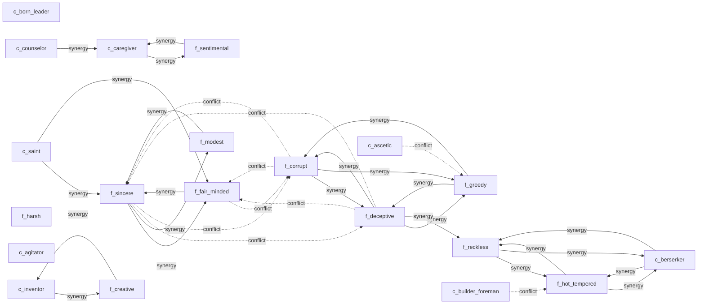

# Personality Traits

The WorldSim personality system uses **187 discrete traits** activated by HEXACO personality axes.
Traits modify emotion sensitivity, behavior weights, stress responses, and social interactions.

**Model basis**: Ashton & Lee (2007) HEXACO Personality Model, with extensions for dark triad traits and composite conditions.

## 개요

| HEXACO Axis | Name (EN) | Name (KR) | Traits | Positive | Negative |
| --- | --- | --- | --- | --- | --- |
| H | Honesty-Humility | 정직-겸손 | 56 | 16 | 33 |
| E | Emotionality | 감정성 | 31 | 12 | 6 |
| X | Extraversion | 외향성 | 31 | 16 | 6 |
| A | Agreeableness | 우호성 | 25 | 13 | 8 |
| C | Conscientiousness | 성실성 | 20 | 11 | 7 |
| O | Openness to Experience | 경험 개방성 | 24 | 12 | 1 |

## 특성 유형

| Type | Count | Description |
| --- | --- | --- |
| Personality | 187 | Standard facet-threshold traits |
| Dark | 0 | Dark triad/tetrad traits (composite conditions) |
| Composite | 0 | Multi-condition traits |

## 특성 작동 방식

1. **Activation**: Each entity's HEXACO personality scores are checked against trait conditions.
2. **Threshold**: A trait activates when a facet score is above (`high`) or below (`low`) the threshold.
3. **Effects**: Active traits modify behavior weights, emotion sensitivity, stress responses, and social interactions.
4. **Synergies**: Some traits amplify each other's effects; anti-synergies create internal conflict.

## 축 페이지

- [Honesty-Humility (H) - 정직-겸손](H.md)
- [Emotionality (E) - 감정성](E.md)
- [Extraversion (X) - 외향성](X.md)
- [Agreeableness (A) - 우호성](A.md)
- [Conscientiousness (C) - 성실성](C.md)
- [Openness to Experience (O) - 경험 개방성](O.md)

## 시너지 네트워크

📄 source: `extracted/trait_data.json`

## 수동 노트

<!-- MANUAL:START -->
<!-- MANUAL:END -->
