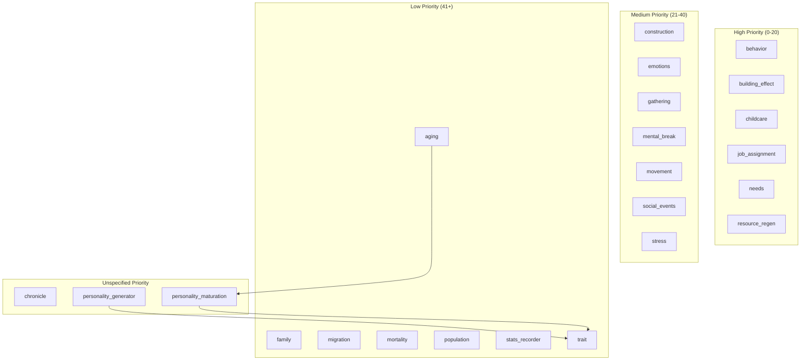

# 시스템 (Systems)

Total: 23 systems

## Execution Order

| Priority | System | Tick Interval | Description |
| --- | --- | --- | --- |
| 5 | [Resource Regen](resource_regen.md) | config (GameConfig.RESOURCE_REGEN_TICK_INTERVAL) | Generated system documentation page. |
| 8 | [Childcare](childcare.md) | 2 | Generated system documentation page. |
| 8 | [Job Assignment](job_assignment.md) | config (GameConfig.JOB_ASSIGNMENT_TICK_INTERVAL) | Generated system documentation page. |
| 10 | [Needs](needs.md) | config (GameConfig.NEEDS_TICK_INTERVAL) | Generated system documentation page. |
| 15 | [Building Effect](building_effect.md) | config (GameConfig.BUILDING_EFFECT_TICK_INTERVAL) | Generated system documentation page. |
| 20 | [Behavior](behavior.md) | config (GameConfig.BEHAVIOR_TICK_INTERVAL) | Generated system documentation page. |
| 25 | [Gathering](gathering.md) | config (GameConfig.GATHERING_TICK_INTERVAL) | Generated system documentation page. |
| 28 | [Construction](construction.md) | config (GameConfig.CONSTRUCTION_TICK_INTERVAL) | Generated system documentation page. |
| 30 | [Movement](movement.md) | config (GameConfig.MOVEMENT_TICK_INTERVAL) | Generated system documentation page. |
| 32 | [Emotions](emotions.md) | 12 | Plutchik 8-emotion update engine with 3-layer temporal dynamics. |
| 34 | [Stress](stress.md) | 2 | Stress System — Phase 1 Pipeline Lazarus & Folkman (1984) Transactional Model Selye (1956) GAS reserve McEwen (1998) Allostatic Load Hobfoll (1989) COR loss aversion Yerkes & Dodson (1908) Eustress efficiency |
| 35 | [Mental Break](mental_break.md) | 1 | Generated system documentation page. |
| 37 | [Social Events](social_events.md) | 30 | Drives relationship interactions using chunk-based proximity. |
| 48 | [Aging](aging.md) | 50 | Checks age stage transitions, emits growth notifications, and applies yearly personality maturation. |
| 49 | [Mortality](mortality.md) | 1 | Siler(1979) bathtub-curve mortality model. |
| 50 | [Population](population.md) | config (GameConfig.POPULATION_TICK_INTERVAL) | Generated system documentation page. |
| 52 | [Family](family.md) | 365 | Handles pregnancy, birth, widowhood, and maternal complications. |
| 60 | [Migration](migration.md) | config (GameConfig.MIGRATION_TICK_INTERVAL) | Generated system documentation page. |
| 90 | [Stats Recorder](stats_recorder.md) | 200 | Generated system documentation page. |
| 100 | [Trait](trait.md) | n/a | Discrete trait emergence and effects system. |
| - | [Chronicle](chronicle.md) | n/a | Chronicles significant events in the simulation for historical viewing. |
| - | [Personality Generator](personality_generator.md) | n/a | Cholesky-based HEXACO personality generator with parental inheritance, sex differences, and culture shifts. |
| - | [Personality Maturation](personality_maturation.md) | n/a | Age-based personality maturation using OU (Ornstein-Uhlenbeck) process. |

## Architecture Diagram

