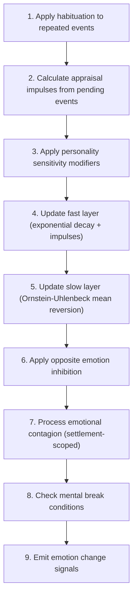

# Emotions

📄 source: `scripts/systems/emotion_system.gd` | Priority: 32 | Tick interval: 12

## Overview (개요)

The **Emotions** system implements Lazarus & Folkman (1984) cognitive appraisal stress model, Standard exponential decay, Plutchik (1980) emotion impulse dynamics, Uhlenbeck & Ornstein (1930) mean-reverting process, Plutchik emotion model, Lazarus appraisal model, Scherer appraisal process, Russell circumplex model, HEXACO personality framework to simulate plutchik 8-emotion update engine with 3-layer temporal dynamics.
It runs every **12 ticks** (0.0 game-years) at priority **32**.

**Core entity data**: `action_timer` (read/write (inferred)), `current_action` (read/write (inferred)), `current_goal` (read/write (inferred)), `emotion_data` (read/write (inferred)), `emotions` (read/write (inferred)), `energy` (read/write (inferred)), `entity_name` (read/write (inferred)), `id` (read/write (inferred)), `personality` (read/write (inferred)), `settlement_id` (read/write (inferred))

> Plutchik 8-emotion update engine with 3-layer temporal dynamics.

## Tick Pipeline (틱 파이프라인)

1. Apply habituation to repeated events
   📄 source: `scripts/systems/emotion_system.gd:L316`
   Math context: x(t) = x₀·e^{-λt}
2. Calculate appraisal impulses from pending events
   📄 source: `scripts/systems/emotion_system.gd:L89`
   Math context: stress_scale = f(demand, resources, appraisal), impulse_e = f(appraisal, personality, context), appraisal scaling
3. Apply personality sensitivity modifiers
   📄 source: `scripts/systems/emotion_system.gd:L103`
   Math context: stress_scale = f(demand, resources, appraisal), impulse_e = f(appraisal, personality, context), Updates emotional state dynamics across fast, slow, or memory-trace layers.
4. Update fast layer (exponential decay + impulses)
   📄 source: `scripts/systems/emotion_system.gd:L62`
   Math context: stress_scale = f(demand, resources, appraisal), Updates emotional state dynamics across fast, slow, or memory-trace layers., x(t) = x₀·e^{-λt}, impulse_e = f(appraisal, personality, context), exponential decay dynamics
5. Update slow layer (Ornstein-Uhlenbeck mean reversion)
   📄 source: `scripts/systems/emotion_system.gd:L103`
   Math context: stress_scale = f(demand, resources, appraisal), Updates emotional state dynamics across fast, slow, or memory-trace layers., x(t) = x₀·e^{-λt}, dX = θ(μ - X)dt + σdW, mean-reverting dynamics
6. Apply opposite emotion inhibition
7. Process emotional contagion (settlement-scoped)
   📄 source: `scripts/systems/emotion_system.gd:L62`
   Math context: Updates emotional state dynamics across fast, slow, or memory-trace layers., x(t) = x₀·e^{-λt}, contagion diffusion update
8. Check mental break conditions
   📄 source: `scripts/systems/emotion_system.gd:L62`
   Math context: Updates emotional state dynamics across fast, slow, or memory-trace layers., x(t) = x₀·e^{-λt}
9. Emit emotion change signals
   📄 source: `scripts/systems/emotion_system.gd:L103`
   Math context: stress_scale = f(demand, resources, appraisal), Updates emotional state dynamics across fast, slow, or memory-trace layers., impulse_e = f(appraisal, personality, context)

### Pipeline Diagram (파이프라인 다이어그램)



## Formulas (수식)

### Computes stress amplification by comparing perceived demands against available coping resources.

**Model**: Lazarus & Folkman (1984) cognitive appraisal stress model (Lazarus, R. S., & Folkman, S. (1984). Stress, Appraisal, and Coping)

$$
stress_scale = f(demand, resources, appraisal)
$$

**Interpretation**: Computes stress amplification by comparing perceived demands against available coping resources.

**GDScript**:
```gdscript
Plutchik 8-emotion update engine with 3-layer temporal dynamics.
Fast (episodic decay) + Slow (mood/baseline, OU process) + Memory trace (long-term scars).
Appraisal-based impulse from events. HEXACO personality coupling.
References:
Plutchik (1980, 2001), Russell (1980), Lazarus (1991), Scherer (2009)
Verduyn & Brans (2012), Hatfield et al. (1993)
```

| Variable | Meaning |
| :-- | :-- |
| `emotion` | emotion |
| `update` | update |
| `engine` | engine |
| `with` | with |
| `layer` | layer |
| `temporal` | temporal |
| `dynamics` | dynamics |
| `episodic` | episodic |
| `decay` | decay factor |
| `mood` | mood |
| `baseline` | baseline |
| `process` | process |
| `long` | long |
| `term` | term |
| `scars` | scars |
| `based` | based |

📄 source: `scripts/systems/emotion_system.gd:L3`

### Updates emotional state dynamics across fast, slow, or memory-trace layers.

**Interpretation**: Updates emotional state dynamics across fast, slow, or memory-trace layers.

**GDScript**:
```gdscript
var path: String = "res://data/emotions/event_presets.json"
```

| Variable | Meaning |
| :-- | :-- |
| `path` | path |

📄 source: `scripts/systems/emotion_system.gd:L48`

### Applies time-based exponential decay using half-life or decay-rate parameters.

**Model**: Standard exponential decay (Standard first-order decay dynamics)

$$
x(t) = x₀·e^{-λt}
$$

**Interpretation**: Applies time-based exponential decay using half-life or decay-rate parameters.

**GDScript**:
```gdscript
_fast_half_life = dp.get("fast_half_life_hours", {"joy": 0.75, "trust": 2.0, "fear": 0.3, "surprise": 0.05, "sadness": 0.5, "disgust": 0.1, "anger": 0.4, "anticipation": 3.0})
	_slow_half_life = dp.get("slow_half_life_hours", {"joy": 48.0, "trust": 72.0, "fear": 24.0, "surprise": 6.0, "sadness": 120.0, "disgust": 12.0, "anger": 12.0, "anticipation": 36.0})
```

| Variable | Meaning |
| :-- | :-- |
| `_fast_half_life` | half-life value |
| `dp` | dp |
| `_slow_half_life` | half-life value |

📄 source: `scripts/systems/emotion_system.gd:L64`

### Applies time-based exponential decay using half-life or decay-rate parameters.

**Model**: Standard exponential decay (Standard first-order decay dynamics)

$$
x(t) = x₀·e^{-λt}
$$

**Interpretation**: Applies time-based exponential decay using half-life or decay-rate parameters.

**GDScript**:
```gdscript
var mt_default_days = float(dp.get("memory_trace_default_half_life_days", 30))
	_memory_trace_default_hl_hours = mt_default_days * 24.0
	var mt_trauma_days = float(dp.get("memory_trace_trauma_half_life_days", 365))
	_memory_trace_trauma_hl_hours = mt_trauma_days * 24.0
```

| Variable | Meaning |
| :-- | :-- |
| `mt_default_days` | mt default days |
| `dp` | dp |
| `_memory_trace_default_hl_hours` |  memory trace default hl hours |
| `mt_trauma_days` | mt trauma days |
| `_memory_trace_trauma_hl_hours` |  memory trace trauma hl hours |

📄 source: `scripts/systems/emotion_system.gd:L70`

### Applies time-based exponential decay using half-life or decay-rate parameters.

**Model**: Standard exponential decay (Standard first-order decay dynamics)

$$
x(t) = x₀·e^{-λt}
$$

**Interpretation**: Applies time-based exponential decay using half-life or decay-rate parameters.

**GDScript**:
```gdscript
_half_life_adjustments = dp.get("half_life_adjustments", {})
```

| Variable | Meaning |
| :-- | :-- |
| `_half_life_adjustments` | half-life value |
| `dp` | dp |

📄 source: `scripts/systems/emotion_system.gd:L85`

### Applies time-based exponential decay using half-life or decay-rate parameters.

**Model**: Standard exponential decay (Standard first-order decay dynamics)

$$
x(t) = x₀·e^{-λt}
$$

**Interpretation**: Applies time-based exponential decay using half-life or decay-rate parameters.

**GDScript**:
```gdscript
var hl: float = _get_adjusted_half_life(emo, pd, "fast")
			var k: float = 0.693147 / hl
```

| Variable | Meaning |
| :-- | :-- |
| `hl` | hl |
| `emo` | emo |
| `pd` | pd |
| `k` | k |

📄 source: `scripts/systems/emotion_system.gd:L132`

### Computes emotion impulses from appraisal dimensions and personality-coupled sensitivity weights.

**Model**: Plutchik (1980) emotion impulse dynamics (Plutchik, R. (1980). A general psychoevolutionary theory of emotion; Lazarus, R. S. (1991). Emotion and Adaptation)

$$
impulse_e = f(appraisal, personality, context)
$$

**Interpretation**: Computes emotion impulses from appraisal dimensions and personality-coupled sensitivity weights.

**GDScript**:
```gdscript
ed.fast[emo] = ed.fast[emo] * exp(-k * dt_hours) + emo_impulse
```

| Variable | Meaning |
| :-- | :-- |
| `ed` | ed |
| `fast` | fast (episodic) emotion layer - rapid decay |
| `emo` | emo |
| `k` | k |
| `dt_hours` | dt hours |
| `emo_impulse` | emo impulse |

📄 source: `scripts/systems/emotion_system.gd:L140`

### Updates a latent state by mean-reverting toward baseline while injecting stochastic fluctuation.

**Model**: Uhlenbeck & Ornstein (1930) mean-reverting process (Uhlenbeck, G. E., & Ornstein, L. S. (1930). On the Theory of the Brownian Motion)

$$
dX = θ(μ - X)dt + σdW
$$

**Interpretation**: Updates a latent state by mean-reverting toward baseline while injecting stochastic fluctuation.

**GDScript**:
```gdscript
Step 3: Slow layer update (Ornstein-Uhlenbeck mean-reverting process)
★ stress shifts OU target baselines
```

| Variable | Meaning |
| :-- | :-- |
| `layer` | layer |
| `mean` | mean |
| `reverting` | reverting |
| `process` | process |
| `stress` | stress |
| `shifts` | shifts |
| `target` | target |
| `baselines` | baselines |

📄 source: `scripts/systems/emotion_system.gd:L143`

### Applies time-based exponential decay using half-life or decay-rate parameters.

**Model**: Standard exponential decay (Standard first-order decay dynamics)

$$
x(t) = x₀·e^{-λt}
$$

**Interpretation**: Applies time-based exponential decay using half-life or decay-rate parameters.

**GDScript**:
```gdscript
var effective_baseline: float = clampf(baseline + mu_shift, 0.0, 30.0)
			var hl_slow: float = _slow_half_life.get(emo, 48.0)
			var k_slow: float = 0.693147 / hl_slow
			var sigma: float = 0.5  # mood fluctuation
			ed.slow[emo] = effective_baseline + (ed.slow[emo] - effective_baseline) * exp(-k_slow * dt_hours)
			ed.slow[emo] += sigma * sqrt(dt_hours) * _randfn()
			ed.slow[emo] = clampf(ed.slow[emo], 0.0, 30.0)
```

| Variable | Meaning |
| :-- | :-- |
| `effective_baseline` | effective baseline |
| `baseline` | baseline |
| `mu_shift` | hazard or mean term |
| `hl_slow` | hl slow |
| `_slow_half_life` | half-life value |
| `emo` | emo |
| `k_slow` | k slow |
| `sigma` | standard deviation/noise scale |
| `ed` | ed |
| `slow` | slow (mood/baseline) layer - Ornstein-Uhlenbeck process |
| `dt_hours` | dt hours |

📄 source: `scripts/systems/emotion_system.gd:L155`

### Applies time-based exponential decay using half-life or decay-rate parameters.

**Model**: Standard exponential decay (Standard first-order decay dynamics)

$$
x(t) = x₀·e^{-λt}
$$

**Interpretation**: Applies time-based exponential decay using half-life or decay-rate parameters.

**GDScript**:
```gdscript
traces[j].intensity *= exp(-traces[j].decay_rate * dt_hours)
```

| Variable | Meaning |
| :-- | :-- |
| `traces` | traces |
| `j` | j |
| `intensity` | intensity |
| `decay_rate` | decay factor |
| `dt_hours` | dt hours |

📄 source: `scripts/systems/emotion_system.gd:L167`

### Computes emotion impulses from appraisal dimensions and personality-coupled sensitivity weights.

**Model**: Plutchik (1980) emotion impulse dynamics (Plutchik, R. (1980). A general psychoevolutionary theory of emotion; Lazarus, R. S. (1991). Emotion and Adaptation)

$$
impulse_e = f(appraisal, personality, context)
$$

**Interpretation**: Computes emotion impulses from appraisal dimensions and personality-coupled sensitivity weights.

**GDScript**:
```gdscript
impulse["joy"] = base_intensity * maxf(0.0, g) * (1.0 + 0.5 * n) * sens.get("joy", 1.0)
		impulse["sadness"] = base_intensity * maxf(0.0, -g) * (1.0 - c) * sens.get("sadness", 1.0)
		impulse["anger"] = base_intensity * maxf(0.0, -g) * c * maxf(0.0, -a + m) * sens.get("anger", 1.0)
		impulse["fear"] = base_intensity * maxf(0.0, -g) * (1.0 - c) * (0.5 + 0.5 * n) * sens.get("fear", 1.0)
		impulse["disgust"] = base_intensity * (p + 0.7 * m) * (0.5 + 0.5 * maxf(0.0, -g)) * sens.get("disgust", 1.0)
		impulse["surprise"] = base_intensity * n * sens.get("surprise", 1.0)
		impulse["trust"] = base_intensity * maxf(0.0, b) * (1.0 - p) * (1.0 - m) * sens.get("trust", 1.0)
		impulse["anticipation"] = base_intensity * fr * (0.5 + 0.5 * maxf(0.0, g)) * sens.get("anticipation", 1.0)
```

| Variable | Meaning |
| :-- | :-- |
| `impulse` | impulse |
| `base_intensity` | base intensity |
| `g` | g |
| `n` | n |
| `sens` | personality->emotion coupling exp(coeff * z_axis) |
| `c` | c |
| `a` | a |
| `m` | m |
| `p` | p |
| `b` | b |
| `fr` | fr |

📄 source: `scripts/systems/emotion_system.gd:L240`

### Updates emotional state dynamics across fast, slow, or memory-trace layers.

$$
e^{total}
$$

**Interpretation**: Updates emotional state dynamics across fast, slow, or memory-trace layers.

**GDScript**:
```gdscript
result[emo] = exp(total)
```

| Variable | Meaning |
| :-- | :-- |
| `result` | result |
| `emo` | emo |
| `total` | total |

📄 source: `scripts/systems/emotion_system.gd:L277`

### Updates emotional state dynamics across fast, slow, or memory-trace layers.

$$
e^{coeff  \cdot  z}
$$

**Interpretation**: Updates emotional state dynamics across fast, slow, or memory-trace layers.

**GDScript**:
```gdscript
result[emo] = exp(coeff * z)
```

| Variable | Meaning |
| :-- | :-- |
| `result` | result |
| `emo` | emo |
| `coeff` | coeff |
| `z` | z |

📄 source: `scripts/systems/emotion_system.gd:L282`

### Applies time-based exponential decay using half-life or decay-rate parameters.

**Model**: Standard exponential decay (Standard first-order decay dynamics)

$$
x(t) = x₀·e^{-λt}
$$

**Interpretation**: Applies time-based exponential decay using half-life or decay-rate parameters.

**GDScript**:
```gdscript
var adj = _half_life_adjustments.get(emo, {})
```

| Variable | Meaning |
| :-- | :-- |
| `adj` | adj |
| `_half_life_adjustments` | half-life value |
| `emo` | emo |

📄 source: `scripts/systems/emotion_system.gd:L290`

### Applies time-based exponential decay using half-life or decay-rate parameters.

**Model**: Standard exponential decay (Standard first-order decay dynamics)

$$
x(t) = x₀·e^{-λt}
$$

**Interpretation**: Applies time-based exponential decay using half-life or decay-rate parameters.

**GDScript**:
```gdscript
return base * exp(coeff * z)
```

| Variable | Meaning |
| :-- | :-- |
| `base` | base |
| `coeff` | coeff |
| `z` | z |

📄 source: `scripts/systems/emotion_system.gd:L296`

### Updates emotional state dynamics across fast, slow, or memory-trace layers.

$$
return clampf(base_val + scale_val  \cdot  z, min_val, max_val)
$$

**Interpretation**: Updates emotional state dynamics across fast, slow, or memory-trace layers.

**GDScript**:
```gdscript
return clampf(base_val + scale_val * z, min_val, max_val)
```

| Variable | Meaning |
| :-- | :-- |
| `base_val` | base val |
| `scale_val` | scale val |
| `z` | z |
| `min_val` | min val |
| `max_val` | max val |

📄 source: `scripts/systems/emotion_system.gd:L309`

### Applies time-based exponential decay using half-life or decay-rate parameters.

**Model**: Standard exponential decay (Standard first-order decay dynamics)

$$
x(t) = x₀·e^{-λt}
$$

**Interpretation**: Applies time-based exponential decay using half-life or decay-rate parameters.

**GDScript**:
```gdscript
return exp(-eta * float(n_count))
```

| Variable | Meaning |
| :-- | :-- |
| `eta` | eta |
| `n_count` | n count |

📄 source: `scripts/systems/emotion_system.gd:L322`

### Updates emotional state dynamics across fast, slow, or memory-trace layers.

$$
e^{0.2  \cdot  z_E + 0.1  \cdot  z_A}
$$

**Interpretation**: Updates emotional state dynamics across fast, slow, or memory-trace layers.

**GDScript**:
```gdscript
var susceptibility: float = exp(0.2 * z_E + 0.1 * z_A)
```

| Variable | Meaning |
| :-- | :-- |
| `susceptibility` | susceptibility |
| `z_E` | z E |
| `z_A` | z A |

📄 source: `scripts/systems/emotion_system.gd:L363`

### Applies time-based exponential decay using half-life or decay-rate parameters.

**Model**: Standard exponential decay (Standard first-order decay dynamics)

$$
x(t) = x₀·e^{-λt}
$$

**Interpretation**: Applies time-based exponential decay using half-life or decay-rate parameters.

**GDScript**:
```gdscript
var distance: float = sqrt(dx * dx + dy * dy)
			var distance_factor: float = exp(-distance / _contagion_distance_scale)
```

| Variable | Meaning |
| :-- | :-- |
| `distance` | distance |
| `dx` | dx |
| `dy` | dy |
| `distance_factor` | distance factor |
| `_contagion_distance_scale` |  contagion distance scale |

📄 source: `scripts/systems/emotion_system.gd:L379`

### Updates emotional state dynamics across fast, slow, or memory-trace layers.

$$
_contagion_kappa[emo]  \cdot  source_val  \cdot  distance_factor  \cdot  relationship  \cdot  susceptibility  \cdot  dt_hours
$$

**Interpretation**: Updates emotional state dynamics across fast, slow, or memory-trace layers.

**GDScript**:
```gdscript
delta[emo] += _contagion_kappa[emo] * source_val * distance_factor * relationship * susceptibility * dt_hours
```

| Variable | Meaning |
| :-- | :-- |
| `delta` | delta |
| `emo` | emo |
| `_contagion_kappa` |  contagion kappa |
| `source_val` | source val |
| `distance_factor` | distance factor |
| `relationship` | relationship |
| `susceptibility` | susceptibility |
| `dt_hours` | dt hours |

📄 source: `scripts/systems/emotion_system.gd:L392`

### Updates emotional state dynamics across fast, slow, or memory-trace layers.

$$
maxf(0.0, entity.energy - drain  \cdot  dt_hours / 24.0)
$$

**Interpretation**: Updates emotional state dynamics across fast, slow, or memory-trace layers.

**GDScript**:
```gdscript
entity.energy = maxf(0.0, entity.energy - drain * dt_hours / 24.0)
```

| Variable | Meaning |
| :-- | :-- |
| `entity` | entity |
| `energy` | energy |
| `drain` | drain |
| `dt_hours` | dt hours |

📄 source: `scripts/systems/emotion_system.gd:L419`

### Applies time-based exponential decay using half-life or decay-rate parameters.

**Model**: Standard exponential decay (Standard first-order decay dynamics)

$$
x(t) = x₀·e^{-λt}
$$

**Interpretation**: Applies time-based exponential decay using half-life or decay-rate parameters.

**GDScript**:
```gdscript
var p: float = 1.0 / (1.0 + exp(-(ed.stress - threshold) / _break_beta))
```

| Variable | Meaning |
| :-- | :-- |
| `p` | p |
| `ed` | ed |
| `stress` | stress |
| `threshold` | threshold |
| `_break_beta` |  break beta |

📄 source: `scripts/systems/emotion_system.gd:L450`

### Applies time-based exponential decay using half-life or decay-rate parameters.

**Model**: Standard exponential decay (Standard first-order decay dynamics)

$$
x(t) = x₀·e^{-λt}
$$

**Interpretation**: Applies time-based exponential decay using half-life or decay-rate parameters.

**GDScript**:
```gdscript
"decay_rate": base_decay,
```

| Variable | Meaning |
| :-- | :-- |
| `base_decay` | decay factor |

📄 source: `scripts/systems/emotion_system.gd:L528`

### Updates emotional state dynamics across fast, slow, or memory-trace layers.

**Interpretation**: Updates emotional state dynamics across fast, slow, or memory-trace layers.

**GDScript**:
```gdscript
Box-Muller Transform (randfn replacement)
═══════════════════════════════════════════════════
```

| Variable | Meaning |
| :-- | :-- |
| `replacement` | replacement |

📄 source: `scripts/systems/emotion_system.gd:L534`

### Updates emotional state dynamics across fast, slow, or memory-trace layers.

**Interpretation**: Updates emotional state dynamics across fast, slow, or memory-trace layers.

**GDScript**:
```gdscript
var u: float = randf()
	var v: float = randf()
```

| Variable | Meaning |
| :-- | :-- |
| `u` | u |
| `v` | v |

📄 source: `scripts/systems/emotion_system.gd:L545`

### Updates emotional state dynamics across fast, slow, or memory-trace layers.

**Interpretation**: Updates emotional state dynamics across fast, slow, or memory-trace layers.

**GDScript**:
```gdscript
u = randf()
	var mag: float = sqrt(-2.0 * log(u))
	_spare_normal = mag * sin(TAU * v)
```

| Variable | Meaning |
| :-- | :-- |
| `u` | u |
| `mag` | mag |
| `_spare_normal` |  spare normal |
| `v` | v |

📄 source: `scripts/systems/emotion_system.gd:L549`

### Updates emotional state dynamics across fast, slow, or memory-trace layers.

$$
return mag  \cdot  cos(TAU  \cdot  v)
$$

**Interpretation**: Updates emotional state dynamics across fast, slow, or memory-trace layers.

**GDScript**:
```gdscript
return mag * cos(TAU * v)
```

| Variable | Meaning |
| :-- | :-- |
| `mag` | mag |
| `v` | v |

📄 source: `scripts/systems/emotion_system.gd:L553`

## Configuration Reference (설정)

No explicit `GameConfig` references extracted.

## Cross-System Effects (시스템 간 상호작용)

### Imported Modules (모듈 임포트)

- `scripts/core/emotion_data.gd` via `preload` at `scripts/systems/emotion_system.gd:L10`

### Shared Entity Fields (공유 엔티티 필드)

| Field | Access | Shared With |
| :-- | :-- | :-- |
| `action_timer` | read/write (inferred) | [`behavior`](behavior.md), [`migration`](migration.md), [`movement`](movement.md) |
| `current_action` | read/write (inferred) | [`behavior`](behavior.md), [`construction`](construction.md), [`gathering`](gathering.md), [`job_assignment`](job_assignment.md), [`migration`](migration.md), [`movement`](movement.md), [`needs`](needs.md), [`social_events`](social_events.md), [`stress`](stress.md) |
| `emotion_data` | read/write (inferred) | [`behavior`](behavior.md), [`family`](family.md), [`mental_break`](mental_break.md), [`stress`](stress.md), [`trait`](trait.md) |
| `emotions` | read/write (inferred) | [`behavior`](behavior.md), [`family`](family.md), [`trait`](trait.md) |
| `energy` | read/write (inferred) | [`behavior`](behavior.md), [`building_effect`](building_effect.md), [`mental_break`](mental_break.md), [`movement`](movement.md), [`needs`](needs.md), [`stress`](stress.md) |
| `entity_name` | read/write (inferred) | [`behavior`](behavior.md), [`aging`](aging.md), [`chronicle`](chronicle.md), [`family`](family.md), [`gathering`](gathering.md), [`job_assignment`](job_assignment.md), [`mental_break`](mental_break.md), [`mortality`](mortality.md), [`movement`](movement.md), [`needs`](needs.md), [`population`](population.md), [`stress`](stress.md) |
| `id` | read/write (inferred) | [`behavior`](behavior.md), [`aging`](aging.md), [`family`](family.md), [`gathering`](gathering.md), [`job_assignment`](job_assignment.md), [`migration`](migration.md), [`mortality`](mortality.md), [`movement`](movement.md), [`needs`](needs.md), [`population`](population.md), [`social_events`](social_events.md) |
| `personality` | read/write (inferred) | [`aging`](aging.md), [`mental_break`](mental_break.md), [`stress`](stress.md), [`trait`](trait.md) |
| `settlement_id` | read/write (inferred) | [`behavior`](behavior.md), [`family`](family.md), [`migration`](migration.md), [`needs`](needs.md), [`population`](population.md), [`stress`](stress.md) |

### Signals (시그널)

No emitted signals extracted for this module.

### Downstream Impact (다운스트림 영향)

- No explicit downstream dependencies extracted.

## Entity Data Model (엔티티 데이터 모델)

| Field | Access | Type | Represents | Typical Values |
| :-- | :-- | :-- | :-- | :-- |
| `action_timer` | read/write (inferred) | int | Current behavior intent used by schedulers and downstream systems. | Non-negative tick counts. |
| `current_action` | read/write (inferred) | String enum | Current behavior intent used by schedulers and downstream systems. | System-defined value domain. |
| `current_goal` | read/write (inferred) | Variant | Current behavior intent used by schedulers and downstream systems. | System-defined value domain. |
| `emotion_data` | read/write (inferred) | Dictionary / custom data object | Affective state used for behavior modulation and social propagation. | Structured object with nested metrics/axes. |
| `emotions` | read/write (inferred) | Dictionary / custom data object | Affective state used for behavior modulation and social propagation. | System-defined value domain. |
| `energy` | read/write (inferred) | float | Fatigue/rest capacity controlling action readiness. | Normalized scalar (commonly 0.0-1.0 or 0-100 by system). |
| `entity_name` | read/write (inferred) | Variant | Entity name. | System-defined value domain. |
| `id` | read/write (inferred) | int | Stable entity identity used for referencing across systems. | Positive integer identifiers. |
| `personality` | read/write (inferred) | Dictionary / custom data object | Trait/axis profile used for sensitivity and decision weighting. | Structured object with nested metrics/axes. |
| `settlement_id` | read/write (inferred) | int | Stable entity identity used for referencing across systems. | Positive integer identifiers. |
