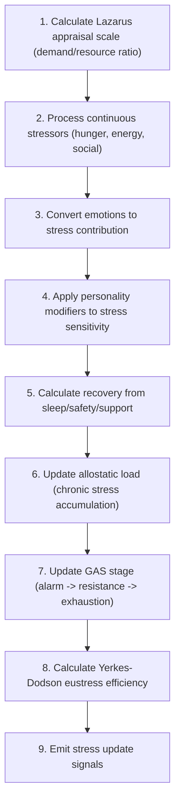

# Stress

📄 source: `scripts/systems/stress_system.gd` | Priority: 34 | Tick interval: 2

## Overview (개요)

The **Stress** system implements Lazarus & Folkman (1984) cognitive appraisal stress model, Standard exponential decay, Selye (1956) General Adaptation Syndrome resistance, McEwen (1998) allostatic load model, Yerkes & Dodson (1908) arousal-performance law, Lazarus appraisal model, Allostatic load model, Yerkes-Dodson arousal-performance law, General Adaptation Syndrome to simulate stress System — Phase 1 Pipeline Lazarus & Folkman (1984) Transactional Model Selye (1956) GAS reserve McEwen (1998) Allostatic Load Hobfoll (1989) COR loss aversion Yerkes & Dodson (1908) Eustress efficiency.
It runs every **2 ticks** (0.0 game-years) at priority **34**.

**Core entity data**: `active_traits` (read/write (inferred)), `current_action` (read/write (inferred)), `emotion_data` (read/write (inferred)), `energy` (read/write (inferred)), `entity_name` (read/write (inferred)), `hunger` (read/write (inferred)), `personality` (read/write (inferred)), `settlement_id` (read/write (inferred)), `social` (read/write (inferred))

> Stress System — Phase 1 Pipeline Lazarus & Folkman (1984) Transactional Model Selye (1956) GAS reserve McEwen (1998) Allostatic Load Hobfoll (1989) COR loss aversion Yerkes & Dodson (1908) Eustress efficiency

## Tick Pipeline (틱 파이프라인)

1. Calculate Lazarus appraisal scale (demand/resource ratio)
   📄 source: `scripts/systems/stress_system.gd:L124`
   Math context: stress_scale = f(demand, resources, appraisal), appraisal scaling
2. Process continuous stressors (hunger, energy, social)
   📄 source: `scripts/systems/stress_system.gd:L124`
   Math context: Updates stress burden, coping reserve, or resilience from current pressure and recovery signals., stress_scale = f(demand, resources, appraisal)
3. Convert emotions to stress contribution
   📄 source: `scripts/systems/stress_system.gd:L55`
   Math context: Updates stress burden, coping reserve, or resilience from current pressure and recovery signals., stress_scale = f(demand, resources, appraisal), x(t) = x₀·e^{-λt}, reserve(t+1) = clamp(reserve(t) - drain + recovery), load(t+1) = clamp(load(t) + chronic_stress - recovery), efficiency = f(stress)
4. Apply personality modifiers to stress sensitivity
   📄 source: `scripts/systems/stress_system.gd:L66`
   Math context: Updates stress burden, coping reserve, or resilience from current pressure and recovery signals.
5. Calculate recovery from sleep/safety/support
   📄 source: `scripts/systems/stress_system.gd:L235`
   Math context: Updates stress burden, coping reserve, or resilience from current pressure and recovery signals., stress_scale = f(demand, resources, appraisal), reserve(t+1) = clamp(reserve(t) - drain + recovery), load(t+1) = clamp(load(t) + chronic_stress - recovery), x(t) = x₀·e^{-λt}
6. Update allostatic load (chronic stress accumulation)
   📄 source: `scripts/systems/stress_system.gd:L279`
   Math context: load(t+1) = clamp(load(t) + chronic_stress - recovery), allostatic accumulation model
7. Update GAS stage (alarm -> resistance -> exhaustion)
   📄 source: `scripts/systems/stress_system.gd:L257`
   Math context: reserve(t+1) = clamp(reserve(t) - drain + recovery)
8. Calculate Yerkes-Dodson eustress efficiency
   📄 source: `scripts/systems/stress_system.gd:L373`
   Math context: efficiency = f(stress), stress-performance curve
9. Emit stress update signals
   📄 source: `scripts/systems/stress_system.gd:L66`
   Math context: Updates stress burden, coping reserve, or resilience from current pressure and recovery signals., stress_scale = f(demand, resources, appraisal), x(t) = x₀·e^{-λt}, reserve(t+1) = clamp(reserve(t) - drain + recovery), load(t+1) = clamp(load(t) + chronic_stress - recovery), efficiency = f(stress)

### Pipeline Diagram (파이프라인 다이어그램)



## Formulas (수식)

### Updates stress burden, coping reserve, or resilience from current pressure and recovery signals.

$$
continuous_input + trace_input + emotion_input - recovery
$$

**Interpretation**: Updates stress burden, coping reserve, or resilience from current pressure and recovery signals.

**GDScript**:
```gdscript
var delta: float = continuous_input + trace_input + emotion_input - recovery
```

| Variable | Meaning |
| :-- | :-- |
| `delta` | delta |
| `continuous_input` | continuous input |
| `trace_input` | trace input |
| `emotion_input` | emotion input |
| `recovery` | recovery |

📄 source: `scripts/systems/stress_system.gd:L88`

### Updates stress burden, coping reserve, or resilience from current pressure and recovery signals.

$$
clampf(ed.stress + delta, 0.0, STRESS_CLAMP_MAX)
$$

**Interpretation**: Updates stress burden, coping reserve, or resilience from current pressure and recovery signals.

**GDScript**:
```gdscript
ed.stress = clampf(ed.stress + delta, 0.0, STRESS_CLAMP_MAX)
```

| Variable | Meaning |
| :-- | :-- |
| `ed` | ed |
| `stress` | stress |
| `delta` | delta |

📄 source: `scripts/systems/stress_system.gd:L92`

### Computes stress amplification by comparing perceived demands against available coping resources.

**Model**: Lazarus & Folkman (1984) cognitive appraisal stress model (Lazarus, R. S., & Folkman, S. (1984). Stress, Appraisal, and Coping)

$$
stress_scale = f(demand, resources, appraisal)
$$

**Interpretation**: Computes stress amplification by comparing perceived demands against available coping resources.

**GDScript**:
```gdscript
var D_dep: float = 0.45 * (1.0 - hunger) + 0.35 * (1.0 - energy) + 0.20 * (1.0 - social)
	var D: float = clampf(0.30 * D_dep + 0.40 * threat + 0.20 * conflict, 0.0, 1.0)
```

| Variable | Meaning |
| :-- | :-- |
| `hunger` | nutrition state input |
| `energy` | energy |
| `social` | social |
| `D` | demand composite (weighted HEXACO modulation) |
| `threat` | threat |
| `conflict` | conflict |

📄 source: `scripts/systems/stress_system.gd:L131`

### Computes stress amplification by comparing perceived demands against available coping resources.

**Model**: Lazarus & Folkman (1984) cognitive appraisal stress model (Lazarus, R. S., & Folkman, S. (1984). Stress, Appraisal, and Coping)

$$
stress_scale = f(demand, resources, appraisal)
$$

**Interpretation**: Computes stress amplification by comparing perceived demands against available coping resources.

**GDScript**:
```gdscript
var R_physical: float = 0.5 * hunger + 0.5 * energy
	var R_safety: float = 1.0 - threat
```

| Variable | Meaning |
| :-- | :-- |
| `hunger` | nutrition state input |
| `energy` | energy |
| `threat` | threat |

📄 source: `scripts/systems/stress_system.gd:L134`

### Computes stress amplification by comparing perceived demands against available coping resources.

**Model**: Lazarus & Folkman (1984) cognitive appraisal stress model (Lazarus, R. S., & Folkman, S. (1984). Stress, Appraisal, and Coping)

$$
stress_scale = f(demand, resources, appraisal)
$$

**Interpretation**: Computes stress amplification by comparing perceived demands against available coping resources.

**GDScript**:
```gdscript
var R: float = clampf(0.30 * R_physical + 0.30 * R_safety + 0.25 * R_support + 0.15 * 0.5, 0.0, 1.0)
```

| Variable | Meaning |
| :-- | :-- |
| `R` | resource composite |

📄 source: `scripts/systems/stress_system.gd:L137`

### Computes stress amplification by comparing perceived demands against available coping resources.

**Model**: Lazarus & Folkman (1984) cognitive appraisal stress model (Lazarus, R. S., & Folkman, S. (1984). Stress, Appraisal, and Coping)

$$
stress_scale = f(demand, resources, appraisal)
$$

**Interpretation**: Computes stress amplification by comparing perceived demands against available coping resources.

**GDScript**:
```gdscript
var threat_appraisal: float = D * (1.0 + 0.55 * (E_axis - 0.5) * 2.0 + 0.25 * (fear_val / 100.0) - 0.15 * (trust_val / 100.0))
```

| Variable | Meaning |
| :-- | :-- |
| `threat_appraisal` | threat appraisal |
| `D` | demand composite (weighted HEXACO modulation) |
| `fear_val` | fear val |
| `trust_val` | trust val |

📄 source: `scripts/systems/stress_system.gd:L143`

### Computes stress amplification by comparing perceived demands against available coping resources.

**Model**: Lazarus & Folkman (1984) cognitive appraisal stress model (Lazarus, R. S., & Folkman, S. (1984). Stress, Appraisal, and Coping)

$$
stress_scale = f(demand, resources, appraisal)
$$

**Interpretation**: Computes stress amplification by comparing perceived demands against available coping resources.

**GDScript**:
```gdscript
var coping_appraisal: float = R * (1.0 + 0.35 * (C_axis - 0.5) * 2.0 + 0.20 * (O_axis - 0.5) * 2.0 + 0.20 * reserve_ratio)
```

| Variable | Meaning |
| :-- | :-- |
| `coping_appraisal` | coping appraisal |
| `R` | resource composite |
| `reserve_ratio` | reserve ratio |

📄 source: `scripts/systems/stress_system.gd:L148`

### Computes stress amplification by comparing perceived demands against available coping resources.

**Model**: Lazarus & Folkman (1984) cognitive appraisal stress model (Lazarus, R. S., & Folkman, S. (1984). Stress, Appraisal, and Coping)

$$
stress_scale = f(demand, resources, appraisal)
$$

**Interpretation**: Computes stress amplification by comparing perceived demands against available coping resources.

**GDScript**:
```gdscript
return clampf(1.0 + 0.8 * imbalance, 0.7, 1.9)
```

| Variable | Meaning |
| :-- | :-- |
| `imbalance` | imbalance |

📄 source: `scripts/systems/stress_system.gd:L151`

### Computes stress amplification by comparing perceived demands against available coping resources.

**Model**: Lazarus & Folkman (1984) cognitive appraisal stress model (Lazarus, R. S., & Folkman, S. (1984). Stress, Appraisal, and Coping)

$$
stress_scale = f(demand, resources, appraisal)
$$

**Interpretation**: Computes stress amplification by comparing perceived demands against available coping resources.

**GDScript**:
```gdscript
var h_def: float = clampf((0.35 - hunger) / 0.35, 0.0, 1.0)
	var s_hunger: float = (3.0 * h_def + 9.0 * h_def * h_def) * appraisal_scale
```

| Variable | Meaning |
| :-- | :-- |
| `h_def` | h def |
| `hunger` | nutrition state input |
| `s_hunger` | nutrition state input |
| `appraisal_scale` | appraisal scale |

📄 source: `scripts/systems/stress_system.gd:L161`

### Computes stress amplification by comparing perceived demands against available coping resources.

**Model**: Lazarus & Folkman (1984) cognitive appraisal stress model (Lazarus, R. S., & Folkman, S. (1984). Stress, Appraisal, and Coping)

$$
stress_scale = f(demand, resources, appraisal)
$$

**Interpretation**: Computes stress amplification by comparing perceived demands against available coping resources.

**GDScript**:
```gdscript
var e_def: float = clampf((0.40 - energy) / 0.40, 0.0, 1.0)
	var s_energy: float = (2.0 * e_def + 10.0 * e_def * e_def) * appraisal_scale
```

| Variable | Meaning |
| :-- | :-- |
| `e_def` | e def |
| `energy` | energy |
| `s_energy` | s energy |
| `appraisal_scale` | appraisal scale |

📄 source: `scripts/systems/stress_system.gd:L167`

### Computes stress amplification by comparing perceived demands against available coping resources.

**Model**: Lazarus & Folkman (1984) cognitive appraisal stress model (Lazarus, R. S., & Folkman, S. (1984). Stress, Appraisal, and Coping)

$$
stress_scale = f(demand, resources, appraisal)
$$

**Interpretation**: Computes stress amplification by comparing perceived demands against available coping resources.

**GDScript**:
```gdscript
var soc_def: float = clampf((0.25 - social) / 0.25, 0.0, 1.0)
	var s_social: float = 2.0 * soc_def * soc_def * appraisal_scale
```

| Variable | Meaning |
| :-- | :-- |
| `soc_def` | soc def |
| `social` | social |
| `s_social` | s social |
| `appraisal_scale` | appraisal scale |

📄 source: `scripts/systems/stress_system.gd:L173`

### Applies time-based exponential decay using half-life or decay-rate parameters.

**Model**: Standard exponential decay (Standard first-order decay dynamics)

$$
x(t) = x₀·e^{-λt}
$$

**Interpretation**: Applies time-based exponential decay using half-life or decay-rate parameters.

**GDScript**:
```gdscript
var decay: float = trace.get("decay_rate", 0.05)
		trace["per_tick"] = contribution * (1.0 - decay)
```

| Variable | Meaning |
| :-- | :-- |
| `decay` | decay factor |
| `trace` | trace |
| `contribution` | contribution |

📄 source: `scripts/systems/stress_system.gd:L192`

### Updates stress burden, coping reserve, or resilience from current pressure and recovery signals.

$$
clampf(-valence / 100.0, 0.0, 1.0)
$$

**Interpretation**: Updates stress burden, coping reserve, or resilience from current pressure and recovery signals.

**GDScript**:
```gdscript
var neg: float = clampf(-valence / 100.0, 0.0, 1.0)
	var ar: float = clampf(arousal / 100.0, 0.0, 1.0)
	var va_contrib: float = VA_GAMMA * ar * neg
```

| Variable | Meaning |
| :-- | :-- |
| `neg` | neg |
| `valence` | valence |
| `ar` | ar |
| `arousal` | arousal |
| `va_contrib` | va contrib |

📄 source: `scripts/systems/stress_system.gd:L224`

### Updates stress burden, coping reserve, or resilience from current pressure and recovery signals.

$$
1.0 + 0.10  \cdot  (resilience - 0.5)  \cdot  2.0
$$

**Interpretation**: Updates stress burden, coping reserve, or resilience from current pressure and recovery signals.

**GDScript**:
```gdscript
decay *= 1.0 + 0.10 * (resilience - 0.5) * 2.0
```

| Variable | Meaning |
| :-- | :-- |
| `decay` | decay factor |
| `resilience` | recovery resilience factor (CD-RISC based) |

📄 source: `scripts/systems/stress_system.gd:L247`

### Updates stress burden, coping reserve, or resilience from current pressure and recovery signals.

$$
maxf(0.0, (ed.stress - 150.0) / 350.0)  \cdot  (0.7 + 0.6  \cdot  (1.0 - resilience))
$$

**Interpretation**: Updates stress burden, coping reserve, or resilience from current pressure and recovery signals.

**GDScript**:
```gdscript
var drain: float = maxf(0.0, (ed.stress - 150.0) / 350.0) * (0.7 + 0.6 * (1.0 - resilience))
	var recover_base: float = 0.4 + 0.6 * resilience
	var recover: float = recover_base * (1.0 if is_sleeping else 0.15)
```

| Variable | Meaning |
| :-- | :-- |
| `drain` | drain |
| `ed` | ed |
| `stress` | stress |
| `resilience` | recovery resilience factor (CD-RISC based) |
| `recover_base` | recover base |
| `recover` | recover |
| `is_sleeping` | is sleeping |

📄 source: `scripts/systems/stress_system.gd:L260`

### Updates resistance reserves as prolonged stress drains capacity toward exhaustion and recovery restores it.

**Model**: Selye (1956) General Adaptation Syndrome resistance (Selye, H. (1956). The Stress of Life)

$$
reserve(t+1) = clamp(reserve(t) - drain + recovery)
$$

**Interpretation**: Updates resistance reserves as prolonged stress drains capacity toward exhaustion and recovery restores it.

**GDScript**:
```gdscript
ed.reserve = clampf(ed.reserve - drain + recover, 0.0, RESERVE_MAX)
```

| Variable | Meaning |
| :-- | :-- |
| `ed` | ed |
| `reserve` | GAS resistance reserve (0-100) |
| `drain` | drain |
| `recover` | recover |

📄 source: `scripts/systems/stress_system.gd:L264`

### Accumulates chronic stress burden over time and models recovery-driven load reduction.

**Model**: McEwen (1998) allostatic load model (McEwen, B. S. (1998). Protective and Damaging Effects of Stress Mediators)

$$
load(t+1) = clamp(load(t) + chronic_stress - recovery)
$$

**Interpretation**: Accumulates chronic stress burden over time and models recovery-driven load reduction.

**GDScript**:
```gdscript
var allo_inc: float = ALLO_RATE * maxf(0.0, ed.stress - ALLO_STRESS_THRESHOLD) / ALLO_STRESS_THRESHOLD
```

| Variable | Meaning |
| :-- | :-- |
| `allo_inc` | allo inc |
| `ed` | ed |
| `stress` | stress |

📄 source: `scripts/systems/stress_system.gd:L281`

### Accumulates chronic stress burden over time and models recovery-driven load reduction.

**Model**: McEwen (1998) allostatic load model (McEwen, B. S. (1998). Protective and Damaging Effects of Stress Mediators)

$$
load(t+1) = clamp(load(t) + chronic_stress - recovery)
$$

**Interpretation**: Accumulates chronic stress burden over time and models recovery-driven load reduction.

**GDScript**:
```gdscript
ed.allostatic = clampf(ed.allostatic + allo_inc, 0.0, 100.0)
```

| Variable | Meaning |
| :-- | :-- |
| `ed` | ed |
| `allostatic` | allostatic load (chronic wear, 0-100) |
| `allo_inc` | allo inc |

📄 source: `scripts/systems/stress_system.gd:L283`

### Accumulates chronic stress burden over time and models recovery-driven load reduction.

**Model**: McEwen (1998) allostatic load model (McEwen, B. S. (1998). Protective and Damaging Effects of Stress Mediators)

$$
load(t+1) = clamp(load(t) + chronic_stress - recovery)
$$

**Interpretation**: Accumulates chronic stress burden over time and models recovery-driven load reduction.

**GDScript**:
```gdscript
ed.allostatic = clampf(ed.allostatic - ALLO_RECOVERY_RATE, 0.0, 100.0)
```

| Variable | Meaning |
| :-- | :-- |
| `ed` | ed |
| `allostatic` | allostatic load (chronic wear, 0-100) |

📄 source: `scripts/systems/stress_system.gd:L286`

### Accumulates chronic stress burden over time and models recovery-driven load reduction.

**Model**: McEwen (1998) allostatic load model (McEwen, B. S. (1998). Protective and Damaging Effects of Stress Mediators)

$$
load(t+1) = clamp(load(t) + chronic_stress - recovery)
$$

**Interpretation**: Accumulates chronic stress burden over time and models recovery-driven load reduction.

**GDScript**:
```gdscript
- 0.30 * (ed.allostatic / 100.0))
```

| Variable | Meaning |
| :-- | :-- |
| `ed` | ed |
| `allostatic` | allostatic load (chronic wear, 0-100) |

📄 source: `scripts/systems/stress_system.gd:L323`

### Updates stress burden, coping reserve, or resilience from current pressure and recovery signals.

$$
clampf((0.3 - energy) / 0.3, 0.0, 0.3) + clampf((0.3 - hunger) / 0.3, 0.0, 0.2)
$$

**Interpretation**: Updates stress burden, coping reserve, or resilience from current pressure and recovery signals.

**GDScript**:
```gdscript
var fatigue_penalty: float = clampf((0.3 - energy) / 0.3, 0.0, 0.3) + clampf((0.3 - hunger) / 0.3, 0.0, 0.2)
	r -= 0.20 * fatigue_penalty
```

| Variable | Meaning |
| :-- | :-- |
| `fatigue_penalty` | fatigue penalty |
| `energy` | energy |
| `hunger` | nutrition state input |
| `r` | resource composite |

📄 source: `scripts/systems/stress_system.gd:L327`

### Updates stress burden, coping reserve, or resilience from current pressure and recovery signals.

**Interpretation**: Updates stress burden, coping reserve, or resilience from current pressure and recovery signals.

**GDScript**:
```gdscript
ed.resilience = clampf(r, 0.05, 1.0)
```

| Variable | Meaning |
| :-- | :-- |
| `ed` | ed |
| `resilience` | recovery resilience factor (CD-RISC based) |
| `r` | resource composite |

📄 source: `scripts/systems/stress_system.gd:L330`

### Accumulates chronic stress burden over time and models recovery-driven load reduction.

**Model**: McEwen (1998) allostatic load model (McEwen, B. S. (1998). Protective and Damaging Effects of Stress Mediators)

$$
load(t+1) = clamp(load(t) + chronic_stress - recovery)
$$

**Interpretation**: Accumulates chronic stress burden over time and models recovery-driven load reduction.

**GDScript**:
```gdscript
var s1: float = clampf((ed.stress - 100.0) / 400.0, 0.0, 1.0)
	var s2: float = clampf((ed.stress - 300.0) / 400.0, 0.0, 1.0)
	var allo_ratio: float = ed.allostatic / 100.0
```

| Variable | Meaning |
| :-- | :-- |
| `s1` | s1 |
| `ed` | ed |
| `stress` | stress |
| `s2` | s2 |
| `allo_ratio` | allo ratio |
| `allostatic` | allostatic load (chronic wear, 0-100) |

📄 source: `scripts/systems/stress_system.gd:L335`

### Updates stress burden, coping reserve, or resilience from current pressure and recovery signals.

$$
ed.set_meta("stress_mu_sadness", 6.0  \cdot  s1 + 10.0  \cdot  allo_ratio)
$$

**Interpretation**: Updates stress burden, coping reserve, or resilience from current pressure and recovery signals.

**GDScript**:
```gdscript
ed.set_meta("stress_mu_sadness", 6.0 * s1 + 10.0 * allo_ratio)
	ed.set_meta("stress_mu_anger", 4.0 * s1 + 8.0 * allo_ratio)
	ed.set_meta("stress_mu_fear", 5.0 * s1 + 12.0 * allo_ratio)
	ed.set_meta("stress_mu_joy", -(5.0 * s1 + 12.0 * allo_ratio))
	ed.set_meta("stress_mu_trust", -(4.0 * s1 + 10.0 * allo_ratio))
```

| Variable | Meaning |
| :-- | :-- |
| `ed` | ed |
| `s1` | s1 |
| `allo_ratio` | allo ratio |

📄 source: `scripts/systems/stress_system.gd:L339`

### Updates stress burden, coping reserve, or resilience from current pressure and recovery signals.

$$
1.0 + 0.9  \cdot  allo_ratio  \cdot  (2.0 if allo_ratio > 0.6 else 1.0)
$$

**Interpretation**: Updates stress burden, coping reserve, or resilience from current pressure and recovery signals.

**GDScript**:
```gdscript
var blunt_denom: float = 1.0 + 0.9 * allo_ratio * (2.0 if allo_ratio > 0.6 else 1.0)
	ed.set_meta("stress_blunt_mult", 1.0 / blunt_denom)
```

| Variable | Meaning |
| :-- | :-- |
| `blunt_denom` | blunt denom |
| `allo_ratio` | allo ratio |
| `ed` | ed |

📄 source: `scripts/systems/stress_system.gd:L348`

### Applies time-based exponential decay using half-life or decay-rate parameters.

**Model**: Standard exponential decay (Standard first-order decay dynamics)

$$
x(t) = x₀·e^{-λt}
$$

**Interpretation**: Applies time-based exponential decay using half-life or decay-rate parameters.

**GDScript**:
```gdscript
return clampf(0.65 * strong + 0.35 * (1.0 - exp(-weak_sum / 1.5)), 0.0, 1.0)
```

| Variable | Meaning |
| :-- | :-- |
| `strong` | strong |
| `weak_sum` | weak sum |

📄 source: `scripts/systems/stress_system.gd:L369`

### Maps stress arousal to task efficiency with a bounded performance response curve.

**Model**: Yerkes & Dodson (1908) arousal-performance law (Yerkes, R. M., & Dodson, J. D. (1908). The relation of strength of stimulus to rapidity of habit-formation)

$$
efficiency = f(stress)
$$

**Interpretation**: Maps stress arousal to task efficiency with a bounded performance response curve.

**GDScript**:
```gdscript
perf = 1.09 - 0.0004 * (s - 150.0)
```

| Variable | Meaning |
| :-- | :-- |
| `perf` | perf |
| `s` | s |

📄 source: `scripts/systems/stress_system.gd:L379`

### Maps stress arousal to task efficiency with a bounded performance response curve.

**Model**: Yerkes & Dodson (1908) arousal-performance law (Yerkes, R. M., & Dodson, J. D. (1908). The relation of strength of stimulus to rapidity of habit-formation)

$$
efficiency = f(stress)
$$

**Interpretation**: Maps stress arousal to task efficiency with a bounded performance response curve.

**GDScript**:
```gdscript
perf = 1.01 - 0.0012 * (s - 350.0)
```

| Variable | Meaning |
| :-- | :-- |
| `perf` | perf |
| `s` | s |

📄 source: `scripts/systems/stress_system.gd:L381`

### Maps stress arousal to task efficiency with a bounded performance response curve.

**Model**: Yerkes & Dodson (1908) arousal-performance law (Yerkes, R. M., & Dodson, J. D. (1908). The relation of strength of stimulus to rapidity of habit-formation)

$$
efficiency = f(stress)
$$

**Interpretation**: Maps stress arousal to task efficiency with a bounded performance response curve.

**GDScript**:
```gdscript
return clampf(perf, 0.35, 1.10)
```

| Variable | Meaning |
| :-- | :-- |
| `perf` | perf |

📄 source: `scripts/systems/stress_system.gd:L385`

### Computes stress amplification by comparing perceived demands against available coping resources.

**Model**: Lazarus & Folkman (1984) cognitive appraisal stress model (Lazarus, R. S., & Folkman, S. (1984). Stress, Appraisal, and Coping)

$$
stress_scale = f(demand, resources, appraisal)
$$

**Interpretation**: Computes stress amplification by comparing perceived demands against available coping resources.

**GDScript**:
```gdscript
per_tick: float = 0.0, decay_rate: float = 0.05,
		is_loss: bool = false, appraisal_scale: float = 1.0) -> void:
```

| Variable | Meaning |
| :-- | :-- |
| `per_tick` | per tick |
| `decay_rate` | decay factor |
| `is_loss` | is loss |
| `bool` | bool |
| `appraisal_scale` | appraisal scale |
| `void` | void |

📄 source: `scripts/systems/stress_system.gd:L390`

### Updates stress burden, coping reserve, or resilience from current pressure and recovery signals.

$$
clampf(ed.stress + final_instant, 0.0, STRESS_CLAMP_MAX)
$$

**Interpretation**: Updates stress burden, coping reserve, or resilience from current pressure and recovery signals.

**GDScript**:
```gdscript
ed.stress = clampf(ed.stress + final_instant, 0.0, STRESS_CLAMP_MAX)
```

| Variable | Meaning |
| :-- | :-- |
| `ed` | ed |
| `stress` | stress |
| `final_instant` | final instant |

📄 source: `scripts/systems/stress_system.gd:L395`

### Applies time-based exponential decay using half-life or decay-rate parameters.

**Model**: Standard exponential decay (Standard first-order decay dynamics)

$$
x(t) = x₀·e^{-λt}
$$

**Interpretation**: Applies time-based exponential decay using half-life or decay-rate parameters.

**GDScript**:
```gdscript
"decay_rate": decay_rate,
```

| Variable | Meaning |
| :-- | :-- |
| `decay_rate` | decay factor |

📄 source: `scripts/systems/stress_system.gd:L401`

### Applies time-based exponential decay using half-life or decay-rate parameters.

**Model**: Standard exponential decay (Standard first-order decay dynamics)

$$
x(t) = x₀·e^{-λt}
$$

**Interpretation**: Applies time-based exponential decay using half-life or decay-rate parameters.

**GDScript**:
```gdscript
var decay_rate = float(sdef.get("base_decay_rate", 0.05))
```

| Variable | Meaning |
| :-- | :-- |
| `decay_rate` | decay factor |
| `sdef` | sdef |

📄 source: `scripts/systems/stress_system.gd:L448`

### Updates stress burden, coping reserve, or resilience from current pressure and recovery signals.

$$
clampf(ed.stress + final_instant, 0.0, STRESS_CLAMP_MAX)
$$

**Interpretation**: Updates stress burden, coping reserve, or resilience from current pressure and recovery signals.

**GDScript**:
```gdscript
ed.stress = clampf(ed.stress + final_instant, 0.0, STRESS_CLAMP_MAX)
```

| Variable | Meaning |
| :-- | :-- |
| `ed` | ed |
| `stress` | stress |
| `final_instant` | final instant |

📄 source: `scripts/systems/stress_system.gd:L472`

### Applies time-based exponential decay using half-life or decay-rate parameters.

**Model**: Standard exponential decay (Standard first-order decay dynamics)

$$
x(t) = x₀·e^{-λt}
$$

**Interpretation**: Applies time-based exponential decay using half-life or decay-rate parameters.

**GDScript**:
```gdscript
"decay_rate": decay_rate,
```

| Variable | Meaning |
| :-- | :-- |
| `decay_rate` | decay factor |

📄 source: `scripts/systems/stress_system.gd:L478`

### Updates stress burden, coping reserve, or resilience from current pressure and recovery signals.

**Interpretation**: Updates stress burden, coping reserve, or resilience from current pressure and recovery signals.

**GDScript**:
```gdscript
return clampf(scale, 0.05, 4.0)
```

| Variable | Meaning |
| :-- | :-- |
| `scale` | scale |

📄 source: `scripts/systems/stress_system.gd:L536`

### Updates stress burden, coping reserve, or resilience from current pressure and recovery signals.

$$
return clampf(min_m + (max_m - min_m)  \cdot  bond, min_m, max_m)
$$

**Interpretation**: Updates stress burden, coping reserve, or resilience from current pressure and recovery signals.

**GDScript**:
```gdscript
return clampf(min_m + (max_m - min_m) * bond, min_m, max_m)
```

| Variable | Meaning |
| :-- | :-- |
| `min_m` | min m |
| `max_m` | max m |
| `bond` | bond |

📄 source: `scripts/systems/stress_system.gd:L547`

### Updates stress burden, coping reserve, or resilience from current pressure and recovery signals.

**Interpretation**: Updates stress burden, coping reserve, or resilience from current pressure and recovery signals.

**GDScript**:
```gdscript
return clampf(scale, 0.1, 5.0)
```

| Variable | Meaning |
| :-- | :-- |
| `scale` | scale |

📄 source: `scripts/systems/stress_system.gd:L556`

### Updates stress burden, coping reserve, or resilience from current pressure and recovery signals.

$$
clampf(ed.fast.get(emo_name, 0.0) + raw_val, 0.0, 100.0)
$$

**Interpretation**: Updates stress burden, coping reserve, or resilience from current pressure and recovery signals.

**GDScript**:
```gdscript
ed.fast[emo_name] = clampf(ed.fast.get(emo_name, 0.0) + raw_val, 0.0, 100.0)
```

| Variable | Meaning |
| :-- | :-- |
| `ed` | ed |
| `fast` | fast |
| `emo_name` | emo name |
| `raw_val` | raw val |

📄 source: `scripts/systems/stress_system.gd:L577`

### Updates stress burden, coping reserve, or resilience from current pressure and recovery signals.

$$
clampf(ed.slow.get(emo_name, 0.0) + raw_val, -50.0, 100.0)
$$

**Interpretation**: Updates stress burden, coping reserve, or resilience from current pressure and recovery signals.

**GDScript**:
```gdscript
ed.slow[emo_name] = clampf(ed.slow.get(emo_name, 0.0) + raw_val, -50.0, 100.0)
```

| Variable | Meaning |
| :-- | :-- |
| `ed` | ed |
| `slow` | slow |
| `emo_name` | emo name |
| `raw_val` | raw val |

📄 source: `scripts/systems/stress_system.gd:L580`

## Configuration Reference (설정)

No explicit `GameConfig` references extracted.

## Cross-System Effects (시스템 간 상호작용)

### Imported Modules (모듈 임포트)

No import relationships extracted for this module.

### Shared Entity Fields (공유 엔티티 필드)

| Field | Access | Shared With |
| :-- | :-- | :-- |
| `active_traits` | read/write (inferred) | [`trait`](trait.md) |
| `current_action` | read/write (inferred) | [`behavior`](behavior.md), [`construction`](construction.md), [`emotions`](emotions.md), [`gathering`](gathering.md), [`job_assignment`](job_assignment.md), [`migration`](migration.md), [`movement`](movement.md), [`needs`](needs.md), [`social_events`](social_events.md) |
| `emotion_data` | read/write (inferred) | [`behavior`](behavior.md), [`emotions`](emotions.md), [`family`](family.md), [`mental_break`](mental_break.md), [`trait`](trait.md) |
| `energy` | read/write (inferred) | [`behavior`](behavior.md), [`building_effect`](building_effect.md), [`emotions`](emotions.md), [`mental_break`](mental_break.md), [`movement`](movement.md), [`needs`](needs.md) |
| `entity_name` | read/write (inferred) | [`behavior`](behavior.md), [`aging`](aging.md), [`chronicle`](chronicle.md), [`emotions`](emotions.md), [`family`](family.md), [`gathering`](gathering.md), [`job_assignment`](job_assignment.md), [`mental_break`](mental_break.md), [`mortality`](mortality.md), [`movement`](movement.md), [`needs`](needs.md), [`population`](population.md) |
| `hunger` | read/write (inferred) | [`behavior`](behavior.md), [`childcare`](childcare.md), [`family`](family.md), [`mental_break`](mental_break.md), [`mortality`](mortality.md), [`movement`](movement.md), [`needs`](needs.md) |
| `personality` | read/write (inferred) | [`aging`](aging.md), [`emotions`](emotions.md), [`mental_break`](mental_break.md), [`trait`](trait.md) |
| `settlement_id` | read/write (inferred) | [`behavior`](behavior.md), [`emotions`](emotions.md), [`family`](family.md), [`migration`](migration.md), [`needs`](needs.md), [`population`](population.md) |
| `social` | read/write (inferred) | [`behavior`](behavior.md), [`building_effect`](building_effect.md), [`movement`](movement.md), [`needs`](needs.md) |

### Signals (시그널)

No emitted signals extracted for this module.

### Downstream Impact (다운스트림 영향)

- No explicit downstream dependencies extracted.

## Entity Data Model (엔티티 데이터 모델)

| Field | Access | Type | Represents | Typical Values |
| :-- | :-- | :-- | :-- | :-- |
| `active_traits` | read/write (inferred) | Variant | Trait/axis profile used for sensitivity and decision weighting. | System-defined value domain. |
| `current_action` | read/write (inferred) | String enum | Current behavior intent used by schedulers and downstream systems. | System-defined value domain. |
| `emotion_data` | read/write (inferred) | Dictionary / custom data object | Affective state used for behavior modulation and social propagation. | Structured object with nested metrics/axes. |
| `energy` | read/write (inferred) | float | Fatigue/rest capacity controlling action readiness. | Normalized scalar (commonly 0.0-1.0 or 0-100 by system). |
| `entity_name` | read/write (inferred) | Variant | Entity name. | System-defined value domain. |
| `hunger` | read/write (inferred) | float | Nutritional deprivation level driving survival and action priorities. | Normalized scalar (commonly 0.0-1.0 or 0-100 by system). |
| `personality` | read/write (inferred) | Dictionary / custom data object | Trait/axis profile used for sensitivity and decision weighting. | Structured object with nested metrics/axes. |
| `settlement_id` | read/write (inferred) | int | Stable entity identity used for referencing across systems. | Positive integer identifiers. |
| `social` | read/write (inferred) | float | Social fulfillment/deficit level affecting mood and stress. | Normalized scalar (commonly 0.0-1.0 or 0-100 by system). |
